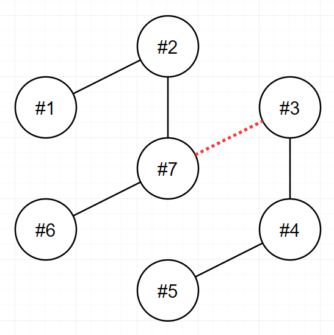

# 전력망을 둘로 나누기

> 카테고리: `완전탐색`

**목차**

- [전력망을 둘로 나누기](#전력망을-둘로-나누기)
    - [원본 링크](#원본-링크)
  - [문제 설명](#문제-설명)
    - [제한사항](#제한사항)
    - [입출력 예](#입출력-예)
    - [입출력 예 설명](#입출력-예-설명)
  - [아이디어](#아이디어)
  - [해결방법](#해결방법)

### 원본 링크

https://school.programmers.co.kr/learn/courses/30/lessons/86971

## 문제 설명

n개의 송전탑이 전선을 통해 하나의 [트리](<https://en.wikipedia.org/wiki/Tree_(data_structure)>) 형태로 연결되어 있습니다. 당신은 이 전선들 중 하나를 끊어서 현재의 전력망 네트워크를 2개로 분할하려고 합니다. 이때, 두 전력망이 갖게 되는 송전탑의 개수를 최대한 비슷하게 맞추고자 합니다.

송전탑의 개수 n, 그리고 전선 정보 wires가 매개변수로 주어집니다. 전선들 중 하나를 끊어서 송전탑 개수가 가능한 비슷하도록 두 전력망으로 나누었을 때, 두 전력망이 가지고 있는 송전탑 개수의 차이(절대값)를 return 하도록 solution 함수를 완성해주세요.

### 제한사항

- n은 2 이상 100 이하인 자연수입니다.
- wires는 길이가 `n-1`인 정수형 2차원 배열입니다.
  - wires의 각 원소는 [v1, v2] 2개의 자연수로 이루어져 있으며, 이는 전력망의 v1번 송전탑과 v2번 송전탑이 전선으로 연결되어 있다는 것을 의미합니다.
  - 1 ≤ v1 < v2 ≤ n 입니다.
  - 전력망 네트워크가 하나의 트리 형태가 아닌 경우는 입력으로 주어지지 않습니다.

### 입출력 예

| n   | wires                                             | result |
| --- | ------------------------------------------------- | ------ |
| 9   | [[1,3],[2,3],[3,4],[4,5],[4,6],[4,7],[7,8],[7,9]] | 3      |
| 4   | [[1,2],[2,3],[3,4]]                               | 0      |
| 7   | [[1,2],[2,7],[3,7],[3,4],[4,5],[6,7]]             | 1      |

### 입출력 예 설명

- **입출력 예 #1**

  다음 그림은 주어진 입력을 해결하는 방법 중 하나를 나타낸 것입니다.
  

  4번과 7번을 연결하는 전선을 끊으면 두 전력망은 각 6개와 3개의 송전탑을 가지며, 이보다 더 비슷한 개수로 전력망을 나눌 수 없습니다.

  또 다른 방법으로는 3번과 4번을 연결하는 전선을 끊어도 최선의 정답을 도출할 수 있습니다.

- **입출력 예 #2**

  다음 그림은 주어진 입력을 해결하는 방법을 나타낸 것입니다.

  

  2번과 3번을 연결하는 전선을 끊으면 두 전력망이 모두 2개의 송전탑을 가지게 되며, 이 방법이 최선입니다.

- **입출력 예 #3**

  다음 그림은 주어진 입력을 해결하는 방법을 나타낸 것입니다.

  

  3번과 7번을 연결하는 전선을 끊으면 두 전력망이 각각 4개와 3개의 송전탑을 가지게 되며, 이 방법이 최선입니다.

## 아이디어

- 특정 와이어를 끊었을 때 끊어진 두 송전탑이 연결된 송전탑의 개수를 구한다.
- 각 송전탑이 와이어를 통해 연결된 송전탑의 현황을 기록하는 테이블을 만들어 연결된 송전탑의 개수를 구하는 데 이용한다.
- 특정 송전탑에 연결된 모든 송전탑을 구하기 위해 `Recursion`을 이용한다.

## 해결방법

- 각 송전탑이 연결된 송전탑 현황을 기록한 객체를 반환하는 `cal` 함수를 만든다.
- `wires` 배열을 순회하면서 `wire`를 하나 씩 끊은 뒤 이를 기반으로 `cal` 함수를 호출해 연결된 송전탑의 현황 객체를 반환받는다.
- 송전탑 현황 객체를 포함하여 연결이 끊어진 두 송전탑을 기준으로 `Recursion`을 호출한다.
  - 무한루프가 생기지 않도록 한번 들린 적이 있는 송전탑인지 체크하며 들린 적이 있는 경우 `Recursion`을 종료한다.
  - 연결되지 않은 송전탑의 경우 본인만 체크하면 되므로 자신의 인덱스를 추가 후 `Recursion`을 종료한다.
  - 연결은 됐지만 들린 적이 없는 송전탑의 경우 해당 송전탑으로 이동하여 위 과정을 반복한다.
- `Recursion`이 종료되면 절대값을 구하여 송전탑 수의 간극이 제일 작은 값을 구한다.
