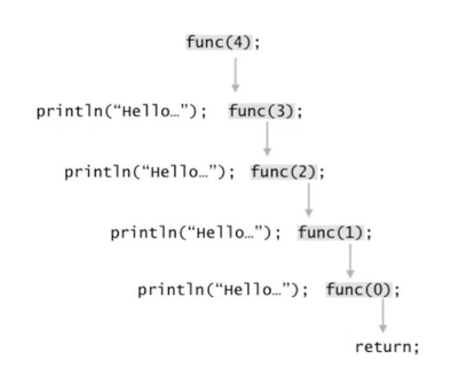
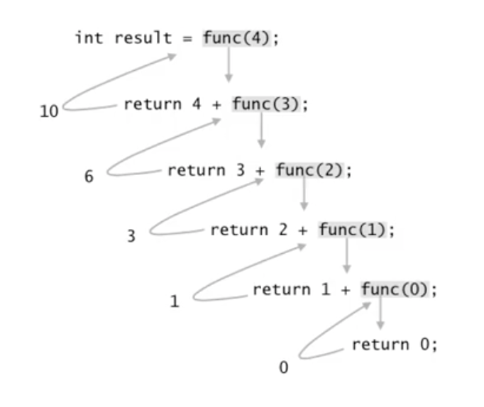
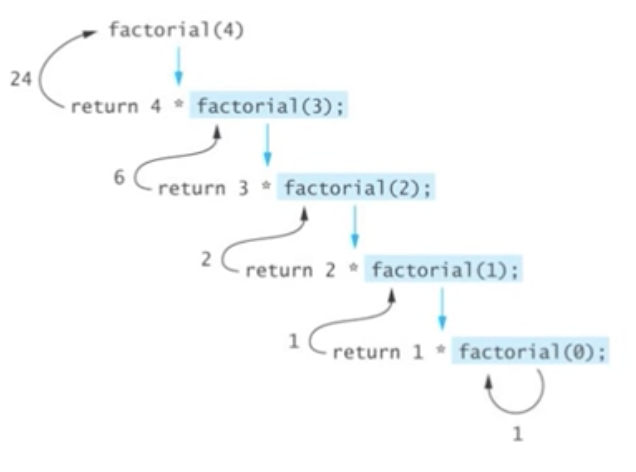

# 순환(Recursion)이란?

자기 자신을 다시 호출하는 함수(또는 메서드)

```java
void func(...) {
  func(...);
}
```

순환 또는 재귀라고 하는 것에 대한 간단한 예제를 살펴보자.

```java
public class Code01 {
  public static void main(String [] args) {
    func();
  }

  public static void func() {
    System.out.println("Hello...");
    func();
  }
}
```

위와 같은 예제로 알 수 있듯이 끝나지 않는 호출, 즉 무한루프에 빠진다. 자기 자신을 끊임없이 호출하기 때문에

**그렇다면 `Recursion`은 항상 무한루프에 빠질까?**

```java
public class Code02 {
  public static void main(String [] args) {
    int n = 4;
    func(n);
  }

  public static void func(int k) {
    if (k <= 0) {
      return;
    } else {
      System.out.println("Hello...");
      func(k-1);
    }
  }
}
```

당연히 그렇지는 않다. `Recursion`을 어떻게 작성하냐에 따라 무한루프에 빠지지 않고 내가 원하는 일을 반복하게 만들 수 있다. 위 예제는 자기 자신을 호출하는 재귀 함수지만 탈출 조건이 존재한다. 처음 매개변수로 입력받은 값에서 `-1`한 값을 자기 자신을 다시 호출하면서 인자값으로 전달하기 때문에 언젠가는 탈출 조건에 걸리게 된다.



## 무한 루프에 빠지지 않으려면?

무한루프에 빠지지 않기 위해서는 다음 두 가지 조건을 만족해야만 한다.

### Base case:

적어도 하나의 `Recursion`에 빠지지 않는 경우가 존재해야 한다.

### Recursive case:

`Recursion`을 반복하다보면 결국 `base case`로 수렴해야 한다.

### 예제 1: 1 ~ n 까지의 합

```java
public class Code03 {
  public static void main(String [] args) {
    int result = func(4);
  }

  public static int func(int n) {
    if (n == 0) {
      return 0;
    } else {
      return n + func(n - 1);
    }
  }
}
```

위 코드의 실행 과정을 그림으로 살펴보자.



## Recursion의 해석

```java
// #1 이 함수의 mission은 0 ~ n 까지의 합을 구하는 것이다.
public static int func(int n) {
  // #2 n = 0이라면 합은 0이다.
  if (n == 0) {
    return 0;
  } else {
    // #3 n이 0보다 크다면 0에서 n까지의 합은 0에서 n - 1까지의 합에 n을 더한 것이다.
    return n + func(n - 1);
  }
}
```

### 순환 함수와 수학적 귀납법

- **정리**: `func(int n)`은 음이 아닌 정수 `n`에 대해서 `0`에서 `n`까지의 합을 올바로 계산한다.
- **증명**:

  1. `n = 0`인 경우: `n = 0`인 경우 `0`을 반환한다. - 올바르다.
  2. 임의의 양의 정수 `k`에 대해서 `n < k`인 경우 `0`에서 `n`까지의 합을 올바르게 계산하여 반환한다고 가정하자.
  3. `n = k`인 경우를 고려해보자.

     `func`은 먼저 `func(k-1)`을 호출하는데 **2번**의 가정에 의해서 `0`에서 `k - 1`까지의 합이 올바로 계산되어 반환된다. 메서드 `func`은 그 값에 `n`을 더해서 반환한다.

     따라서 메서드 `func`은 `0`에서 `k`까지의 합을 올바로 계산하여 반환한다.

`Recursion`을 위와 같은 방식으로 증명하는 것은 과하다라고 할 수 있지만 여기서 중요한 점은 우리가 위와 같은 증명을 하진 않아도 `Recursion`을 대할 때 위와 같은 논리적인 구조로 `Recursion`을 이해하고 해석해야 한다는 말이다.

### 예제 2: Factorial `n!`

- `0! = 1`
- `n! = n x (n-1)!` (단, `n > 0`)

```java
public static int factorial(int n) {
  if (n == 0) {
    return 1;
  } else {
    return n * factorial(n - 1);
  }
}
```

위 코드의 실행 과정을 그림으로 살펴보자.



마찬가지로 조금 과하지만 수학적 귀납법으로 위 예제를 증명해보자.

### 순환 함수와 수학적 귀납법

- **정리**: `factorial(int n)`은 음이 아닌 정수 `n`에 대해서 `n!`을 올바로 계산한다.
- **증명**:
  1. `n = 0`인 경우: `n = 0`인 경우 `1`을 반환한다. - 올바르다.
  2. 임의의 양의 정수 `k`에 대해서 `n < k`인 경우 `n!`을 올바르게 계산한다고 가정하자.
  3. `n = k`인 경우를 고려해보자. `factorial`은 먼저 `factorial(k - 1)`을 호출하는데 **2번**의 가정에 의해서 `(k - 1)!`이 올바로 계산되어 반환한다. 따라서 메서드 `factorial`은 `k * (k - 1)! = k!`을 반환한다.

### 예제 3: `x^n`

- `x^0 = 1`
- `x^n x * x^n-1` (단, `n > 0`)

```java
public static double power(double x, int n) {
  if (n == 0) {
    return 1;
  } else {
    return x * power(x, n-1);
  }
}
```

### 예제 4: Fibonacci Number

- `f0 = 0`
- `f1 = 1`
- `fn = fn-1 + fn-2` (단, `n > 1`)

```java
public int fibonacci(int n) {
  if (n < 2) {
    return n;
  } else {
    return fibonacci(n-1) + fibonacci(n-2);
  }
}
```

### 예제 5-1: 최대공약수 - Euclid Method

- `m ≥ n`인 두 양의 정수 `m`과 `n`에 대해서 `m`이 `n`의 배수이면 `gcd(m, n) = n`이고, 그렇지 않으면 `gcd(m, n) = gcd(n, m%n)` 이다.

```java
public static int gcd(int m, int n) {
  if (m < n) {
  // swap m and n
    int tmp = m;
    m = n;
    n = tmp;
  }

  if (m % n == 0) {
    return n;
  } else {
    return gcd(n, m%n);
  }
}
```

### 예제 5-2: `Euclid Method` - 단순한 버전

- `p` (단, `q = 0`)
- `gcd(q, p%q)`

```java
public static int gcd(int p, int q) {
  if (q == 0) {
    return p;
  } else {
    return gcd(q, p%q);
  }
}
```
