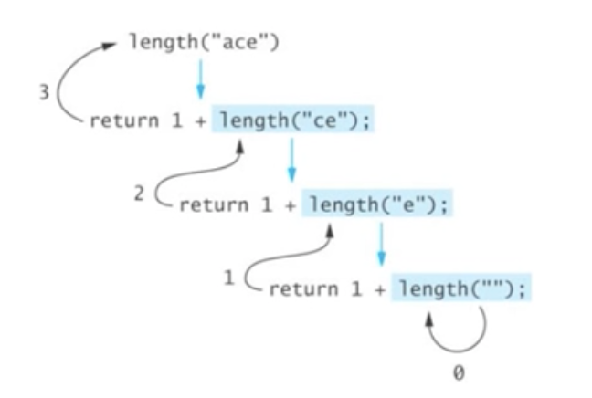
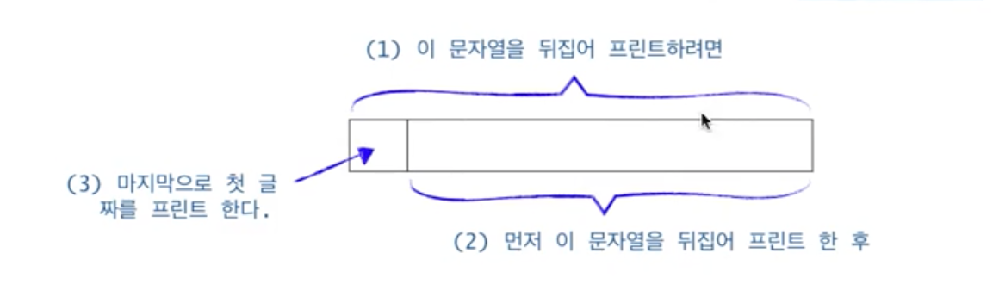

# Recursive Thinking - 순환적으로 사고하기

### `Recursion`은 수학 함수 계산에만 유용한가?

수학 함수뿐 아니라 다른 많은 문제들을 `Recursion`으로 해결할 수 있다.

## 예제 1: 문자열의 길이 계산

---


일반적으로 문자열의 길이를 계산한다고 할 때 어떻게 계산을 할까?

앞에서부터 문자를 하나씩 세면 된다. 이러한 방법을 절차지향적인 프로그래밍이다 라고도 말할 수 있을 것이다. 이 방법을 가지고 코딩을 한다고 하면 아마 `for` 문 또는 `while` 문을 이용할 것이다.

하지만 전혀 다른 방식으로 생각할 수도 있다.

위 이미지처럼 문자열의 길이를 첫 번째 문자를 제외한 나머지 문자열의 길이에 `1`을 더하는 방식으로 말이다.

```
if the string is empty
	return 0;
else
	return 1 plus the length of the string that
		exludes the first character;
```

위 **pseudo code**를 바탕으로 코드를 작성해보면

```java
public static int length(String str) {
	if (str.equals("")) {
		return 0;
	} else {
		return 1 + length(str.substring(1));
	}
}
```

위 코드의 동작을 그림으로 살펴보자.



## 예제 2: 문자열의 프린트

---

입력으로 들어온 하나의 문자열을 화면에 출력하는 메서드를 구현해보자.

하나의 문자열을 화면에 출력하는 방식도 **예제 1**과 동일한 사고 방식으로 생각해보자.

- 입력받은 문자열의 길이가 `0`일 경우 함수를 종료
- 그렇지 않은 경우 문자열의 첫 번째 문자를 출력
  그리고 첫 번째 문자를 제외한 나머지 문자열을 가지고 동일한 작업을 반복하는 것이다.

```java
public static void printChars(String str) {
	if (str.length() == 0) {
		return;
	} else {
		System.out.print(str.charAt(0));
		printChars(str.substring(1));
	}
}
```

## 예제 3: 문자열을 뒤집어 프린트

---

이번엔 동일하게 문자열을 화면에 출력하는 대신 뒤집어서 출력하는 것이 목표이다.



이 예제도 동일한 사고 방식으로 진행한다. 문자열을 뒤집어 프린트하고 싶은 경우

- 먼저 문자열을 뒤집어 출력한 후
- 문자열의 첫 문자를 출력한다.

```java
public static void printCharsReverse(String str) {
	if (str.length() == 0) {
		return;
	} else {
		printCharsReverse(str.substring(1));
		System.out.print(str.charAt(0));
	}
}
```

재밌는 점은 **예제 2**와 **예제 3**의 차이는 `else` 구문에서 호출하고 있는 함수의 순서만 반대라는 것이다.

## 예제 4: 2진수로 변환하여 출력

---

음이 아닌 정수 `n`을 이진수로 변환하여 인쇄한다.

- `n`을 `2`로 나눈 몫을 먼저 2진수로 변환하여 인쇄한 후
- `n`을 `2`로 나눈 나머지를 인쇄한다.

```java
public void printInBinary(int n) {
	if (n < 2) {
		System.out.print(n);
	} else {
		printInBinary(n / 2);
		System.out.print(n % 2);
	}
}
```

## 예제 5: 배열의 합 구하기

---

`data[0]`에서 `data[n-1]`까지의 합을 구하여 반환한다.

생각을 조금 전환하면 `data[0]`부터 `data[n-1]`까지의 합은 `data[0]` 부터 `data[n-2]`까지의 합에 `data[n-1]`을 더하면 된다. 이를 계속해서 반복하는 구조로 코드를 작성하게 되면 다음과 같다.

```java
public static int sum(**int n**, int [] data) {
  // n이 계속해서 줄어들고 있기 때문에 무한루프에 빠지지 않는다.
	if (n <= 0) {
		return 0;
	} else {
		return **sum(n-1, data) + data[n-1]**;
	}
}
```

## 예제 6: 데이터파일로 부터 n개의 정수 읽어오기

---

`Scanner in`이 참조하는 파일로 부터 `n`개의 정수를 입력받아 배열 `data`의 `data[0]`, … , `data[n-1]`에 저장한다.

이러한 형태의 코드를 실제로 쓰는 경우는 거의 없으니 `Recursion`의 예제로만 확인하고 넘어가자.

```java
// 데이터 파일을 참조하는 Scanner라고 가정
public void readFrom(int n, int [] data, Scanner in) {
	if (n == 0) {
		return;
	} else {
		readFrom(n-1, data, in);
		data[n-1] = in.nextInt();
	}
}
```

## `Recursion` vs. `Iteration`

---

- 모든 순환함수는 반복문(`iteration`)으로 변경 가능
- 그 역도 성립한다. 즉, 모든 반복문은 `Recursion`으로 표현 가능하다.
- 순환함수는 복잡한 알고리즘을 단순하고 일기 쉽게 표현하는 것을 가능하게 한다.
- 하지만 함수 호출에 따른 오버헤드가 발생한다. (매개변수 전달, 액티베이션 프레임 생성 등)
