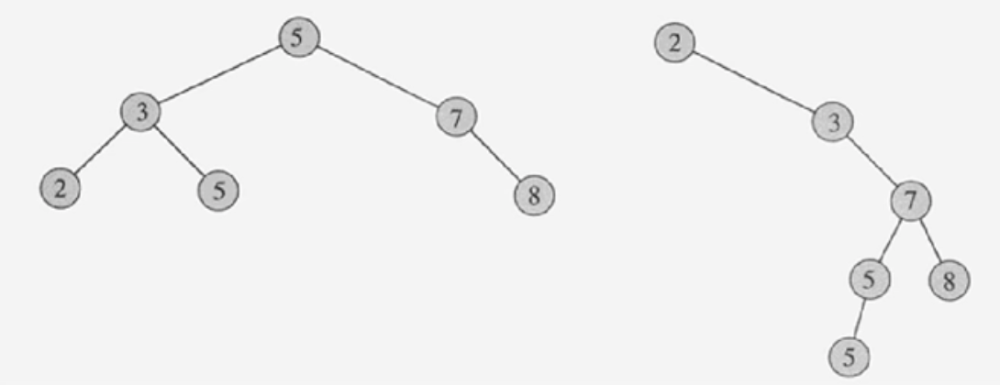
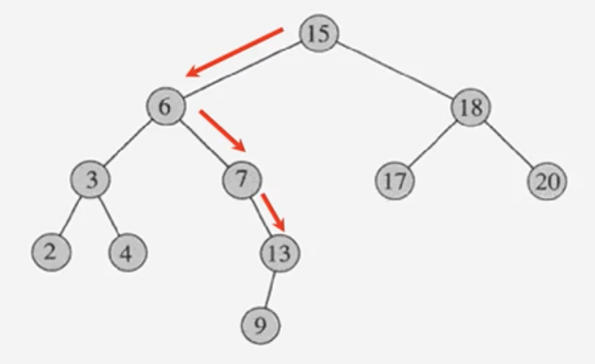

# #10-1 이진검색트리 (1)

**목차**

- [#10-1 이진검색트리 (1)](#10-1-이진검색트리-1)
  - [Dynamic Set](#dynamic-set)
  - [다양한 방법들](#다양한-방법들)
    - [검색트리](#검색트리)
  - [이진검색트리 (BST = Binary Search Tree)](#이진검색트리-bst--binary-search-tree)
    - [BST의 예제](#bst의-예제)
    - [`SEARCH` 연산 예제](#search-연산-예제)
    - [`SEARCH` pseudo code (Recursion version)](#search-pseudo-code-recursion-version)
    - [`SEARCH` pseudo code (Iterative version)](#search-pseudo-code-iterative-version)

## Dynamic Set

- 저장된 요소들이 고정된 값들이 아니라 `INSERT`, `SEARCH`, `DELETE` 될 수 있다.
- 여러 개의 키를 저장
- 다음과 같은 연산들을 지원하는 자료구조
  - `INSERT` - 새로운 키의 삽입
  - `SEARCH` - 키 탐색
  - `DELETE` - 키의 삭제
- **Dynamic Set**의 예로는 `심볼 테이블`이 있다.

`INSERT`, `SEARCH`, `DELETE` 연산을 정렬된 또는 정렬되지 않은 배열과 연결 리스트를 이용할 경우 시간 복잡도가 얼마나 걸리는지 한번 알아보자.

| 자료구조    | 정렬 유무 | SEARCH  | INSERT         | DELETE |
| ----------- | --------- | ------- | -------------- | ------ |
| 배열        | O         | O(logn) | O(n)           | O(n)   |
|             | X         | O(n)    | O(1) 또는 O(n) | O(1)   |
| 연결 리스트 | O         | O(n)    | O(n)           | O(1)   |
|             | X         | O(n)    | O(1)           | O(1)   |

- **정렬되지 않은 배열의 `INSERT` 연산**이 `O(1)` 또는 `O(n)`인 이유는 **Java**와 같은 언어처럼 일반적으로 배열의 크기를 동적으로 늘릴 수는 없기 때문에 더 큰 사이즈의 배열에 기존 배열 요소들을 집어 넣는 연산까지 고려한다면 `O(n)`이라고 말할 수도 있다.
- **정렬된 연결 리스트**라고 할 때는 배열처럼 중간점을 한 번에 알 수는 없다. 따라서, 이진 검색을 활용할 수는 없기에 `SEARCH` 연산의 시간 복잡도는 `O(n)`이다.
- **정렬된 배열**이라고 할 때 중간점을 활용하는 이진 검색이 가능하다. 따라서, SEARCH 연산의 경우 시간 복잡도는 `O(logn)`이다.

위 표를 통해 알 수 있듯이 배열이나 연결 리스트를 사용했다면 정렬을 하건 정렬을 하지 않건 `INSERT`, `SEARCH`, `DELETE` 세 연산 중 하나는 시간복잡도를 `O(n)`가 된다.

그렇다면 세 연산 모두 시간복잡도를 O(1)로 가지는 자료구조는 없을까?

## 다양한 방법들

- 이진탐색트리(Binary Search Tree), 레브-블랙 트리, AVL 트리 등 트리에 기반한 구조들
- 해시 테이블(Hash Table)
- Direct Address Table

### 검색트리

- **Dynamic Set**을 트리의 형태로 구현한 것을 말하며 대부분 `INSERT`, `SEARCH`, `DELETE` 연산의 효율적으로 지원하기 위해 만들어진 자료구조를 뜻한다.
- 일반적으로 `INSERT`, `SEARCH`, `DELETE` 연산이 트리의 높이(height)에 비례하는 시간복잡도를 가진다.
- 이진탐색트리(Binary Search Tree), 레브-블랙 트리, B-트리 등

## 이진검색트리 (BST = Binary Search Tree)

- 이진트리이면서 각 노드에 하나의 키를 저장하고 있다.
- 각 노드 `v`에 대해서 그 노드의 왼쪽 서브트리에 있는 키들은 `key[v]`보다 작거나 같고, 오른쪽 서브트리에 있는 값은 크거나 같다.

### BST의 예제



- 왼쪽 이진트리에서 5를 기준으로 봤을 때 5의 왼쪽 서브트리에 있는 값들은 5보다 작거나 같고 오른쪽 서브트리에 있는 값들은 5보다 크거나 같다.
- 왼쪽 이진트리의 3을 기준으로 봐도 동일하다. 2는 3보다 작거나 같고 5는 3보다 크거나 같다.
- `heap`과 헷갈리지 말자. `heap`은 애초에 **complete binary tree** 여야 한다.

### `SEARCH` 연산 예제



- 13을 탐색
  - 루트 노드를 먼저 살펴본다. 15는 13이 아니다.
  - 위에서 살펴봤던 이진트리의 특징을 떠올려보자. 13은 15보다 작다. 따라서, 13이 현재 이진트리에 있다면 15의 왼쪽 서브트리에 존재할 것이다.
  - 6을 살펴보는데 이 또한 13이 아니다. 다만, 6은 13보다 작기 때문에 13이 있다면 6의 오른쪽 서브트리에 존재할 것이다.
  - 7도 6과 동일하다. 13이 있다면 7의 오른쪽 서브트리에 존재할 것이다.
  - 15 → 6 → 7 → 13

### `SEARCH` pseudo code (Recursion version)

```
tree-search(x, k)
  if x = NIL or k = key[x]
    then return x
  if k < key[x]
    then return tree-search(left[x], k)
    else then return tree-search(right[x], k)
```

- `x`: 노드 (시작할 때는 루트 노드)
- `k`: 찾고자 하는 값
- 예외 케이스 (base case)
  - `x = NIL`: `x`가 `null`인 경우
  - `k = key[x]`: 현재 노드의 값이 내가 찾고자 하는 값인 경우
- 시간복잡도: `O(h)`, 여기서 `h`는 트리의 높이다.
  - 한번 비교할 때마다 한 레벨 씩 내려가기 때문에 아무리 깊이 내려가도 트리의 높이보다 더 내려갈 수는 없다. 따라서, 시간복잡도는 트리의 높이에 비례한다.
  - 이전에 한번 언급했듯이 이진트리는 한쪽으로 치우쳐진 형태의 이진트리가 존재할 수도 있다. 따라서, 트리의 높이가 최악의 경우 노드의 개수와 같을 수도 있다.

### `SEARCH` pseudo code (Iterative version)

```
iterative-tree-search(x, k)
  while x != NIL and k != key[x]
    do if k < key[x]
      then x <- left[x]
      else x <- right[x]
  return x
```

- 시간복잡도: `O(h)`, 여기서 `h`는 트리의 높이다.
