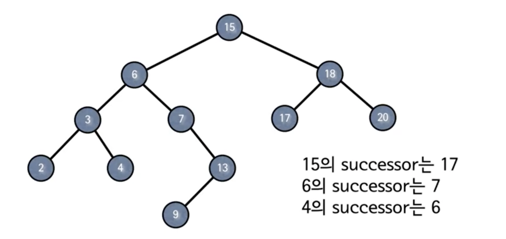
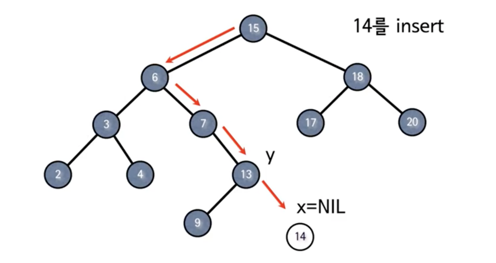
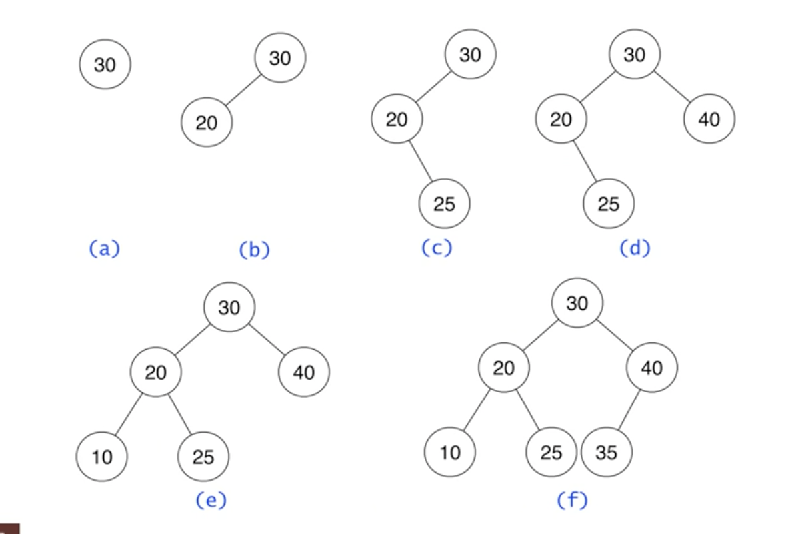

# #10-2 이진검색트리 (2)

**목차**

- [#10-2 이진검색트리 (2)](#10-2-이진검색트리-2)
  - [최소값](#최소값)
    - [pseudo code](#pseudo-code)
  - [최대값](#최대값)
    - [pseudo code](#pseudo-code-1)
  - [Successor](#successor)
    - [3가지 경우](#3가지-경우)
    - [pseudo code](#pseudo-code-2)
  - [Predecessor](#predecessor)
  - [`INSERT`](#insert)
    - [14를 `INSERT`하는 예제](#14를-insert하는-예제)
    - [Insert 6 nodes into an empty tree](#insert-6-nodes-into-an-empty-tree)
    - [pseudo code](#pseudo-code-3)

## 최소값

기본적으로 이진트리에서 왼쪽에 있는 값들은 기준이 되는 노드보다 작아야 하고 오른쪽에 있는 값들은 기준이 되는 노드보다 커야 된다. 따라서, 이 조건을 만족하면서 값이 최소인 노드를 찾아서 내려가다 보면 자연스레 **가장 왼쪽에 있는 노드가 최소값**을 갖고 있는 것을 알 수 있다.

### pseudo code

```
tree-mininum(x)
  while left[x] != NIL
    do x <- left[x]
  return x
```

- `left[x] != NIL`: 왼쪽 자식 노드가 더 이상 없을 때까지 반복
- 시간복잡도: `O(h)`
  - 노드의 왼쪽 자식 노드를 타고 내려가기 때문에 아무리 오래 걸려도 트리의 높이보다 더 시간이 걸리진 않는다.

## 최대값

최대값은 최소값의 대칭이므로 가장 오른쪽에 있는 노드가 최대값이다.

### pseudo code

```
tree-maximum(x)
  while right[x] != NIL
    do x <- right[x]
  return x
```

- 시간복잡도: `O(h)`
  - 노드의 오른쪽 자식 노드를 타고 내려가기 때문에 아무리 오래 걸려도 트리의 높이보다 더 시간이 걸리진 않는다.

## Successor



- 노드 `x`의 `successor`란 **`key[x]`보다 크면서 가장 작은 키를 가진 노드**를 말한다.
- 모든 키들이 서로 다르다고 가정한다.
- `successor`가 항상 존재하진 않는다.

### 3가지 경우

1. **노드 `x`의 오른쪽 서브트리가 존재할 경우**, `x`의 `successor`는 오른쪽 서브트리의 최소값이다.
   - 이진 트리의 특성 상 오른쪽 서브트리에 있는 값들은 노드 `x`보다 큰 값들이기 때문에 그 중 최소값이 `successor`다.
   - 위에서 배웠듯이 오른쪽 서브트리의 최소값은 해당 서브트리의 가장 왼쪽에 있는 노드이다. (없을 경우 루트 노드)
2. **오른쪽 서브트리가 존재하지 않는 경우**, 어떤 노드 `y`의 왼쪽 서브트리의 최대값이 `x`가 되는 그런 노드 `y`가 `x`의 `successor`
   - **부모를 따라 루트까지 올라가면서 처음으로 누군가의 왼쪽 자식이 되는 노드**
3. 2번에 해당하는 노드 `y`가 존재하지 않을 경우 `successor`가 존재하지 않는다.
   - 즉, `x`가 최대값이다.

### pseudo code

```
tree-successor(x)
  if right[x] != NIL
    then return tree-minimum(right[x])
  y <- p[x]
  while y != NIL and x = right[y]
    do x <- y
      y <- p[y]
  return y
```

- `right[x] != NIL`: 3가지 경우 중 1번에 해당하는 경우, 오른쪽 서브트리를 기준으로 최소값을 찾는 **tree-minimum**을 수행한다.
- `y`: 현재 노드가 `x`라고 할 때 부모가 되는 노드
- `y != NIL and x = right[y]`: 부모 노드가 `null`이 아니면서 `x`가 부모 노드의 오른쪽 자식인 경우
- `return y`: `x`가 부모 노드의 왼쪽 자식이 된 경우 또는 부모 노드가 `null`인 경우
- 시간복잡도: `O(h)`
  - 위로 올라가던 아래로 내려가던 트리의 높이 이상 수행될 수 없다.

## Predecessor

- **Successor**와 반대
  - 따라서, `successor`의 **pseudo code**에서 `x`와 `y`를 바꾸면 `predecessor`의 **pseudo code**가 된다.
- 노드 `x`의 `predecessor`란 `key[x]`보다 작으면서 가장 큰 키를 가진 노드를 말한다.
- 시간복잡도: `O(h)`
  - 위로 올라가던 아래로 내려가던 트리의 높이 이상 수행될 수 없다.

## `INSERT`

- 이진트리 `INSERT` 연산의 특징 중 하나는 기존 노드의 변경이 없다는 것이다. 그저 비어 있는 `leaf` 노드에 새로운 노드를 배치한다.
- 2개의 포인터 `x`, `y`를 사용한다.
  - 새로운 노드를 배치할 장소를 찾는 `x`
  - 배치할 장소와 연결된 위치 정보를 갖고 있는 `y`

### 14를 `INSERT`하는 예제



앞서 언급한 대로 `x`가 `null`이 된 순간, 즉 새로운 노드를 배치할 `leaf` 노드 자리를 발견했을 때 부모 노드의 위치 정보를 `y`가 갖고 있는 것을 볼 수 있다.

### Insert 6 nodes into an empty tree



`INSERT` 연산이 수행될 때마다 기존 노드들은 변경이 없고 기준이 되는 노드보다 크냐 작냐에 따라서 왼쪽 서브트리 또는 오른쪽 서브트리를 타고 내려가 `leaf` 노드에 배치된다.

### pseudo code

```
tree-insert(T, z)
  y <- NIL
  x <- root[T]
  while x != NIL
    do y <- x
      if key[z] < key[x]
        then x <- left[x]
        else x <- right[x]
  p[z] <- y
  if y == NIL
    then root[T] <- z     // Tree T was empty
  else if key[z] < key[y]
    then left[y] <- z
    else right[y] <- z
```

- `T`: **Binary Search Tree**
- `z`: 삽입할 노드
- `x <- root[T]`: `x`는 루트에서 시작
- `y <- NIL`: `y`는 항상 `x`의 한칸 뒤를 따라와야 하므로 시작점은 `null`
- `y == NIL`: 시작부터 `x`가 `null`이라는 뜻, 즉 **empty tree**였다.
  - `root[T] <- z`: **empty tree**기 때문에 삽입할 노드를 루트 노드로 배치
- 시간복잡도: `O(h)`
