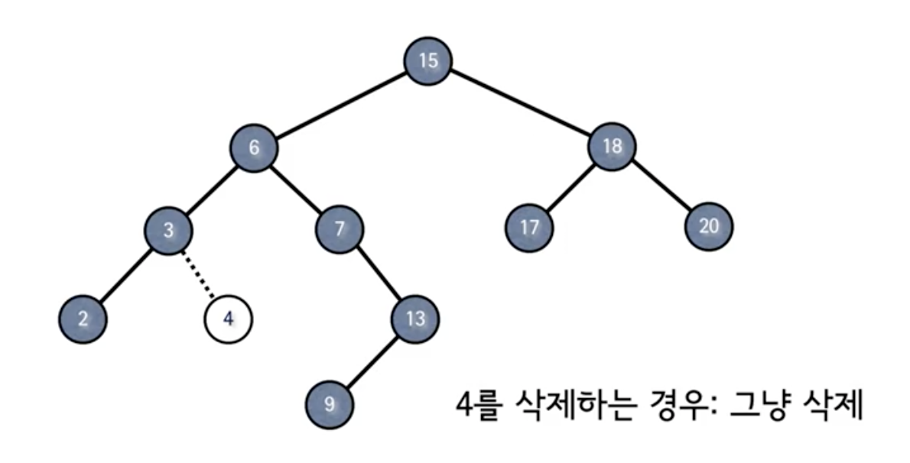
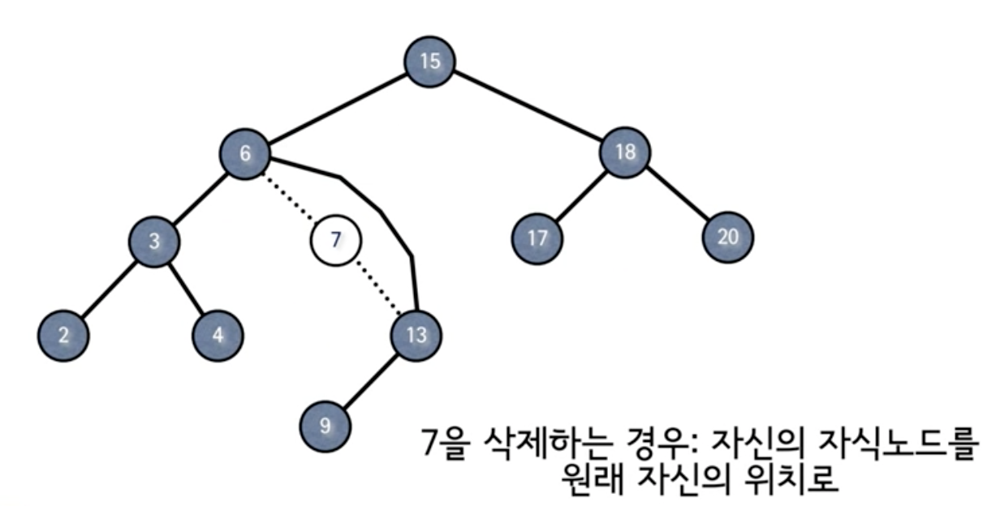
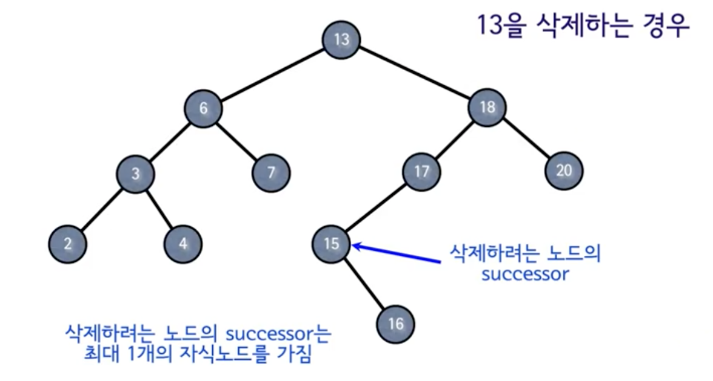

# 이진검색트리 (3)

**목차**

- [이진검색트리 (3)](#이진검색트리-3)
  - [`DELETE`](#delete)
    - [Case 1: 자식 노드가 없는 경우](#case-1-자식-노드가-없는-경우)
    - [Case 2: 자식 노드가 1개인 경우](#case-2-자식-노드가-1개인-경우)
    - [Case 3: 자식 노드가 2개인 경우](#case-3-자식-노드가-2개인-경우)
    - [pseudo code](#pseudo-code)
  - [BST (`SEARCH`, `INSERT`, `DELETE`)](#bst-search-insert-delete)

## `DELETE`

`DELETE` 연산을 수행하기 위해서는 당연히 삭제할 노드를 찾는 과정이 먼저 필요하다. 여기선 삭제할 노드를 찾았다는 가정하에 `DELETE` 연산에 대해서만 다룬다.

### Case 1: 자식 노드가 없는 경우



위 예제는 가장 간단한 경우로 삭제할 노드가 자식 노드가 없는 노드이므로 해당 노드를 그냥 바로 삭제해주면 된다. 부모 노드 기준으로 왼쪽 노드든 오른쪽 노드든 `null`로 바꾸어 삭제 처리를 하면 된다.

### Case 2: 자식 노드가 1개인 경우



위 예제와 같이 자식 노드가 1개인 경우는 어찌 보면 연결 리스트와 유사한 형태를 갖고 있다고 볼 수 있다. 7번 노드를 기준으로 부모 노드도 유일하고 자식 노드도 유일하기 때문에 `6 - 7 - 13` 노드들만 놓고 봤을 때는 선형적인 구조를 갖고 있기 때문이다.

따라서, 노드를 삭제하고 삭제되는 노드의 부모 노드에게 삭제되는 노드의 자식 노드를 이어주면 `DELETE` 연산이 마무리된다. 즉, 자식 노드를 부모 노드에게로 끌어올린다.

### Case 3: 자식 노드가 2개인 경우



자식 노드가 2개인 노드, 즉 위 예제에서 13번 노드 또는 18번 노드가 이에 해당된다.

Case 1, 2와는 다르게 조금 복잡한 것이 Case 1, 2는 노드를 삭제하더라도 기존 트리의 구조를 유지하기가 쉬웠지만 Case 3의 경우 노드를 삭제하는 순간 트리의 기본적인 구조를 깨트리게 된다.

**그렇다면 이 `DELETE` 연산은 어떻게 해야할까?**

우선 노드를 삭제할 때 해당 노드를 아예 지워버리는 것이 아니라(이럴 경우 자식 노드들을 다시 배치하는 연산이 생겨버리므로 비효율적) 노드가 가지고 있는 데이터만을 삭제한다. 그리고 비어 있는 데이터를 채우기 위해 자식 노드들 중에 적합한 노드를 찾아내어 값을 복사한다.

**여전히 의문은 존재한다. 여기서 적합한 노드는 누가 될 것인가?**

이진트리의 특성 상 왼쪽 서브트리는 해당 노드보다 작은 값들만 오른쪽 서브트리는 해당 노드의 큰 값들만 와야한다. 따라서, 효율을 따진다면 이진트리의 조건을 만족하면서 삭제할 노드랑 가장 가까운 값을 가져오는 것이 좋다.

가장 가까운 값이니 `이진트리검색 (2)`에서 배운 **Predecessor** 또는 **Successor**를 가지고 구현하면 된다. 어떤 것을 선택하여 구현하든 상관없지만 여기선 **Successor**를 사용한다.

이 방법이 적합할 수 밖에 없는 이유는 다음과 같다.

- **Successor**를 찾아서 가져왔다는 뜻은 삭제할 노드보다 큰 값이라는 뜻이다.
- 삭제할 노드보다 큰 값을 가져왔으므로 왼쪽 서브트리는 변화가 없다.
- **Successor**란 오른쪽 서브트리 중에서 가장 작은 값이므로 **Successor**를 제외하고 오른쪽 서브트리에 남은 값들은 전부 **Successor**보다 크기 때문에 오른쪽 서브트리도 큰 변화가 없다.
- **Successor**라는 건 이진트리의 특정 서브트리의 가장 작은 값을 의미하므로 왼쪽 자식 노드가 없다. 이는 자식 노드가 0개이거나 1개라는 것을 의미한다.
  따라서, 자식 노드가 0개라면 Case 1과 같이 그냥 삭제하면 되고 자식 노드가 1개라면 Case 2와 같이 자식 노드를 삭제되는 노드에 위치시키면 된다.

결과적으로 이진트리가 유지해야 할 크기 관계가 여전히 유지되고 있다.

### pseudo code

```
tree-delete(T, z)
  if left[z] = NIL or right[z] = NIL
    then y <- z
    else y <- tree-successor(z)
  if left[y] != NIL
    then x <- left[y]
    else x <- right[y]
  if x != NIL
    then p[x] <- p[y]
  if p[y] = NIL
    then root[T] <- x
    else if y = left[p[y]]
      then left[p[y]] <- x
      else right[p[y]] <- x
  if y != z
    then key[z] <- key[y]
      copy y's satellite data into z
  return y
```

- `left[z] = NIL or right[z] = NIL`: 자식 노드가 0개 또는 1개인 경우
  - 0개 또는 1개인 경우 `y`에 삭제할 노드를 할당
  - 아닐 경우 `y`에 **Successor**를 할당
- **`y`의 자식 노드는 0개이거나 1개다.**
  - `left[y] != NIL`: `y`의 왼쪽 자식이 존재하는 경우
- `x != NIL`: `y`의 자식 노드인 `x`가 `null`이 아닌 경우
  - `y`를 삭제하고 `y` 자리에 `x`를 배치할 것이기 때문에 `y`의 부모 노드는 `x`의 부모 노드가 된다.
- `p[y] = NIL`: `y`의 부모 노드가 `null`인 경우 (= `y`가 루트 노드인 경우)
  - `x`가 그대로 루트 노드가 된다.
  - `y`가 부모가 있는 경우 `y`가 부모 노드의 왼쪽 자식인지 오른쪽 자식인지 여부에 따라 `x`를 부모 노드의 자식 노드로 배치한다.
- `y ≠ z`: `y`가 **Successor**인 경우 (Case 3)
  - `y`(**Succesor**)의 값을 `z`로 이동
- 시간복잡도: `O(h)`

## BST (`SEARCH`, `INSERT`, `DELETE`)

- 각종 연산(`SEARCH`, `INSERT`, `DELETE`)의 시간복잡도는 모두 `O(h)`이다.
- 그러나 최악의 경우 트리의 높이는 `h = O(n)`가 될 수 있다. 현실적으로 평균적인 시간복잡도는 `O(logn)`이지만 결국은 최악의 경우가 발생할 수도 있긴 하다. 따라서, 이러한 점을 보완한 이진트리가 존재한다.
- **균형 잡힌(Balanced) 트리**
  - 레드-블랙 트리 등
  - 키의 삽입이나 삭제시 추가로 트리의 균형을 잡아줌으로써 높이를 `O(logn)`으로 유지한다. 단, 균형을 잡아주기 위해서 연산의 복잡도는 증가한다.
