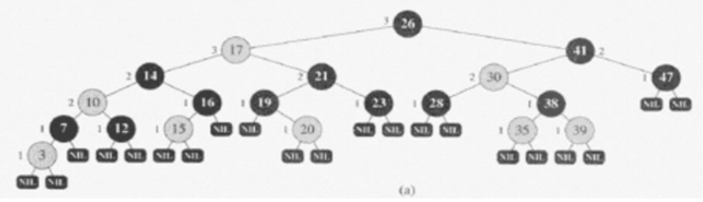
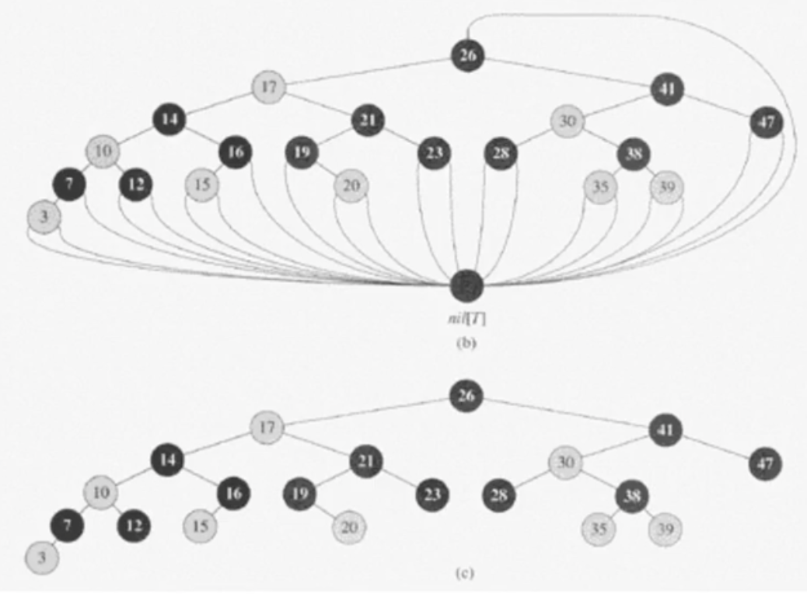
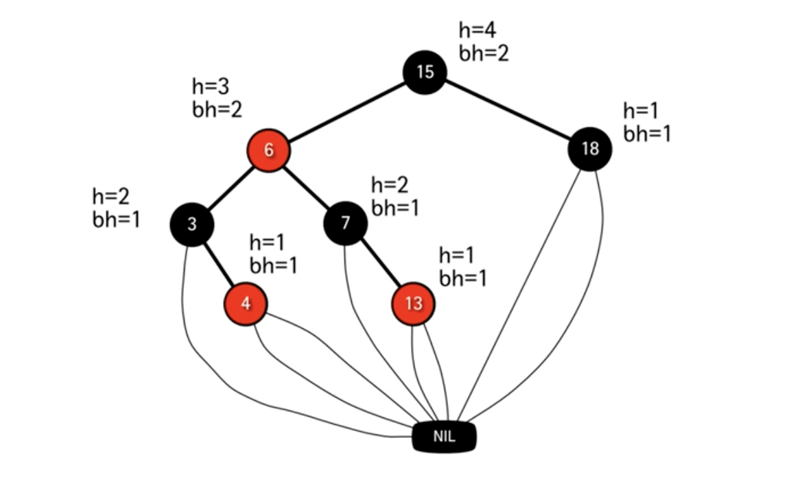
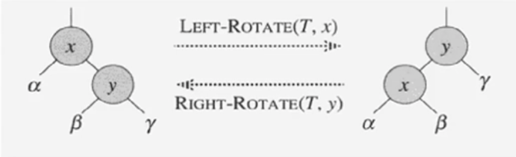
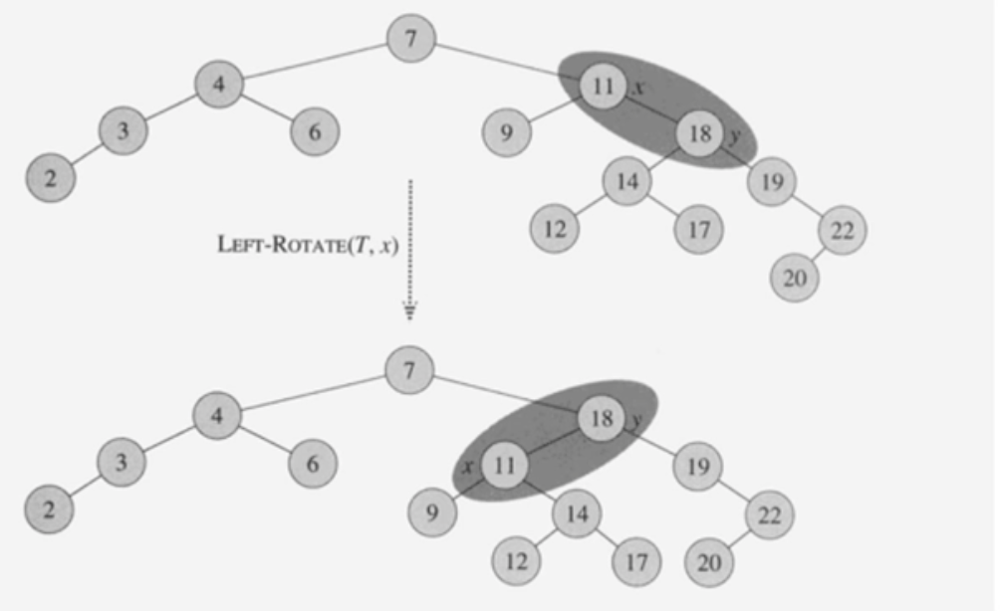

# #11-1 Red-Black Tree (1)

**목차**

- [#11-1 Red-Black Tree (1)](#11-1-red-black-tree-1)
  - [개요](#개요)
  - [Red-Black Tree](#red-black-tree)
    - [조건](#조건)
    - [정의](#정의)
    - [예시](#예시)
    - [높이](#높이)
  - [Left and Right Rotation](#left-and-right-rotation)
    - [Left Rotation pseudo code](#left-rotation-pseudo-code)
    - [예시](#예시-1)

## 개요

바로 전에 까지 이진검색트리를 이용한 3가지 연산(`SEARCH`, `INSERT`, `DELETE`)에 대해 알아봤다. 이진검색트리를 이용한 3가지 연산은 평균적인 시간복잡도 `O(logn)`을 가질 정도로 이상적일 경우 이진검색과 유사한 효율을 보인다.

다만, 이진검색트리 때도 언급했듯이 최악의 경우, 예를 들어 한 쪽으로 쏠린 트리의 형태를 가지게 됐을 경우 시간복잡도를 `O(n)`을 가진다는 게 문제였다.

평균적인 시간복잡도는 `O(logn)`을 갖고 있으면서 최악의 경우가 흔하게 나타나지도 않지만 어찌 됐든 `O(n)`이라는 시간복잡도를 가질 수 있다. 이진검색트리에서 최악의 경우는 트리의 균형이 깨졌을 때 보통 발생을 한다. 만약 루트 노드의 왼쪽 서브트리와 오른쪽 서브트리가 계속해서 균형 잡힌 트리의 모양을 하고 있다면 최악의 경우를 만날 일은 없을 것이다.

따라서, 이런 균형 잡힌 트리를 만들기 위해 `INSERT`와 `DELETE` 연산 후 트리의 균형을 다시 잡아주는 연산이 포함된 트리에 대한 연구가 상당히 많은데 이 중에서 대표적인 예인 **Red-Black Tree**에 대해 알아보고자 한다.

## Red-Black Tree

- 이진탐색트리의 일종으로 기존 이진탐색트리의 `INSERT`와 `DELETE` 연산에 추가적인 작업이 들어갔다고 생각하면 된다.
- 균형 잡힌 트리로써 높이가 `O(logn)`이다.
- `SEARCH`, `INSERT`, `DELETE` 연산이 최악의 경우에도 `O(logn)` 시간복잡도를 갖는다.

### 조건



- 각 노드는 하나의 키(`key`), 왼쪽 자식(`left`), 오른쪽 자식(`right`) 그리고 부모 노드(`p`)의 주소를 저장한다.
- 자식 노드가 존재하지 않을 경우 `NIL` 노드라고 부르는 특수한 노드가 있다고 가정한다.
- 따라서, 모든 `leaf` 노드는 `NIL` 노드다.
- 루트 노드의 부모 노드도 `NIL` 노드라고 가정한다.
- 노드들은 내부 노드와 `NIL` 노드로 분류한다.

`NIL` 노드를 구현 단계에서는 사용하지 않는다. **Red-Black Tree**의 설명을 위해 사용되는 용어라고 생각하면 된다.



따라서, 설명을 위해서 위 이미지의 (**b**)와 같이 생각을 하지만 실제 구현한 트리를 보면 (**c**)와 같다.

### 정의

1. 각 노드는 `red` 혹은 `black`이다.
2. 루트 노드는 `black`이다.
3. 모든 `leaf` 노드 (즉, `NIL` 노드)는 `black`이다.
4. **`red` 노드의 자식 노드들은 전부 `black`이다(즉, `red` 노드는 연속되어 등장하지 않는다).**
5. **모든 노드에 대해서 그 노드로부터 자손인 `leaf` 노드에 이르는 모든 경로에는 동일한 개수의 `black` 노드가 존재한다.**

### 예시



위 이미지를 보면 정의에서 언급됐던 조건들이 모두 지켜지는 것을 확인할 수 있다.

`red` 노드는 연속되어 등장하지 않으며 모든 노드에 대해서 `leaf` 노드까지 가는데 거치는 `black` 노드의 수는 동일하다.

### 높이

- **노드 `x`의 높이 `h(x)`:** 자신으로부터 `leaf` 노드까지의 **가장 긴 경로**에 포함된 `edge`의 개수
- **노드 `x`의 블랙-높이 `bh(x)`:** `x`로부터 `leaf` 노드까지의 경로상의 `black` 노드의 개수
  - 단, 노드 `x` 자신은 포함하지 않는다.
- 높이가 `h`인 블랙-높이는 `bh ≥ h / 2` 이다.
  - 조건 4에 의해 `red` 노드는 연속될 수 없으므로, 즉 `red` 노드가 나온 이상 `black` 노드가 반드시 나와야 하므로 당연한 이야기다.
- 노드 `x`를 루트로 하는 임의의 서브트리는 적어도 `2^bh(x)-1` 개의 내부 노드를 포함한다.
- `n`개의 내부 노드를 가지는 **Red-Black Tree**의 높이는 `2log(n+1)` 이하이다.
  - `n ≥ 2^bh-1 ≥ 2^(h/2)-1` 이므로, 여기서 `bh`와 `h`는 각각 루트 노드의 블랙-높이와 높이

## Left and Right Rotation



- `SEARCH` 연산은 기존의 이진탐색트리와 동일하다.
- 시간복잡도: `O(1)`
- **Left Rotation**이나 **Right Rotation**을 수행해도 여전히 이진탐색트리의 특성을 유지한다.
  - **Rotation**이 발생하는 서브 트리의 부모 트리의 입장에선 이미 해당 서브 트리는 부모보다 작은 노드들이 모여 있는 것이기 때문에 해당 서브 트리에서 **Rotation**이 발생하는 것은 상관이 없다.
  - **Left Rotation**의 경우 `β`는 `x`보다는 큰 값들 중 가장 작은 값이며 **Right Rotation**의 경우 `β`는 `y`보다 작은 값들 중 가장 큰 값이다. 따라서, **Rotation** 후에 `β`의 위치가 이동해도 이진탐색트리의 조건을 만족한다는 것을 알 수 있다.
  - **Rotation**이 발생한다고 이진탐색트리의 조건을 여전히 만족한다는 것이지 **Red-Black Tree**의 조건을 항상 만족하는 것은 아니다.

### Left Rotation pseudo code

- `y = right[x] ≠ NIL` 이라고 가정한다.
- 루트 노드의 부모 노드도 `NIL`이라고 가정한다.

```
left-rotate(T, x)
  y <- right[x]             // Set y
  right[x] <- left[y]       // Turn y's left subtree into x's right subtree
  p[left[y]] <- x
  p[y] <- p[x]              // Link x's parent to y
  if p[x] = nil[T]
    then root[T] <- y
    else if x = left[p[x]]
      then left[p[x]] <- y
      else right[p[x]] <- y
  left[y] <- x
  p[x] <- y
```

- `y <- right[x]`: **Left Rotation**을 하기 위하여 `x`의 오른쪽 노드를 `y`에 할당
- `right[x] <- left[y]`: `y`의 왼쪽 자식(`β`)를 `x`의 오른쪽 자식으로 만든다.
- `p[left[y]] <- x`: `y`의 왼쪽 자식(`β`)의 부모 노드를 `x`로 변경
- `p[y] <- p[x]`: `y`의 부모 노드를 현재 `x`의 부모 노드로 교체
- `p[x] = nil[T]`: 현재 `x`의 부모 노드가 `NIL` 노드인 경우 (= `x`가 루트 노드인 경우)
- `x = left[p[x]]`: `x`의 부모 노드가 존재하는 경우 (= `NIL`이 아닌 경우)
  - `left[p[x]] <- y`: 원래 `x`가 부모 노드의 왼쪽 자식이었다면 `y`를 왼쪽 자식으로 배치
  - `right[p[x]] <- y`: 원래 `x`가 부모 노드의 오른쪽 자식이었다면 `y`를 오른쪽 자식으로 배치
- `left[y] <- x`: `x`를 `y`의 왼쪽 자식으로 만든다.
- `p[x] <- y`: `x`의 부모 노드를 `y`로 만든다.
- 시간복잡도: `O(1)`

뭔가 복잡해 보이는 **pseudo code**지만 위에서 결국 하는건 꼼꼼하게 노드들의 주소값을 **Rotation**한 결과에 맞게 변경해주는 것 밖에 없다.

### 예시



11과 18을 가지고 **Left Rotation**하는 예제를 그림으로 표시한 것이다.
