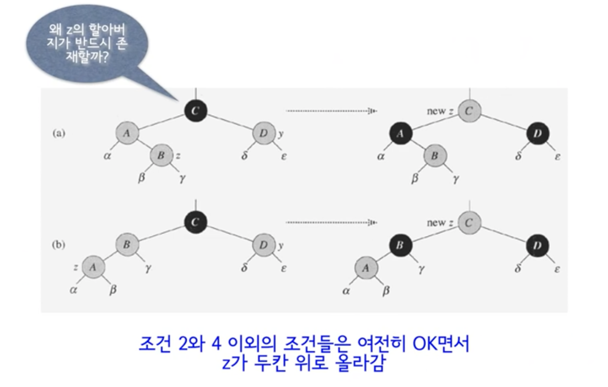
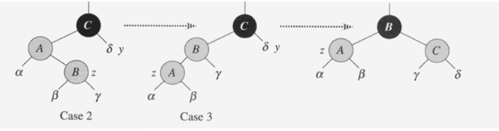
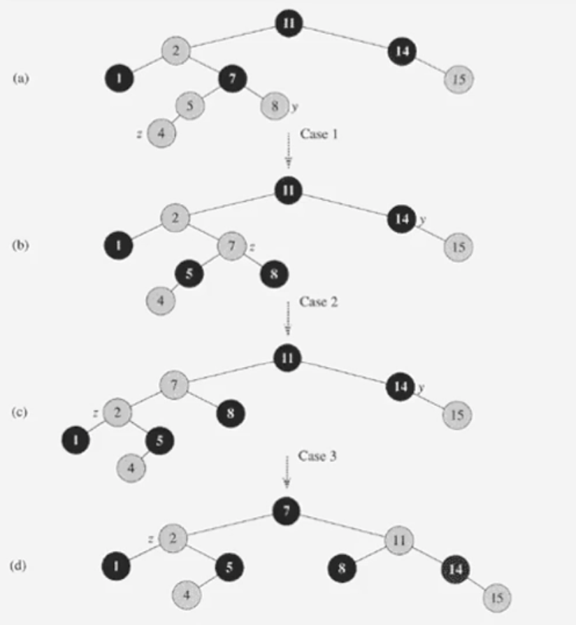

# #11-2 Red-Black Tree (2)

**목차**

- [#11-2 Red-Black Tree (2)](#11-2-red-black-tree-2)
  - [`INSERT`](#insert)
    - [pseudo code](#pseudo-code)
  - [RB-INSERT-FIXUP](#rb-insert-fixup)
    - [Red-Red Violation](#red-red-violation)
    - [경우 1: `z`의 삼촌이 `red`](#경우-1-z의-삼촌이-red)
    - [경우 2, 3: `z`의 삼촌이 `black`](#경우-2-3-z의-삼촌이-black)
    - [경우 4, 5, 6](#경우-4-5-6)
    - [pseudo code](#pseudo-code-1)
    - [`INSERT`의 시간복잡도](#insert의-시간복잡도)
    - [예시](#예시)

## `INSERT`

- 보통의 **BST**에서처럼 노드를 `INSERT` 한다.
- 새로운 노드 `z`를 `red` 노드로 명시한다.
- RB-INSERT-FIXUP을 호출한다.

### pseudo code

```
RB-INSERT(T, z)
  y <- nil[T]
  x <- root[T]
  while x != nil[T]
    do y <- x
      if key[z] < key[x]
        then x <- left[x]
        else x <- right[x]
  p[z] <- y
  if y = nil[T]
    then root[T] <- z
    else if key[z] < key[y]
      then left[y] <- z
      else right[y] <- z
  left[z] <- nil[T]
  right[z] <- nil[T]
  color[z] <- RED
  RB-INSERT-FIXUP(T, z)
```

- `key[z] < key[x]`: 추가할 노드의 값이 `x` 노드의 값보다 크냐 작냐에 따라서 왼쪽 서브트리 또는 오른쪽 서브트리로 이동한다.
- `y <- nil[T]`: 이전에 `INSERT` 연산에서 살펴봤듯이 새로운 노드를 추가할 때 노드의 부모 노드를 기억하고 있어야 하기 때문에 그 역할을 `y` 노드에게 맡긴다.
- `y = nil[T]`: 새로운 노드를 배치할 자리를 찾기 위해 트리를 순회했음에도 `y`가 `null`이라는 뜻은 새로운 노드가 루트 노드가 되어야 하는 경우를 말한다.
- `left[z] <- nil[T]`, `right[z] <- nil[T]`: 새로운 노드를 추가하고 나면 해당 노드는 `leaf` 노드가 되므로 양쪽 자식 노드를 `NIL` 노드로 만든다.
- `color[z] <- RED`: 새로운 노드를 `red` 노드라고 명시한다.
  단, 새로운 노드를 `red` 노드라고 명시하면 부모 노드(`y`)가 `black` 노드면 상관이 없지만 `red` 노드일 경우 **Red-Black Tree**의 조건을 만족하지 못한다. 따라서, 이런 경우 조건을 만족시키기 위한 작업(**RB-INSERT-FIXUP**)이 필요하다.

## RB-INSERT-FIXUP

위반될 가능성이 있는 조건은 두 가지이다.

- 루트 노드는 `black` 노드다.
  - 이 경우는 간단하게 해결이 가능하다. `black` 노드에서 `red` 노드로 바꾸는 작업이 위험한 것이지 `red` 노드였던걸 `black` 노드로 바꾸는 경우는 큰 문제가 없다.
  - 블랙-높이(`bh`)를 계산할 때도 마찬가지이다. `bh`를 계산할 때는 출발 지점 노드를 제외하기 때문에 이 또한 문제가 되지 않는다.
- **연속된 `red` 노드가 존재해선 안된다.**
  - 문제는 이 조건이다.

### Red-Red Violation

- **Loop Invariant** (= 루프를 돌면서 변하지 않는 조건)
  - `z`는 `red` 노드
  - 오직 하나의 위반만이 존재한다.
    - 조건 2: `z`가 루트 노드이면서 `red`이거나, 또는
    - 조건 4: `z`와 그 부모 `p[z]`가 둘 다 `red`이거나.
- 종료조건
  - 부모 노드 `p[z]`가 `black`이면 종료한다. 조건 2가 위반일 경우 `z`를 블랙으로 바꿔주고 종료한다.

즉, 새로운 노드를 추가했을 때 `red` 노드가 연속된 상황이라면 `red` 노드의 위치를 변경하면서 종료 조건을 만족할 때까지 반복한다.

**Red-Red Violation**의 케이스를 경우 1, 2, 3과 4, 5, 6으로 나눠서 살펴볼 것인데 경우 1, 2, 3은 부모 노드가 조상 노드의 왼쪽 자식인 경우 그리고 경우 4, 5, 6은 부모 노드가 조상 노드의 오른쪽 자식인 경우를 말한다.

### 경우 1: `z`의 삼촌이 `red`



- 위 상황에서 `**z` 노드의 조상 노드가 존재할 수 밖에 없는 이유\*\*는 루트 노드가 `red`일 순 없기 때문에 부모 노드가 `red`인 이상 최소한 `black`인 루트 노드(또는 그 이상의 노드들)가 존재할 수 밖에 없기 때문이다.
- 새로운 노드와 해당 노드의 부모 노드가 모두 `red`인 경우이다. 물론 새로운 노드는 부모 노드의 왼쪽 자식일 수도 있고 오른쪽 자식일 수도 있다.
- 조상 노드를 `red` 노드로 부모 노드와 삼촌 노드를 `black` 노드로 변경한다.
  - `z`를 조상 노드로 변경한다.
  - **Red-Red Violation**을 해결했다고 보기 보다는 **Red-Red Violation**을 두 칸 위로 올렸다고 보면 된다.
  - 두 칸 위로 올리는 작업이 무한히 발생하지는 않는 이유는 결국 `z`가 루트 노드에 도달할 것이기 때문이다.
- 조상 노드를 `red` 노드로 변경했을 때 조상 노드의 부모 노드도 `red`인 경우가 있을테니 이럴 경우 이전 작업을 반복한다.

### 경우 2, 3: `z`의 삼촌이 `black`



- 삼촌 노드가 `black` 노드라는 뜻은 "`NIL` 노드일 수도 있다"라는 말과 같다.
- **경우 2**: `z`가 오른쪽 자식인 경우
  - `p[z]`에 대해서 **Left Rotation** 한 후 원래 `p[z]`를 `z`로 변경
  - **경우 3**으로 넘어간다.
- **경우 3**: `z`가 왼쪽 자식인 경우
  - `p[z]`를 `black`으로 `p[p[z]]`를 `red`로 변경
  - `p[p[z]]`에 대해서 **Right Rotation** 한다.
- 변환 전과 변환 후의 `bh`가 동일하다.

### 경우 4, 5, 6

- 경우 1, 2, 3은 `p[z]`가 `p[p[z]]`의 **왼쪽 자식인 경우**들을 말한다.
- 경우 4, 5, 6은 `p[z]`가 `p[p[z]]`의 **오른쪽 자식인 경우**들을 말한다.
  - 경우 1, 2, 3과 대칭적이므로 생략한다.

### pseudo code

```
RB-INSERT-FIXUP(T, z)
  while color[p[z]] == RED
    do if p[z] == left[p[p[z]]]
      then y <- right[p[p[z]]]
        if color[y] == RED
          then color[p[z]] <- BLACK                // Case 1
               color[y] <- BLACK                   // Case 1
               color[p[p[z]]] <- RED               // Case 1
               z <- p[p[z]]                        // Case 1
          else if z == right[p[z]]
            then z <- p[z]                         // Case 2
              LEFT-ROTATE(T, z)                    // Case 2
            color[p[z]] <- BLACK                   // Case 3
            color[p[p[z]]] <- RED                  // Case 3
            RIGHT-ROTATE(T, p[p[z]])               // Case 3
    else (same as then clause with "right" and "left" exchanged)
  color[root[t]] <- BLACK
```

- `color[p[z]] == RED`: **Red-Red Violation**이 존재하는 경우

  - **pseudo code**에서는 `NIL` 노드가 존재한다고 보니까 `while` 문의 조건문의 위와 같지만 실제로 구현을 한다고 했을 때는 `NIL` 노드는 존재하지 않으니 `p[z] ≠ null` 과 같은 조건이 추가되어야 한다.

- `p[z] == left[p[p[z]]]`: 부모 노드가 조상 노드의 왼쪽 자식인 경우 (Case 1, 2, 3)
- `y <- right[p[p[z]]]`: 노드 `y`는 삼촌 노드다.
- `color[y] == RED`: Case 1에 해당하는 삼촌 노드가 `red` 노드인 경우
- `z <- p[p[z]]`: 조상 노드를 새로운 **Red-Red Violation**으로 지정한다.
- `z == right[p[z]]`: `z` 노드가 왼쪽 자식(Case 3)인지 오른쪽 자식(Case 2)인지 확인
- `color[root[t]] <- BLACK`: Case 3, 6으로 빠져 나왔다면 문제가 해결됐을텐데 만약 루트 노드가 `red`인 채로 반복문이 끝났을 수도 있기 때문에 루트 노드를 `black` 노드로 바꿔주는 작업을 마지막에 해줘야 한다.

### `INSERT`의 시간복잡도

- **BST**에서의 `INSERT` 시간복잡도는 `O(logn)`이다.
- **RB-INSERT_FIXUP**

  - Case 1, 4에 해당할 경우 `z`가 2 레벨 상승한다.

    단, 루트 노드에 도달하는 순간 어찌 됐든 종료되기 때문에 시간복잡도가 트리의 높이를 넘어갈 순 없다.

  - Case 2, 3, 5, 6에 해당할 경우 시간복잡도는 `O(1)`이다.
  - 따라서, 트리의 높이에 비례하는 시간복잡도를 갖는다.

- 결론적으로 `INSERT`의 시간복잡도는 `O(logn)`이다.

### 예시



- `z`가 새롭게 추가될 노드이다.
- (**a**)에서 삼촌 노드인 `y`가 `red` 노드이므로 Case 1에 해당한다.
- (**b**)에서 7이 새로운 `z`가 되며 삼촌 노드가 `black` 이므로 Case 2에 해당한다.
- (**c**)에서 2가 새로운 `z`가 되며 삼촌 노드가 `black` 노드이므로 Case 3에 해당한다.
