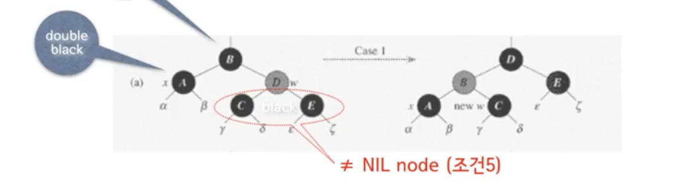
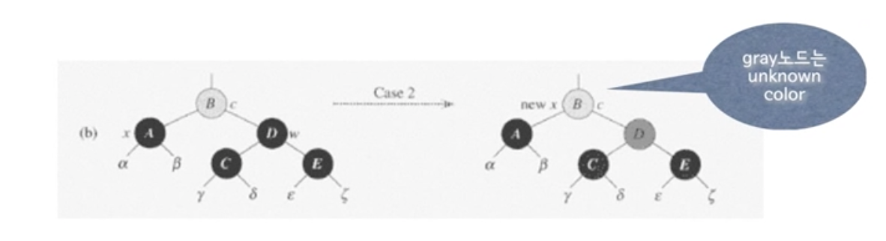
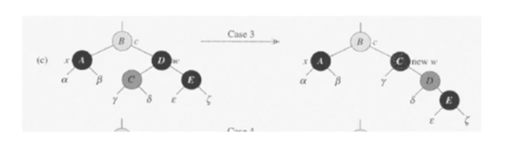
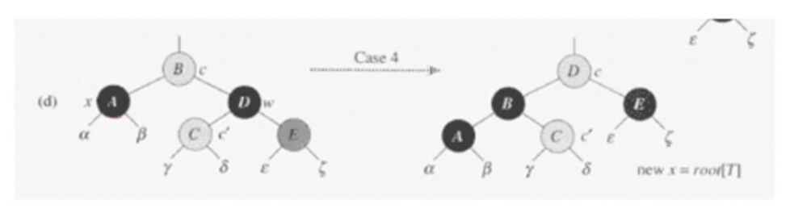
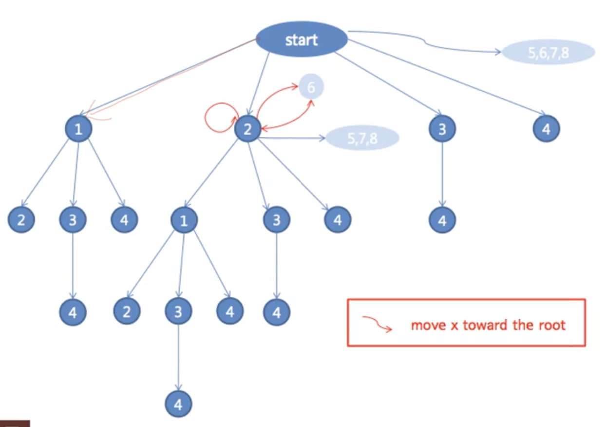

# #11-3 Red-Black Tree (3)

**목차**

- [#11-3 Red-Black Tree (3)](#11-3-red-black-tree-3)
  - [`DELETE`](#delete)
    - [pseudo code](#pseudo-code)
  - [RB-DELETE-FIXUP(T, x)](#rb-delete-fixupt-x)
    - [경우 1: `w`가 `red`인 경우](#경우-1-w가-red인-경우)
    - [경우 2: `w`는 `black`, `w`의 자식들도 `black`](#경우-2-w는-black-w의-자식들도-black)
    - [경우 3: `w`는 `black`, `w`의 왼쪽 자식이 `red`](#경우-3-w는-black-w의-왼쪽-자식이-red)
    - [경우 4: `w`는 `black`, `w`의 오른쪽 자식이 `red`](#경우-4-w는-black-w의-오른쪽-자식이-red)
    - [경우 5, 6, 7, 8](#경우-5-6-7-8)
    - [RB-DELETE-FIXUP의 모든 경우의 수](#rb-delete-fixup의-모든-경우의-수)
    - [pseudo code](#pseudo-code-1)

## `DELETE`

- 보통의 **BST**에서처럼 `DELETE` 한다.
- 실제로 삭제된 노드 `y`가 `red` 노드였으면 연산을 종료한다.
- `y`가 `black` 노드였을 경우 **RB-DELETE-FIXUP** 연산을 진행한다.

### pseudo code

```
RB-DELETE(T, z)
  if left[z] == nil[T] or right[z] == nil[T]
    then y <- z
    else y <- TREE-SUCCESSOR(z)
  if left[y] != nil[T]
    then x <- left[y]
    else x <- right[y]
  p[x] <- p[y]
  if p[y] == nil[T]
    then root[T] <- x
    else if y == left[p[y]]
      then left[p[y]] <- x
      else right[p[y]] <- x
  if y != z
    then key[z] <- key[y]
      copy y's satelite data into z
  if color[y] = BLACK
    then RB-DELETE-FIXUP(T, x)
  return y
```

- 실제로 이러한 연산을 구현할 때 삭제할 `key`가 주어질 텐데 해당 `key`를 가지고 있는 노드의 위치를 모르기 때문에 `key`를 가진 노드를 찾는 `SEARCH` 연산이 선행되어야 한다.
- `left[z] == nil[T] or right[z] == nil[T]`: 왼쪽 자식 또는 오른쪽 자식이 없는 경우 그것도 아니라면 둘 다 없는 경우를 뜻한다.
  - 자식 노드가 0 ~ 1개인 경우 해당 노드를 삭제한다.
  - 자식 노드가 2개인 경우 `successor`를 찾는다.
- `left[y] != nil[T]`: `y`가 자식 노드를 보유하고 있는 경우 (`y`는 최대 1개의 자식 노드를 보유할 수 있다)
- `p[x] <- p[y]`: `y`를 삭제할 것이기 때문에 `x`의 부모 노드를 `y`의 부모 노드로 명시
- `p[y] == nil[T]`: `y`가 루트 노드인 경우
  - `then root[T] <- x`: `y`가 루트 노드였다면 `x`가 그 자리를 채우기 때문에 루트 노드가 되어야 한다.
- `y == left[p[y]]`: `y`가 부모 노드의 왼쪽 자식인지 오른쪽 자식인지 확인
- `y != z`: `successor`를 삭제한 경우

**여기까지는 `SEARCH` 연산이다.**

- 삭제할 노드가 `red` 노드라면 해당 노드를 삭제한다고 **Red-Black Tree** 조건이 어긋나지 않는다. 따라서, `red` 노드를 삭제하는 경우라면 그냥 삭제하면 되고 `**black` 노드를 삭제하는 경우만 추가적인 연산을 진행하면 된다.\*\*
- 삭제할 노드가 `black` 노드였다면 여러 문제가 생길 수 있다.
  - 해당 노드가 루트 노드라면 루트 노드는 `black` 노드여야 한다는 조건이 어긋나므로 이를 다시 맞추는 작업이 필요하다.
  - 또는 삭제하고 나니 **Red-Red Vioration**을 맞이할 수도 있다.
  - 제일 안좋은 상황은 `black` 노드를 삭제함으로써 `bh`에서 차이가 발생할 때이다.
    - 삭제한 노드의 자식 노드가 `black` 노드라거나
    - 삭제한 노드의 자식 노드가 없는 경우, 즉 `NIL` 노드인 경우
    - 자식 노드가 `red` 노드라면 해당 노드를 `black` 노드로 변경하면 되기에 큰 문제가 없다.

## RB-DELETE-FIXUP(T, x)

> `x`가 `NIL` 노드가 될 수 있다는 것을 기억해야 한다.

`DELETE` 연산을 함으로써 어긋날 수 있는 **Red-Black Tree**의 조건들을 살펴보자.

1. 영향이 없다.
2. `y`가 루트 노드였고 `x`가 `red` 노드인 경우 문제가 된다.
3. 영향이 없다.
4. `p[y]`와 `x`가 모두 `red` 노드인 경우 문제가 된다.
5. 원래 `y`를 포함했던 모든 경로는 이제 `black` 노드가 하나가 되므로 `black` 노드의 수가 하나 부족해진다(`bh` 차이가 발생한다).
   1. 노드 `x`에 "**extra black**" 노드를 부여해서 일단 조건 5를 만족시킨다.
   2. 노드 `x`는 "**double black**" 혹은 "**red & black**" 상태가 된다

이대로 놔두는 것이 아니라 이제 이 상황을 해결한다.

- 아이디어
  - **extra black**을 트리의 위쪽으로 올려보낸다.
  - `x`가 **red & black** 상태가 되면 그냥 `black` 노드로 만들고 끝낸다(기존에 `red`였던 노드를 `black`으로 만드는 작업).
  - 위로 올라가는데 `black` 노드만 만난다면 최악의 경우 루트 노드까지 올라간다. 이때, `x`가 루트 노드가 되면 그냥 **extra black**을 제거한다.
- **Loop Invariant**
  - `x`는 루트 노드가 아닌 **double black** 노드라고 할 때 `w`를 `x`의 형제 노드라고 한다.
  - 이때, `w`는 `NIL` 노드가 될 수 없다(`NIL` 노드일 경우 `x`의 부모 노드에 대해 의 차이가 발생하여 조건 5가 위반되기 때문이다).

### 경우 1: `w`가 `red`인 경우



- `w`의 자식 노드들은 `black` 노드이며 `NIL` 노드일 수 없다(`NIL` 노드일 경우 `bh` 차이 발생).
- `w`를 `black` 노드로, `p[x]`를 `red` 노드로 만든다.
- `p[x]`에 대해서 **Left Rotation**을 적용한다.
- `x`의 새로운 형제 노드는 원래 `w`의 자식 노드(위 그림에서는 `c` 노드)로 변경된다. 원래 `w`의 자식 노드들은 `black` 노드였으므로 새로운 형제 노드는 `black` 노드다.
- 위 과정을 거치고 나면 경우 2, 3 혹은 4에 해당이 된다.

### 경우 2: `w`는 `black`, `w`의 자식들도 `black`



- 경우 2에서 `x`의 부모 노드의 색깔은 알 수 없다. 즉, `red` 일 수도 `black` 일 수도 있다.
- `x`에게서 **extra black**을 뺏고 `w`를 `red` 노드로 바꾼다.
  - 양 쪽에서 `black`이 하나 씩 사라졌기 때문에 결국 경로 상에 존재하는 `black` 노드의 수는 같다.
- `p[x]`에게 `x`에게서 뺏은 **extra black**을 준다.
- 만약 `p[x]`가 `red` 노드였다면 **red & black** 상태가 되므로 `red` 노드를 뺏은 다음 종료한다.
- 만약 `p[x]`가 `black` 노드였다면 `p[x]`를 새로운 `x`로 해서 작업을 반복한다.
- 만약 **경우 1**에서 **경우 2**에 도달했다면 `p[x]`는 `red` 였기에 새로운 `x`는 **red & black**이 되므로 `red`를 뺏고 연산이 종료된다.

### 경우 3: `w`는 `black`, `w`의 왼쪽 자식이 `red`



- `w`를 `red`로 만들고 `w`의 왼쪽 자식을 `black`으로 만든다.
- `w`에 대해서 **Right Rotation**을 적용한다.
- `x`의 새로운 형제 `w`는 오른쪽 자식이 `red`이며 이는 **경우 4**에 해당된다.

### 경우 4: `w`는 `black`, `w`의 오른쪽 자식이 `red`



- `w`의 색을 현재 `p[x]`의 색으로 변경한다. 이때 `p[x]`의 색은 `red`일 수도 있고 `black`일 수도 있다.
- `w`의 왼쪽 자식 또한 `red`일 수도 있고 `black`일 수도 있다.
- `p[x]`를 `black`으로 만들고 `w`의 오른쪽 자식을 `black`으로 만든다.
- `p[x]`에 대해서 **Left Rotation**을 적용한다.
- `x`의 **extra black**을 제거하고 종료한다(`x`의 부모 노드에 `black` 노드가 추가됐기 때문에 **extra black**을 제거해도 경로 상의 `black` 노드의 개수는 동일하다).

### 경우 5, 6, 7, 8

- 경우 1, 2, 3, 4는 `x`가 부모 노드의 왼쪽 자식인 경우다.
- 경우 5, 6, 7, 8은 `x`가 부모 노드의 오른쪽 자식인 경우이며 경우 1, 2, 3, 4와 각각 대칭적이다.

### RB-DELETE-FIXUP의 모든 경우의 수



- Case 5, 6, 7 , 8은 Case 1, 2, 3, 4에 대칭이다.

### pseudo code

```
RB-DELETE-FIXUP(T, x)
  while x != root[T] and color[x] == BLACK
    do if x == left[p[x]]
      then w <- right[p[x]]
        if color[w] == RED
          then color[w] <- BLACK                    // Case 1
               color[p[x]] <- RED                   // Case 1
               LEFT-ROTATE(T, p[x])                 // Case 1
               w <- right[p[x]]                     // Case 1
        if color[left[w]] == BLACK and color[right[w]] == BLACK
          then color[w] <- RED                      // Case 2
               x <- p[x]                            // Case 2
          else if color[right[w]] == BLACK
            then color [left[w]] <- BLACK           // Case 3
                 color[w] <- RED                    // Case 3
                 RIGHT-ROTATE(T, w)                 // Case 3
                 w <- right[p[x]]                   // Case 3
            color[w] <- color[p[x]]                 // Case 4
            color[p[x]] <- BLACK                    // Case 4
            color[right[w]] <- BLACK                // Case 4
            LEFT-ROTATE(T, p[x])                    // Case 4
            x <- root[T]                            // Case 4
      else (same as then clause with "right" and "left" exchanged)
  color[x] <- BLACK
```

- `x != root[T] and color[x] == BLACK`: `x`가 루트 노드가 아닐 경우
  - `x`가 루트 노드인 경우엔 `x`의 색을 `black`으로 변경하면 끝난다.
- `w <- right[p[x]]`: 형제 노드를 `w`라고 명시
- `x <- root[T]`: **Case 4**를 완료했다면 `while` 문을 빠져나가야 하기 때문에 루트 노드의 값을 `x`에 할당한다. 루트 노드의 값을 `x`로 바꾸는 것이 아닌 `x`를 루트 노드의 값으로 바꾸는 것이기 때문에 실제 트리에는 전혀 영향을 주지 않고 반복문만 탈출하게 된다.
- **BST**에서의 `DELETE` 연산 시간복잡도는 `O(logn)`이다.
- **RB-DELETE-FIXUP**의 시간복잡도는 `O(logn)`이다.
  - **Case 2**를 제외하면 2단계 정도 이내로 연산이 종료된다.
  - 제일 시간이 많이 소요되는 경우는 **Case 2**인데 아무리 많이 시간이 걸리더라도 루트 노드까지 올라가면 끝이 난다.
