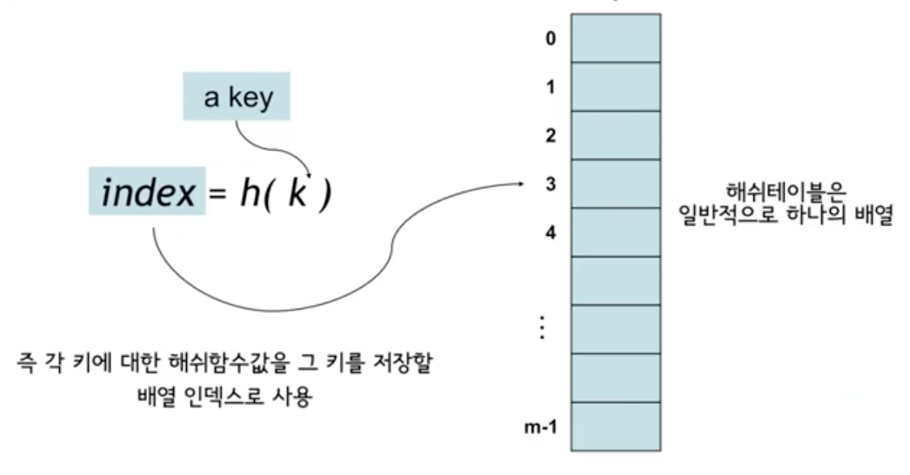
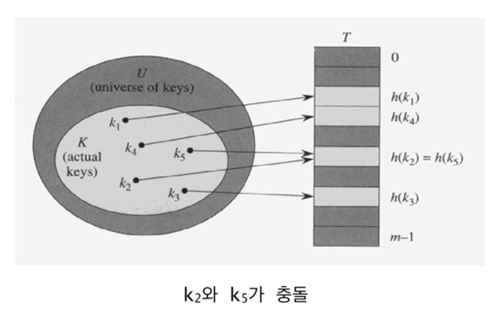
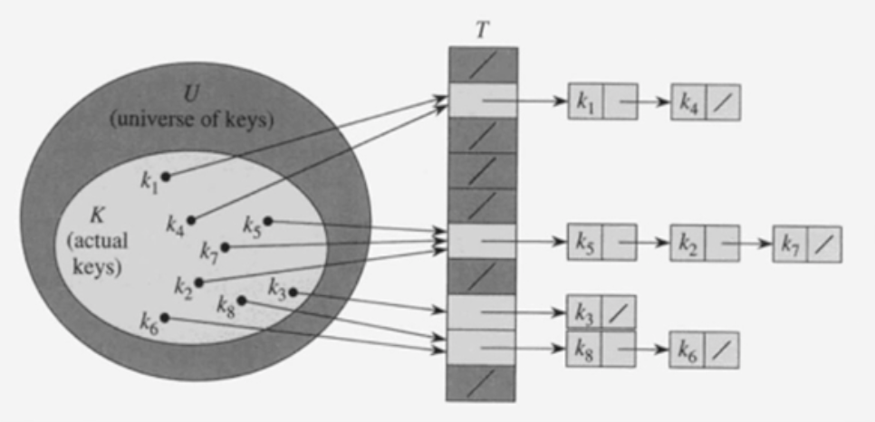

# #12-1 해싱 (1)

**목차**

- [#12-1 해싱 (1)](#12-1-해싱-1)
  - [Hash Table](#hash-table)
    - [개념](#개념)
    - [해시 함수의 예시](#해시-함수의-예시)
    - [충돌(collision)](#충돌collision)
  - [Chaining에 의한 충돌 해결](#chaining에-의한-충돌-해결)
    - [키의 삽입 (Insertion)](#키의-삽입-insertion)
    - [키의 검색 (Search)](#키의-검색-search)
    - [키의 삭제 (Deletion)](#키의-삭제-deletion)
    - [최악의 경우](#최악의-경우)
    - [SUHA (Simple Uniform Hashing Assumption)](#suha-simple-uniform-hashing-assumption)

## Hash Table

**해시 테이블**(**Hash Table**)은 **dynamic set**을 구현하는 효과적인 방법 중 하나다.

- 적절한 가정하에서 평균 `SEARCH`, `INSERT`, `DELETE` 연산의 시간복잡도는 `O(1)`이다.
- 보통 최악의 경우 `O(n)`의 시간복잡도를 가진다.

### 개념

- 해시 함수 `h`를 사용하여 키 `k`를 구하고 이를 이용하여 `T[h(k)]`에 저장한다.
  - `h`: `{ 0, 1, … m-1 }`, 여기서 `m`은 테이블의 크기를 뜻한다.
  - 키 `k`가 `h(k)`로 해싱되었다고 말한다.

### 해시 함수의 예시

- 모든 키들을 자연수라고 가정한다(어떤 데이터든지 자연수로 해석하는 것이 가능하다).
- `h(k) = k % m`: `key`를 하나의 자연수로 해석한 후 테이블의 크기 `m`으로 나눈 나머지
- 항상 `0 ~ m-1` 사이의 정수가 된다.

물론 위와 같은 해시 함수는 정말 간단한 예일 뿐이고 실제로 해시 테이블의 키 값을 구하는 용도로 사용하진 못한다.

### 충돌(collision)

- **두 개 이상의 키가 동일한 위치로 해싱되는 경우**
  즉, 서로 다른 두 키 `k1`과 `k2`에 대해서 `h(k1) = h(k2)`인 상황을 말한다.
- 일반적으로 `|U| >> m` 이므로 항상 충돌이 발생할 가능성이 있다.
  - 충돌이 발생하지 않으려면 만들 수 있는 키의 수보다 해시 테이블의 크기가 커야 한다.
  - 하지만 이것은 이론적으로는 쉬워보일지 몰라도 현실성이 없는 이야기다.
- 따라서, 충돌의 발생 가능성을 아예 제거하는 것은 현실적으로 불가능하기 때문에 발생한다는 가정하에 이에 대한 대처 방법이 필요하다.
  - 대표적인 두 가지 충돌 해결 방법으로 **chaining**과 **open addressing**이 있다.

## Chaining에 의한 충돌 해결

동일한 장소로 해싱된 모든 키들을 **하나의 연결 리스트**로 저장하는 방법

### 키의 삽입 (Insertion)

- 키 `k`를 리스트 `T[h(k)]`의 맨 앞에 삽입한다.
  - 시간복잡도는 `O(1)`이다.
- 중복된 키가 들어올 수 있고 **중복 저장이 허용되지 않는다면** 삽입 시 리스트를 검색해야 한다.
  - 따라서, 시간 복잡도는 **리스트의 길이에 비례**한다.

### 키의 검색 (Search)

- 리스트 `T[h(k)]`에서 **순차적으로 검색**한다.
- 시간복잡도는 키가 저장된 **리스트의 길이에 비례**한다.

### 키의 삭제 (Deletion)

- 리스트 `T[h(k)]`로 부터 키를 **검색 후 삭제**한다.
- 일단 키를 검색해서 찾은 후에는 `O(1)` 시간에 삭제가 가능하다.

### 최악의 경우

- 모든 키가 **하나의 슬롯**으로 해싱되는 경우이다.
- 길이가 `n`인 하나의 연결 리스트가 만들어 진다.
- 따라서, 시간복잡도는 `O(n) + 해시함수 계산시간`이 된다.
- 이런 최악의 경우는 해시 함수의 문제라기 보다는 해시 함수로 만들어지는 키의 집합과 해시 테이블과 크기 관계상 발생할 수 밖에 없다고 보면 된다.

  즉, 해싱을 하는 한 크기 관계에 따라서 필연적인 일이라고 볼 수 있다. 그렇기에 보통 최악의 경우에 대해서 이야기하기 보다는 평균 시간복잡도에 대해서 이야기한다.

**평균 시간복잡도는 키들이 여러 슬롯에 얼마나 잘 분배되느냐에 의해서 결정된다.**

### SUHA (Simple Uniform Hashing Assumption)

- 각각의 키가 모든 슬롯들에 균등한 확률로 독립적으로 해싱된다고 가정한다.
  - 성능 분석을 위해서 주로 하는 가정이다.
  - 해시 함수는 **deterministic** 하므로 현실에서 위 가정은 실현 불가능하다.
    - 즉, 해시 함수는 랜덤 함수가 아니라는 뜻이다. 랜덤 함수일 수가 없는 것이 랜덤 함수라면 결과값이 매번 다르게 나와서 동일한 입력에 다른 결과값이 나오게 된다.
    - 여담으로 랜덤한 해싱 값을 만들어 내기 위한 **universal hashing**이라는 주제도 있다.
- **Load factor** `ɑ` = `n/m`:
  - `n`: 테이블에 저장될 키의 개수
  - `m`: 해시 테이블의 크기, 즉 연결 리스트의 개수
  - 각 슬롯에 저장된 키의 평균 개수
- 연결리스트 `T[j]`의 길이를 `nj`라고 하면 `E[nj] = ɑ`
- 만약 `n = O(m)`이면 평균 검색 시간복잡도는 `O(1)`이다.
