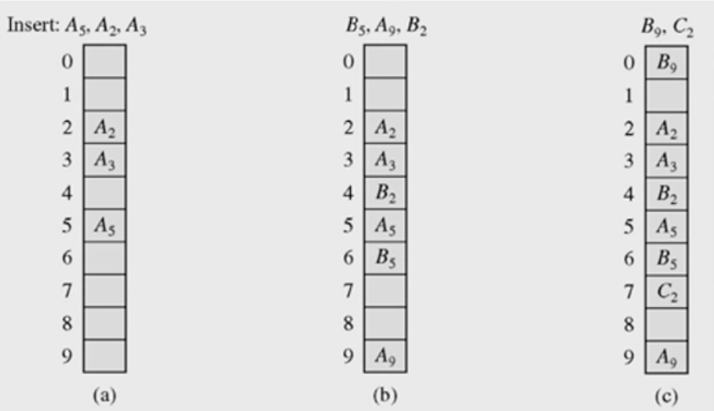
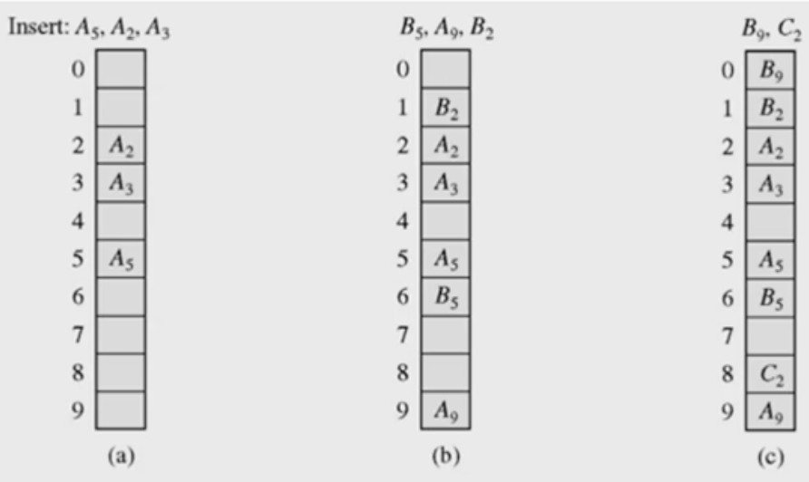
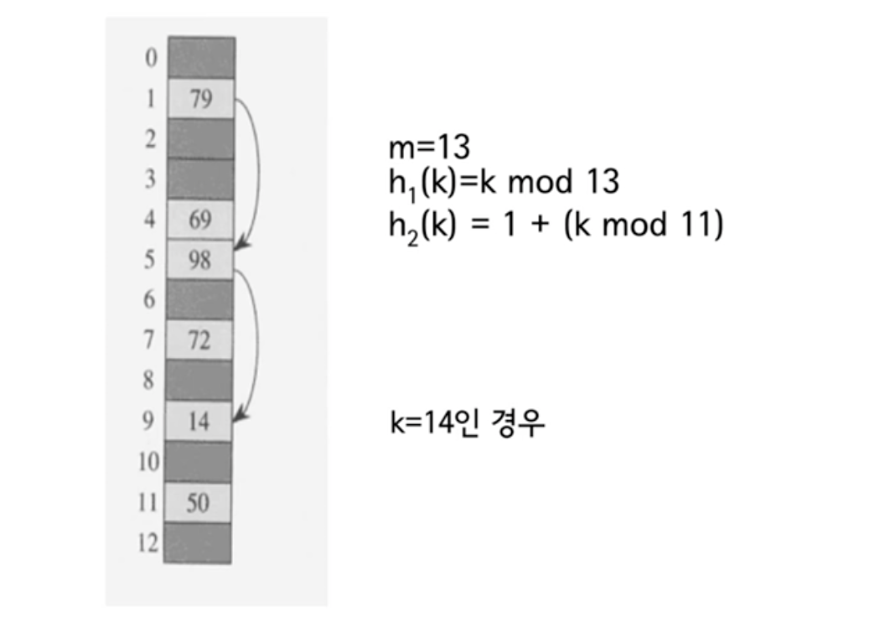
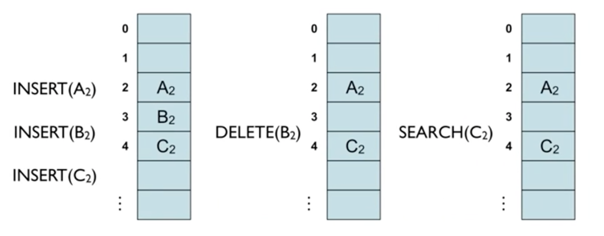

# #12-2 해싱 (2)

**목차**

- [#12-2 해싱 (2)](#12-2-해싱-2)
  - [Open Addressing에 의한 충돌 해결](#open-addressing에-의한-충돌-해결)
  - [Open Addressing - Linear Probing](#open-addressing---linear-probing)
    - [단점](#단점)
    - [Quadratic Probing](#quadratic-probing)
    - [Double Hashing](#double-hashing)
  - [Open Adrdressing - Quadratic Probing](#open-adrdressing---quadratic-probing)
  - [Open Addressing - Double Hashing](#open-addressing---double-hashing)
  - [Open Adrdressing - 키의 삭제](#open-adrdressing---키의-삭제)

## Open Addressing에 의한 충돌 해결

- 모든 키를 해시 테이블 자체에 저장한다.
- 테이블의 각 칸(`slot`)에는 1개의 키만 저장한다.
  - 1개의 키만 저장한다는 말은 원래 저장될 장소가 아니라 다른 공간에 저장된다는 뜻이 된다.
- **충돌 해결 기법**에는 여러 가지 방법이 있지만 여기선 다음과 같은 기법들에 대해 알아본다.
  - **Linear Probing**
  - **Quadratic Probing**
  - **Double Hashing**

## Open Addressing - Linear Probing

`h(k)`, `h(k) + 1`, `h(k) + 2`, `…` 순서(연속된 순서)로 검사하여 처음으로 만나는 빈 슬롯에 저장한다. 테이블의 끝에 도달하면 다시 처음으로(첫 슬롯으로) `circular` 하게 돌아간다.

### 단점

- **primary cluster**: 키에 의해서 채워진 **연속된 슬롯**들을 의미
  - 키가 골고루 퍼져 있는 것이 아닌 한 곳에 뭉쳐있는 경우
  - 이런 `cluster`가 생성되면 이 `cluster`는 점점 더 커지는 경향이 생긴다.
  - 이 `cluster`가 커지면서 생기는 문제점은 `cluster`로 인하여 빈 슬롯을 찾는 연산이 `cluster`의 길이에 비례하게 되버린 다는 것이다.

따라서, 이러한 충돌을 줄이기 위한 많은 연구들이 있다. 다음은 충돌 횟수를 줄이기 위한 간단한 방식들이다.

### Quadratic Probing

충돌 발생시 `h(k)`, `h(k) + 1^2`, `h(k) + 2^2`, `h(k) + 3^2`, `…` 순서로 시도하는 방법

### Double Hashing

서로 다른 두 해시 함수 `h1`과 `h2`를 이용하여 `h(k, i) = (h1(k) + i * h2(k)) mod m`

## Open Adrdressing - Quadratic Probing

앞서 설명했듯이 충돌 발생시 `h(k)`, `h(k) + 1^2`, `h(k) + 2^2`, `h(k) + 3^2`, `…` 순서로 시도하는 방법이다.

## Open Addressing - Double Hashing

위 이미지와 같이 **Double Hashing**은 2가지 해시 함수가 준비되어 있다.

단, 2번째 해시 함수는 0이 되면 안되므로 1을 더해주고 있다.

**Quadratic Probing**과의 가장 큰 차이점은 키 값에 따라서 `Offset`이 계속 변경된다는 점이다. **Quadratic Probing**은 키 값이 무엇이든 간에 `Offset`은 계속 동일하다.

## Open Adrdressing - 키의 삭제

- 단순히 키를 삭제할 경우 문제가 발생한다.
  - 가령 `A2`, `B2`, `C2`가 순서대로 모두 동일한 해시 함수값(위 이미지의 경우 2인 상황)을 가져서 **Linear Probing**으로 출동을 해결했다고 해보자.
  - 이런 상황에서 `B2`를 삭제한 후 `C2`를 검색할 경우 문제가 발생한다.
    - `C2`를 찾기 위해 키가 2인 곳을 살펴봤다가 `A2`인 것을 확인하고 **Linear Probing**에 의해 다음 키로 넘어갔는데 `B2`를 삭제했기 때문에 해당 키는 비어있다.
    - 따라서, `C2`는 없다. 라고 결론이 내려진다.
- 키를 삭제하고 나서 해당 키에 키가 삭제된 적이 있다는 표시를 남길 수도 있지만 이는 곧 효력을 상실한다.
  - **Dynamic Set**인 이상 키가 동적으로 활발히 삽입된다는 뜻인데 초반에는 효력이 있을지 몰라도 몇번 키가 삽입, 삭제되고 나면 모든 키가 이전에 삭제된 적이 있다는 표시로 가득차게 될 것이다.
  - 이렇게 되면 검색을 하긴 하는데 검색을 멈출 수 없다. 즉, 전체 키를 다 봐야한다는 말이다.
  - 전체 키를 다 보게 되면 이건 배열이나 다름이 없다. 해싱을 이용하는 의미가 없게 된다.
- 따라서, 단순히 삭제만 하는 것이 아니라 키를 삭제한 후에 동일한 해시 함수값을 가지는 값들의 위치를 재배치해야 한다.
