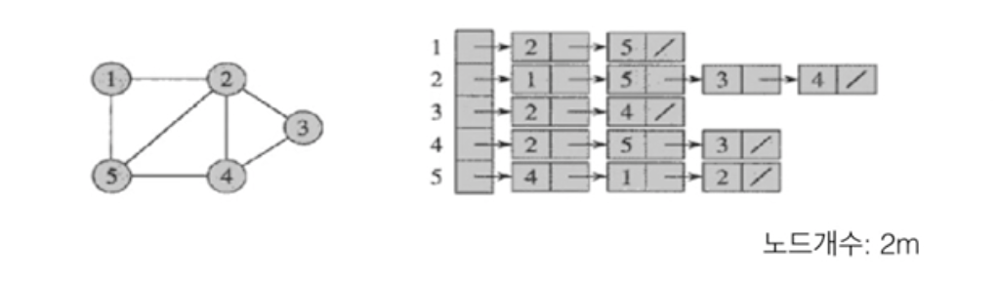

# #13-1 그래프

**목차**

- [#13-1 그래프](#13-1-그래프)
  - [개념과 표현](#개념과-표현)
    - [무방향 그래프](#무방향-그래프)
    - [방향 그래프와 가중치 그래프](#방향-그래프와-가중치-그래프)
  - [그래프의 표현](#그래프의-표현)
    - [인접 행렬 (adjacency matrix)](#인접-행렬-adjacency-matrix)
    - [인접 리스트 (adjacency list)](#인접-리스트-adjacency-list)
    - [방향 그래프인 경우](#방향-그래프인-경우)
    - [가중치 그래프의 인접 행렬 표현](#가중치-그래프의-인접-행렬-표현)
  - [경로와 연결성](#경로와-연결성)
    - [무방향 그래프](#무방향-그래프-1)

## 개념과 표현

### 무방향 그래프

그래프 `G` = `(V, E)`

- `V`: 노드(node) 혹은 정점(vertex)
- `E`: 노드쌍을 연결하는 엣지(edge) 혹은 링크(link)
- 개체(object)들 간의 이진 관계를 표현
- `n = |V|`, `m = |E|`

### 방향 그래프와 가중치 그래프

- **방향 그래프(Directed Graph)**
  - `G` = `(V, E)`
  - 엣지 `(u, v)`는 `u`로부터 `v`로의 방향을 가진다.
  - 무방향 그래프와는 다르게 자기 자신으로 가는 엣지가 존재할 수 있다고 보는 것이 보편적인 관습이다.
- **가중치(weighted) 그래프**
  - 엣지마다 가중치(weight)가 지정된다.
  - 노드에 가중치를 부여할 수도 있지만 엣지에 가중치를 부여한 가중치 그래프가 훨씬 활용도가 높기 때문에 보통 가중치 그래프라고 하는 것은 엣지에 가중치가 부여된 형태다.

## 그래프의 표현

### 인접 행렬 (adjacency matrix)

- 그래프를 2차원 배열로 표현
- 저장 공간: `O(n^2)`
- **어떤 노드 `v`에 인접한 모든 노드를 찾는데** 걸리는 시간복잡도: `O(n)`
  - 인접한 모든 노드를 알고 싶다면 2차원 배열의 한 행을 다 읽어볼 수 밖에 없다.
- **어떤 엣지 `(u, v)`가 존재하는지** 검사하는데 걸리는 시간복잡도: `O(1)`
  - 2차원 배열의 한 요소만 보면 된다.

### 인접 리스트 (adjacency list)

- 정점 집합을 표현하는 하나의 배열과 각 정점마다 인접한 정점들의 연결 리스트
- 저장 공간: `O(n+m)`
  - 실질적으로는 `O(n+2m)`이지만 시간복잡도 상에서 큰 의미는 없다.
  - 인접한 두 노드의 연결 리스트에 요소가 1개 씩 추가되므로 총 `2m`개가 된다.
- **어떤 노드 `v`에 인접한 모든 노드를 찾는데** 걸리는 시간복잡도: `O(degree(v))`
  - `degree(v)`이 최악의 경우 `n-1`(한 노드에 모든 노드가 연결되어 있는 경우)가 될 수 있지만 평균적으로는 그렇지 않다. 따라서, 이 부분에서는 인접 행렬보다 시간복잡도가 유리하다.
- **어떤 엣지 `(u, v)`가 존재하는지** 검사하는데 걸리는 시간복잡도: `O(degree(u))`
  - 여기선 인접 행렬보다 오래 걸릴 수 밖에 없는 것이 해당 노드의 연결 리스트를 전부 살펴봐야만 특정 엣지가 존재하는지 알 수 있기 때문이다.

### 방향 그래프인 경우

- **인접 행렬은 비대칭이 된다.**
  - 예를 들어, 1에서 2로 가는 엣지가 있다면 2에서 1로 가는 엣지는 없기 때문에 비대칭이 된다.
- **인접 리스트는 `m`개의 노드를 가진다.**
  - 인접 리스트도 동일하다. 1에서 2로 가는 엣지가 있다면 2에서 1로 가는 엣지는 없기 때문에 `2m`개가 아니라 `m`개가 된다.

### 가중치 그래프의 인접 행렬 표현

- 핵심은 엣지가 존재하는가 존재하지 않는가를 구분해서 표현하는 것이지 이를 표현하는데 1과 0을 써야만 하는 것은 아니다.
- 엣지의 존재를 나타내는 값으로 1 대신 엣지의 가중치를 저장한다.
- 엣지가 없을 때 혹은 대각선인 경우
  - 특별히 정해진 규칙은 없으며, **그래프와 가중치가 의미하는 바에 따라서 다르다.**
  - 예시 1
    - 가중치가 거리 혹은 비용을 의미하는 경우라면 엣지가 없으면 무한대, 대각은 0이다.
  - 예시 2
    - 만약 가중치가 용량을 의미한다면 엣지가 없을 때 0, 대각선은 무한대다.

## 경로와 연결성

### 무방향 그래프

- `G = (V, E)`에서 노드 `u`와 노드 `v`를 연결하는 경로(path)가 존재할 때 `v`와 `u`는 서로 **연결되어** 있다고 말한다.
  - 인접은 말 그대로 하나의 엣지를 두고 두 노드가 바로 이어져 있다는 뜻이고 여기서 연결이라는 뜻은 하나의 노드에서 또 다른 하나의 노드를 엣지를 타고 갈 수 있다면 이 두 노드를 연결되어 있다고 표현한다.
- 모든 노드 쌍들이 서로 연결된 그래프를 **연결된 그래프**라고 한다.
- **연결 요소 (connected component)**

  

  위 이미지와 같이 끊김없이 노드끼리 연결되어 있는 그래프를 **연결된 그래프** 또는 **연결 요소**라고 표현한다.
