# #13-2 그래프에서의 BFS

**목차**

- [#13-2 그래프에서의 BFS](#13-2-그래프에서의-bfs)
  - [그래프 순회 (Graph Traversal)](#그래프-순회-graph-traversal)
  - [너비우선순회 (BFS)](#너비우선순회-bfs)
    - [큐를 이용한 너비우선순회](#큐를-이용한-너비우선순회)
    - [pseudo code](#pseudo-code)
    - [BFS와 최단경로](#bfs와-최단경로)
    - [pseudo code (최단 경로의 길이 계산을 추가한 버전)](#pseudo-code-최단-경로의-길이-계산을-추가한-버전)
    - [pseudo code (방문 여부 판단하는 로직 추가한 버전)](#pseudo-code-방문-여부-판단하는-로직-추가한-버전)
    - [그래프를 BFS 가지고 계산한 예시](#그래프를-bfs-가지고-계산한-예시)
    - [BFS 트리](#bfs-트리)
    - [BFS 트리의 예시](#bfs-트리의-예시)
  - [너비우선순회: 최단 경로 출력하기](#너비우선순회-최단-경로-출력하기)
  - [예외 케이스](#예외-케이스)

## 그래프 순회 (Graph Traversal)

- 순회 (traversal)
  - 그래프의 **모든 노드**들을 방문하는 일
- 대표적으로 두 가지 방법이 존재한다.
  - BFS (Breadth-First Search, 너비우선순회)
  - DFS (Depth-First Search, 깊이우선순회)

## 너비우선순회 (BFS)

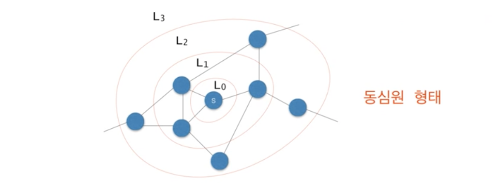

**BFS** 알고리즘은 다음 순서로 노드들을 방문한다.

- `L(0)` = `{s}`, 여기서 `s`는 출발 노드
- `L(1)` = `L(0)`의 모든 이웃 노드들 (이웃 노드 = 엣지로 연결되어 있는 노드)
- `L(2)` = `L(1)`의 이웃 노드들 중 `L(0)`에 속하지 않는 노드들
- …
- `L(i)` = `L(i-1)`의 이웃들 중 `L(i-2)`에 속하지 않는 노드들

### 큐를 이용한 너비우선순회

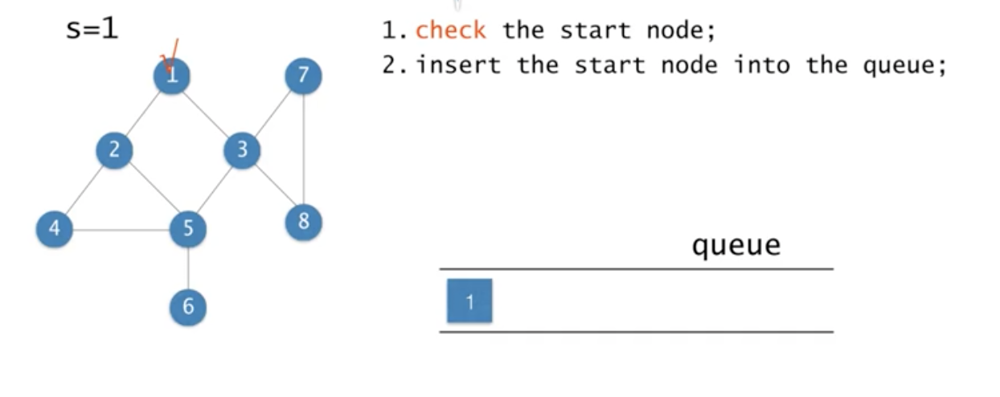

여기서 **체크(check)**란, 이미 방문한 노드라는 표시이다.

노드 하나(위에선 1번 노드)를 방문하고 해당 노드를 방문했다는 표시를 남긴다. 위 이미지에서도 나왔듯이 방문했다는 표시를 큐에 해당 노드의 값을 넣는 것으로 대신한다.

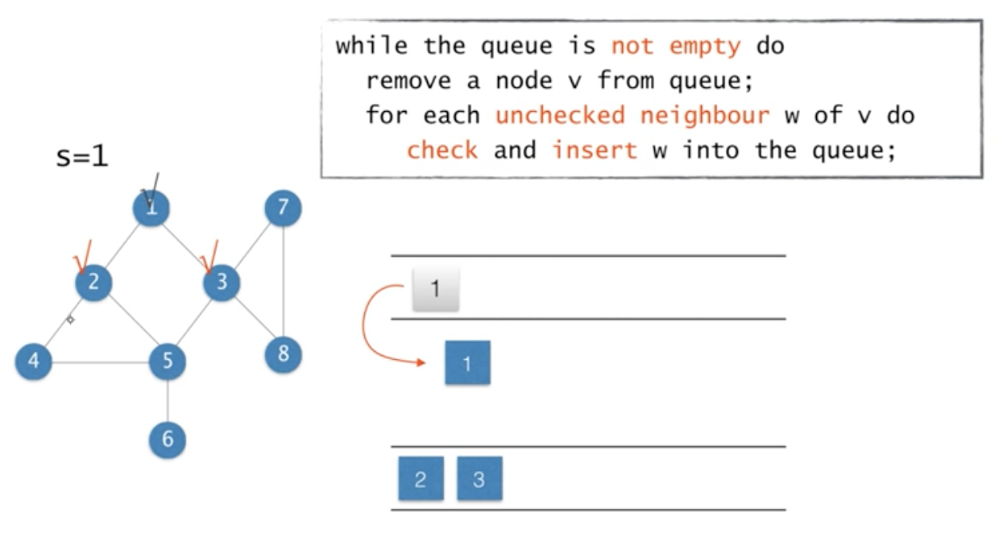

그 다음엔 이전 작업을 반복한다. 큐가 비어있지 않다면 큐에서 노드 하나(큐에서 맨 앞 요소)를 꺼내 해당 노드의 인접한 노드들 중 방문하지 않았던 노드들만 방문, 즉 큐에 넣는다.

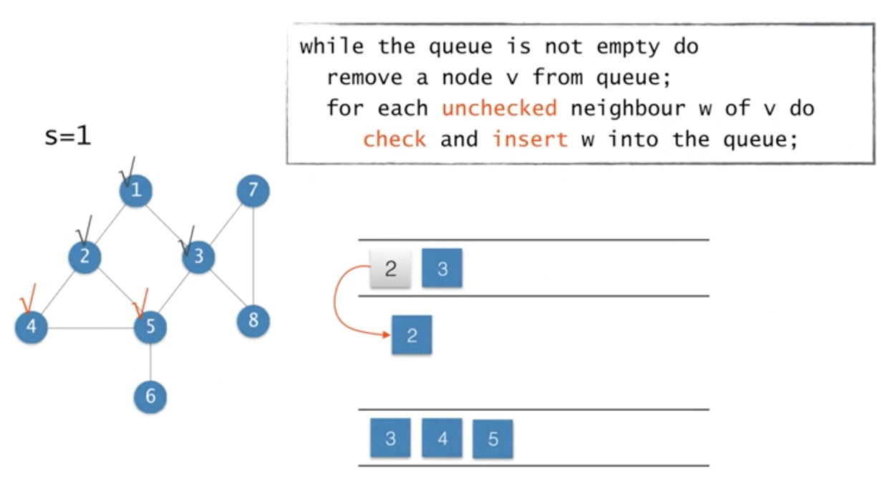

큐에 새로운 노드를 집어 넣었으니 큐는 비어있지 않다. 따라서, 이전 작업을 반복한다.

위 이미지와 같이 3, 4, 5번 노드를 큐에 넣을 예정인데 3번 노드는 이미 방문했던 노드이므로 해당 노드를 제외한 4, 5번 노드만 큐에 넣는다.

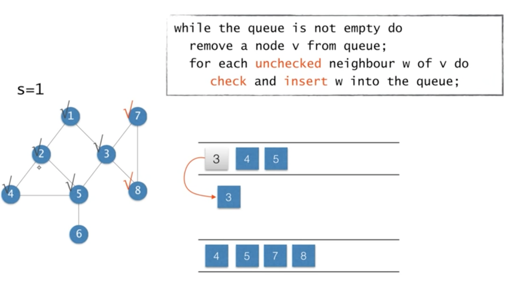

이 작업 역시 동일하다. 3번 노드를 큐에서 꺼내 3번 노드와 인접한 4, 5, 7, 8번을 큐에 넣으려고 할 때 방문했던 노드들인 4, 5번 노드는 제외한 7, 8번 노드만을 큐에 넣는다.

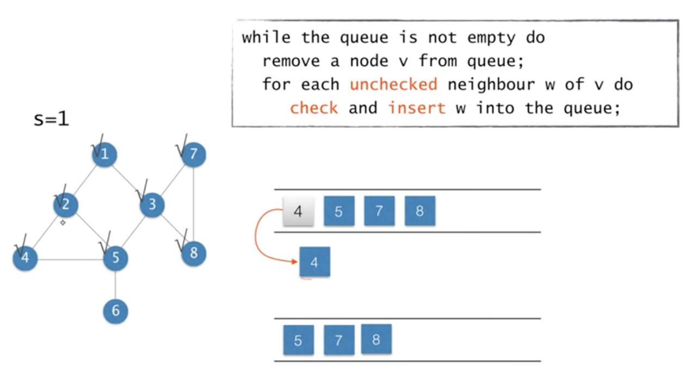

4번 노드가 인접한 노드들은 이미 전부 방문한 노드이므로 딱히 할 일이 없다.


5번 노드가 인접한 노드들 중 방문하지 않은 노드는 6번 노드 뿐이다. 따라서, 6번 노드를 큐에 넣고 다음 노드로 넘어간다.

이제 그래프의 모든 노드를 방문한 상태이기 때문에 큐에 남은 요소들을 별 다른 작업 없이 계속해서 꺼내기만 하고 넘어간다.

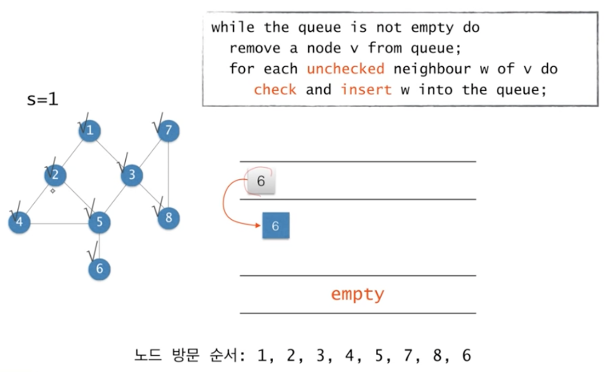

그러고 나면 큐에 더 이상 남은 노드가 없기 때문에 연산이 종료된다.

### pseudo code

```
BFS(G, s)
  Q <- empty;
  Enqueue(Q, s);
  while Q != empty do
    u <- Dequeue(Q)
    for each v adjacent to u do
      if v is unvisited then
        mark v as visited
        Enqueue(Q, v);
      end.
    end.
  end.
```

- `G`: 그래프
- `s`: 출발 노드
- `Enqueue`: 큐에 요소를 집어 넣는 연산
- `Dequeue`: 큐의 맨 앞 요소를 꺼내는 연산

### BFS와 최단경로

- `s`에서 `L(i)`에 속한 노드까지의 최단 경로의 길이는 `i`이다.
  - 여기서 경로의 길이는 경로에 속한 엣지의 개수를 의미한다.
- **BFS를 하면서 각 노드에 대해서 최단 경로의 길이를 구할 수 있다.**
  - `L(i)`면서 `L(i)` 보다 엣지의 수가 적은 노드가 있을 수도 있지 않을까? 싶지만 엣지의 수가 적었다면 동일한 `L(i)`에 속해있지 않았을 것이기 때문에 `L(i)`가 최단 경로가 된다.
  - 동심원 형태로 한번만에 갈 수 있는 노드를 모두 가는 형식이기 때문에 `s`에서 `L(i)`에 속한 노드까지의 최단 경로의 길이는 `i`이다.
- 입력: 방향 혹은 무방향 그래프 `G = (V, E)` 그리고 출발 노드 `S`
- 출력: 모든 노드 `v`에 대해서
  - `d[v]` = `s`로부터 `v`까지의 최단 경로의 길이(엣지의 개수)
  - `pi[v]` = `s`로부터 `v`까지의 최단 경로상에서 `v`의 직전 노드(`predecessor`)

### pseudo code (최단 경로의 길이 계산을 추가한 버전)

```
BFS(G, s)
  Q <- empty;
  d[s] <- 0;
  pi[s] <- null;
  Enqueue(Q, s);
  while Q != empty do
    u <- Dequeue(Q)
    for each v adjacent to u do
      if v is unvisited then
        mark v as visited;
        d[v] <- d[u] + 1;
        pi[v] <- u;
        Enqueue(Q, v);
      end.
    end.
  end.
```

- `d[s] <- 0`: 출발 노드부터 출발 노드까지 가지는 최단 경로의 길이는 0이다.
- `pi[s] <- null`: 최단 경로 상에서 출발 노드의 직전 노드는 없다.
- `d[v] <- d[u] + 1`: 큐에서 꺼낸 요소의 최단 경로의 길이에 1을 더한 값
- `pi[v] <- u`: `v`까지 가는 최단 경로상에서 `v`의 직전 노드는 `u`다.
- `if v is unvisited then`: 보통 모든 노드들에 대해서 `d[v]`를 `-1`로 초기화해두고, `-1`이면 `unvisited`, `-1`이 아니면 `visited`로 판단한다.

### pseudo code (방문 여부 판단하는 로직 추가한 버전)

```
BFS(G, s)
  Q <- empty;
  for each node u do
    d[u] <- -1;
    pi[u] <- null;
  end.
  d[s] <- 0;
  pi[s] <- null;
  Enqueue(Q, s);
  while Q != empty do
    u <- Dequeue(Q)
    for each v adjacent to u do
      if (d[v] == -1) then
        d[v] <- d[u] + 1;
        pi[v] <- u;
        Enqueue(Q, v);
    end.
  end.
```

- `while Q != empty do`: `while`문을 한 번 순회할 때마다 큐에서 요소를 하나 꺼내므로 `while`문은 최대 `n`번 돈다.
- `for each v adjacent to u do`: 인접 리스트로 구현할 경우 `for` 문은 각 노드 `v`에 대해서 `degree(v)`번 돈다.
  - `degree(v)`: 어떤 노드에 인접한 노드의 수
- `Enqueue(Q, v)`: `unchecked` 노드만 큐에 들어갈 수 있으므로 어떤 노드도 큐에 두번 들어가지는 않는다.
- **인접리스트로 구현할 경우** 시간복잡도는 다음과 같다.

  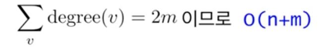

  - 이건 **무방향 그래프**가 가지고 있는 특성이다. 인접한 두 노드에 대해서 엣지가 각각 1개씩 측정되므로 결국 그래프의 모든 노드의 `degree` 합은 `2 x 엣지`의 수가 된다.
  - 이전에도 이야기했듯이 최악의 경우는 인접행렬과 같이 `O(n^2)`이 될 수가 있다(엣지의 개수가 엄청 많은 경우). 하지만 평균적으로 `O(n)`의 시간복잡도를 갖는다.

### 그래프를 BFS 가지고 계산한 예시

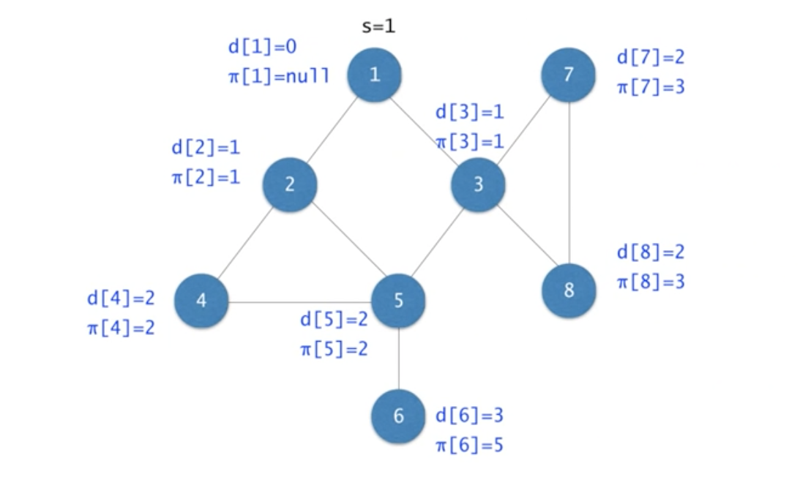

- 시작 노드(`s`)는 1번 노드이다.

### BFS 트리

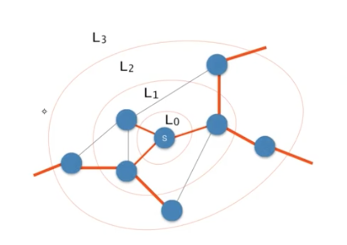

- **각 노드 `v`와 `pi[v]`를 연결하는 엣지들로 구성된 트리**
  - 여기서 `pi[v]`는 위에서도 말했듯이 노드 `v`의 직전 노드다.
- **BFS** 트리에서 `s`에서 `v`까지의 경로는 `s`에서 `v`까지 가는 최단 경로
- **어떤 엣지도 2개의 `layer`를 건너가지 않는다.**
  - 이건 **BFS**와는 조금 별개의 이야기인데 예를 들어, `L(0)`에서 `L(2)`로 바로 넘어가는 엣지는 존재하지 않는다는 말이다.
  - 즉, **동일 layer의 노드를 연결하거나 1개의 `layer`를 건너간다.**

### BFS 트리의 예시

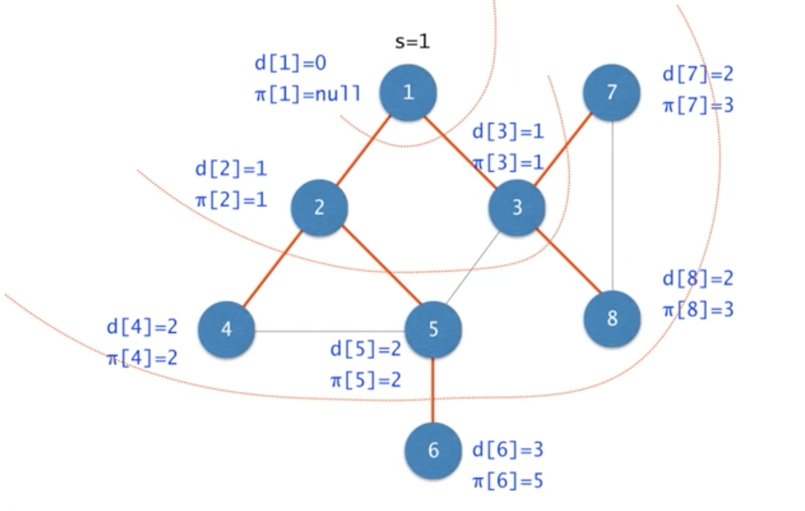

## 너비우선순회: 최단 경로 출력하기

출발점 `s`에서 노드 `v`까지의 경로 출력하기

```
PAINT-PATH(G, s, v)
  if v = s then
    print s;
  else if pi[v] = null then
    print "no path from s to v exists";
  else
    PRINT-PATH(G, s, pi[v]);
    print v;
end.
```

- 단, 모든 노드에 대해서 `pi[v]`를 계산해 뒀다는 가정하에 연산을 진행한다.
- `pi[v] = null`: `v`가 `s` 노드거나 애시당초 연결되지 않은 경로를 뜻한다.
- `PRINT-PATH(G, s, pi[v])`: 노드 `v`의 직전 경로 `pi(v)`를 출력한다.
  - 이 부분이 시작 노드까지 반복되고 마지막에 `v` 노드가 출력되는 식이다.

## 예외 케이스

- 그래프가 연결되어 있지 않거나 **방향 그래프**라면 **BFS**에 의해서 모든 노드가 방문되지 않을 수도 있다.
- **BFS**를 반복하여 모든 노드를 방문한다.

```
BFS-ALL(G) // 출발 노드는 상관없다.
{
  while there exists unvisited node v
    BFS(G, V);
}
```
