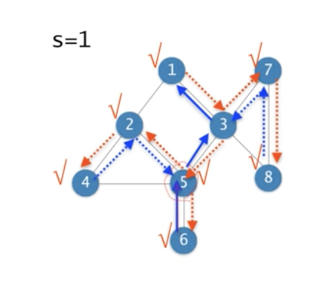

# #13-3 그래프에서의 DFS

## 깊이우선순회 (DFS)



1. 출발점 `s`에서 시작한다.
2. 현재 노드를 `visited`로 표시(mark)하고 인접한 노드들 중 `unvisited` 노드가 존재하면 그 노드로 간다.
3. 2번을 계속 반복한다.
4. 인접한 노드들 중 `unvisited` 노드가 존재하지 않는다면 계속해서 직전 노드로 되돌아간다.
5. 다시 2번을 반복한다.
6. 시작 노드 `s`로 돌아오고 더 이상 갈 곳이 없으면 종료한다.

### DFS pseudo code

```
DFS(G, v)
  visited[v] <- YES;
  for each node x adjacent to v do
    if visited[x] = NO then
      DFS(G, x);
    end.
  end.
```

- 그래프가 **disconnected** 이거나 혹은 **방향 그래프**라면 **DFS**에 의해서 모든 노드가 방문되지 않을 수도 있다.
- 따라서, **DFS**를 반복하여 모든 노드를 방문한다.

### DFS-ALL pseudo code

```
DFS-ALL(G)
  for each v of V
    visited[v] <- NO;
  for each v of V
    if (visited[v] == NO) then
      DFS(G, v);
```

- `if (visited[v] == NO) then`: **disconnected** 된 그래프를 포함하여 모든 노드들을 방문하여 방문하지 않은 노드가 있다면 해당 노드에서 **DFS**를 수행한다.
- 시간복잡도: `O(n+m)`
  - 방문 처리를 하기 때문에 한번 갔던 경로를 다시 가는 경우가 없다. 따라서, `Recursion`은 한번씩만 호출된다.
  - **BFS**와 동일하게 인접리스트로 표현할 경우 인접한 노드들을 한번씩 들르기 때문에 엣지의 개수에 비례한다.
  - 인접행렬일 경우도 동일하다. 인접행렬의 경우 어떤 노드끼리 인접하고 있는지 한번에 확인할 수 없기 때문에 모든 노드를 확인해야만 한다. 따라서, 인접행렬의 경우 시간복잡도는 `O(n^2)`이다.
