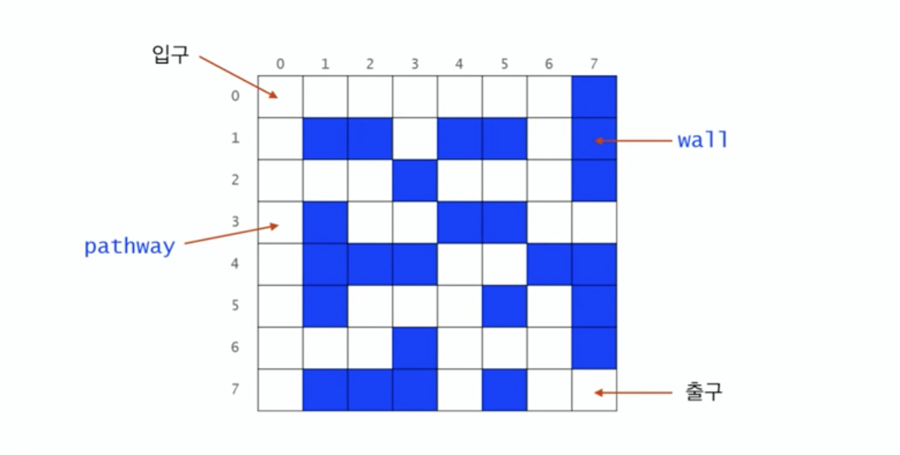
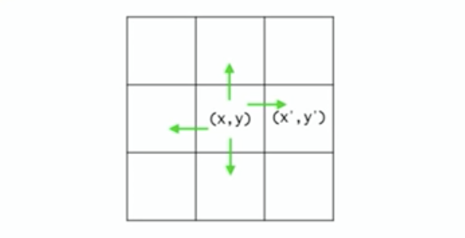

# Recursion의 응용 (1)

**목차**

- [Recursion의 응용 (1)](#recursion의-응용-1)
	- [미로 찾기](#미로-찾기)
		- [Recurisve Thinking](#recurisve-thinking)
		- [Decision Problem](#decision-problem)
		- [주의할 점](#주의할-점)
		- [개선](#개선)
	- [class Maze](#class-maze)
	- [`findMazePath`](#findmazepath)

## 미로 찾기



- `N x N` 크기의 미로이며 입구는 `(0, 0)`, 출구는 `(N-1, N-1)`이라고 가정
- 흰색은 지나갈 수 있는 공간
- 파란색은 벽으로 지나갈 수 없는 공간

### Recurisve Thinking

**현재 위치**에서 **출구**까지 가는 경로가 있으려면

1. 현재 위치가 출구인 경우
2. 이웃한 셀들 중 하나에서 **현재 위치를 다시 지나지 않고** 출구까지 가는 경로가 있는 경우

### Decision Problem

> 답이 `yes` or `no`인 문제를 보통 **Decision Problem**이라고 부른다.

위에 작성한 아이디어를 **pseudo code**로 작성해보자.



```
boolean findPath(x, y)
	if (x, y) is the exit
		return true;
	else
		for each neighbouring cell (x', y') of (x, y) do
			if (x', y') is on th pathway
				if findPath(x', y')
					return true;
		return false;
```

- 현재 위치가 출구인지 확인하고 출구라면 `true`를 반환한다.
- 나머지 경우
  - 현재 위치에서 인접한 셀(최대 4개)이 지나갈 수 있는 경우 (통로)
    - 이동한 좌표를 가지고 출구까지 갈 수 있는 경로가 있는지 다시 확인
  - 지나갈 수 없는 경우엔 아무것도 하지 않는다. (벽)
  - 인접한 셀을 모두 확인했음에도 `true`가 반환되지 않았다는 뜻은
    - 인접한 셀이 모두 벽인 경우
    - 인접할 셀을 지났지만 결국에는 출구까지 가는 경로를 찾을 수 없는 경우

### 주의할 점

이런 문제는 무한루프에 빠지기 쉬운 구조를 갖고 있다. 그렇기 때문에 **base case**를 빠트리진 않았는지 그리고 모든 **recursive case**가 **base case**로 수렴하는지 확인해야만 한다.

위 아이디어에는 문제점이 하나 있는데 인접한 셀로 이동해서 주변 셀들을 체크하고 나서 이동하기 전 셀로 다시 넘어갈 수도 있다. 즉, 인접한 셀끼리 서로 계속 이동하면서 무한루프에 빠질 수도 있다는 말이다. 따라서, 이러한 케이스를 방지해줘야 한다.

### 개선

위 아이디어를 다시 살펴보자. 이웃할 셀들 중 현재 위치를 다시 지나지 않고 출구까지 가는 경로를 찾기로 했기 때문에 이미 이동한 셀에 대해서는 고려할 필요가 없다.

이러한 점을 고려하여 **pseudo code**를 변경해보자.

```
boolean findPath(x, y)
	if (x, y) is the exit
		return true;
	else
		mark (x, y) as a visited cell;
		for each neighbouring cell (x', y') of (x, y) do
			if (x', y') is on th pathway and not visited
				if findPath(x', y')
					return true;
		return false;
```

위와 같이 `Recursion`을 특정 조건을 만족할 때만 호출하도록 만들 수도 있지만 우선 호출하고 따로 특정 조건을 만족하는지 체크하는 방법도 있다.

```
boolean findPath(x, y)
	if (x, y) is either on the wall or a visited cell
		return false;
	else if (x, y) is the exit
		return true;
	else
		mark (x, y) as a visited cell;
		for each neighbouring cell (x', y') of (x, y) do
			if findPath(x', y')
				return true;
		return false;
```

이렇게 작성하면 `Recursion`을 호출하는 횟수는 증가하지만 코드는 조금 더 간결해지는 효과가 있다.

## class Maze

```java
public class Maze {
	private static int N = 8;
	private static int [][] = maze = {
		{0, 0, 0, 0, 0, 0, 0, 1},
		{0, 1, 1, 0, 1, 1, 0, 1},
		{0, 0, 0, 1, 0, 0, 0, 1},
		{0, 1, 0, 0, 1, 1, 0, 0},
		{0, 1, 1, 1, 0, 0, 1, 1},
		{0, 1, 0, 0, 0, 1, 0, 1},
		{0, 0, 0, 1, 0, 0, 0, 1},
		{0, 1, 1, 1, 0, 1, 0, 0},
	};
}

private static final int PATHWAY_COLOR = 0; // white
private static final int WALL_COLOR = 1;    // blue
private static final int BLOCKED_COLOR = 2; // red
private static final int PATH_COLOR = 3;    // green
```

- `PATH_COLOR`: `visited`이며 아직 출구로 가는 경로가 될 가능성이 있는 `cell`
- `BLOCKED_COLOR`: `visited`이며 출구까지의 경로상에 있지 않음이 밝혀진 `cell`

## `findMazePath`

```java
public static boolean **findMazePath**(int x, int y) {
	if (x < 0 || y < 0 || x >= N || y >= N) {
		return false;
	} else if (maze[x][y] != PATHWAY_COLOR) {
		return false;
	} else if (x == N-1 && y == N-1) {
		maxe[x][y] = PATH_COLOR;
		return true;
	} else {
		maze[x][y] = PATH_COLOR;
		if (findMazePath(x-1, y) || findMazePath(x, y+1)
				|| findMazePath(x+1, y) || findMazePath(x, y-1)) {
			return true;
		}
		maze[x][y] = BLOCKED_COLOR; // dead end
		return false;
	}
}

findMazePath(0, 0);
```

- 미로를 벗어나는 경우를 체크한다. (올바르지 않은 좌표값이 `Recursion`으로 들어오는 경우)
- `maze[x][y] != PATHWAY_COLOR` (= 통로가 아닌 경우 ex. 벽, 이미 지난 셀)
- `x == N-1 && y == N-1` (= 출구)
- 인접한 4개의 셀에 대해서 `Recursion`을 호출
  단, `true`가 반환되지 않은 경우에는 막힌 경로(`BLOCKED_COLOR`)라고 표시하고 `false`를 반환한다.
