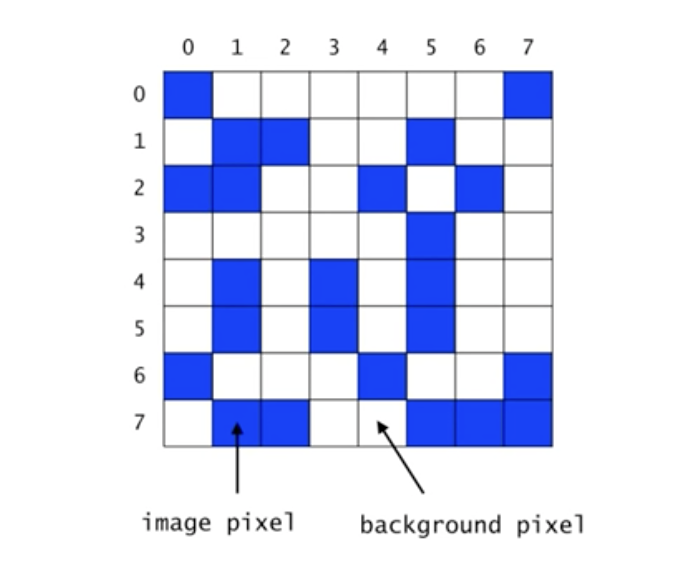
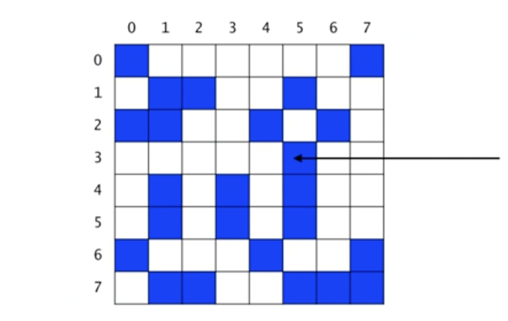
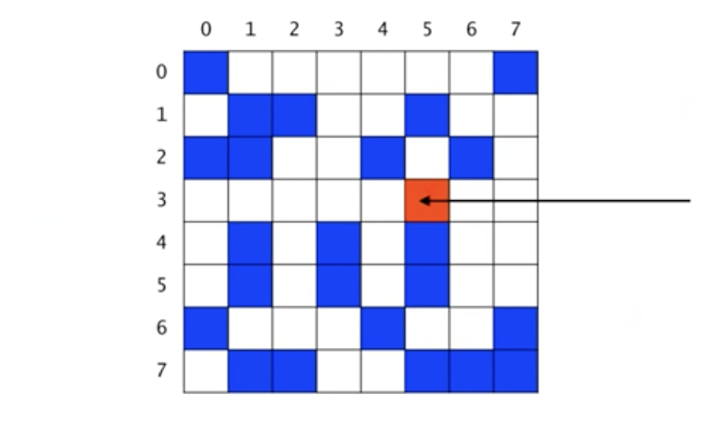
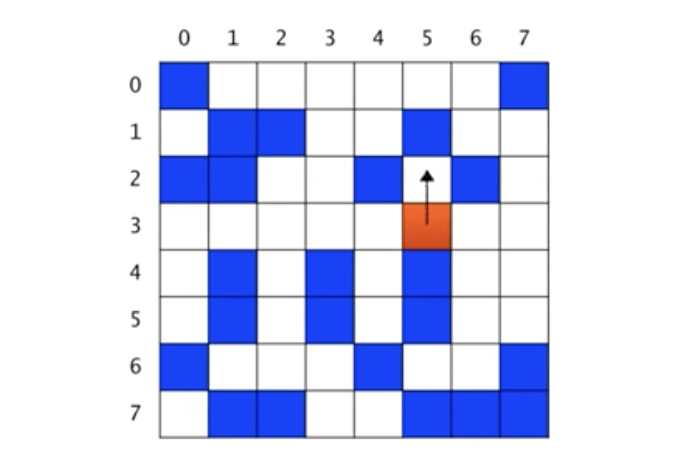
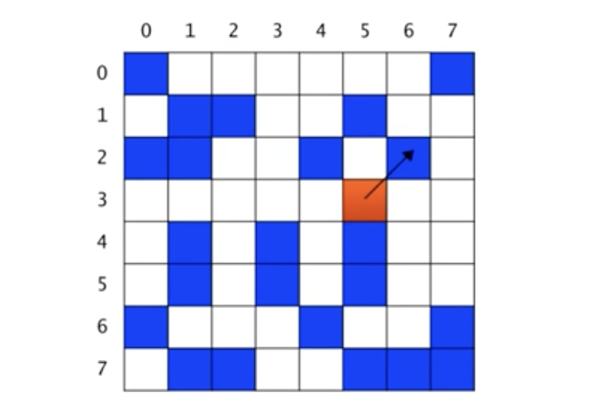
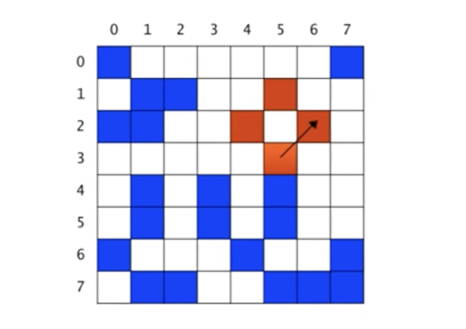
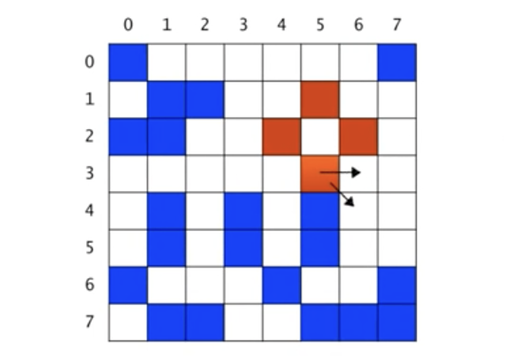
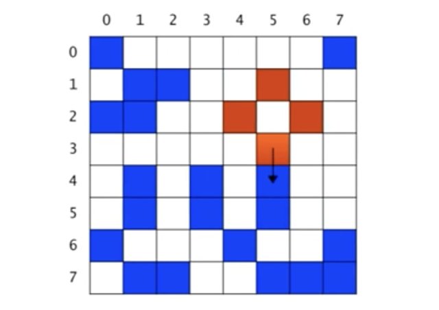
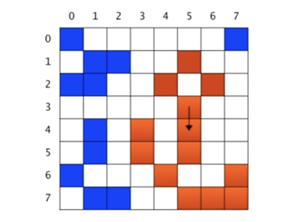

# Recursion의 응용 (2)

**목차**

- [Recursion의 응용 (2)](#recursion의-응용-2)
  - [Counting Cells in a Blob](#counting-cells-in-a-blob)
    - [입력](#입력)
    - [출력](#출력)
  - [Recursive Thinking](#recursive-thinking)
    - [순환적 알고리즘 (1)](#순환적-알고리즘-1)
    - [순환적 알고리즘 (2)](#순환적-알고리즘-2)
    - [순한적 알고리즘 (3)](#순한적-알고리즘-3)
    - [순환적 알고리즘 (4)](#순환적-알고리즘-4)
    - [순환적 알고리즘 (5)](#순환적-알고리즘-5)
    - [순환적 알고리즘 (6)](#순환적-알고리즘-6)
    - [순환적 알고리즘 (7)](#순환적-알고리즘-7)
  - [Algorithm for countCells(x, y)](#algorithm-for-countcellsx-y)
    - [pseudo code](#pseudo-code)
    - [구현](#구현)

## Counting Cells in a Blob



- `Binary` 이미지
- 각 픽셀은 **background pixel**이거나 **image pixel**이다.
- 서로 연결된 **image pixel**들의 집합을 `blob`이라고 부른다.
- 상, 하, 좌, 우 그리고 대각 방향도 연결된 것으로 간주한다.

### 입력

- `N x N` 크기의 2차원 그리드
- 하나의 좌표 `(x, y)`

### 출력

- 픽셀 `(x, y)`가 포함된 `blob`의 크기
- `(x, y)`가 어떤 `blob`에도 속하지 않는 경우에는 0

이 문제는 언뜻 2중 `for` 문으로도 간단히 해결할 수 있을 것 같지만 실상은 그렇게 간단한 문제는 아니다. 왜냐하면 한 `Cell`의 주변 `Cell` 정보만으로 두 `Cell`이 연결된 즉, 같은 `blob`에 속해있는지 판단하기 쉽지 않기 때문이다. 예를 들어, 한 `Cell`을 건너 마주보고 있는 두 `Cell`은 언뜻 보면 같은 `blob`에 속해있지 않아 보이지만 실제로 **image pixel**이 복잡하게 얽혀서 동일한 `blob`에 속해 있을지도 모르기 때문이다.

## Recursive Thinking

```
현재 픽셀이 속한 blob의 크기를 카운트하려면
	현재 픽셀이 image pixel이 아니라면
		0을 반환한다.
	현재 픽셀이 image pixel이라면
		먼저 현재 픽셀을 카운트한다. (count+1)
		현재 픽셀이 중복 카운트되는 것을 방지하기 위해 다른 색으로 칠한다.
		현재 픽셀에 이웃한 모든 픽셀들에 대해서
			그 픽셀이 속한 blob의 크기를 카운트하여 카운터에 더해준다.
		카운터를 반환한다.
```

### 순환적 알고리즘 (1)



`x = 5`, `y = 3`이라고 가정, 즉 이 픽셀이 포함된 `blob`의 크기를 계산하는 것이 목적이다.

이때 `count`는 0이다.

### 순환적 알고리즘 (2)



먼저 현재 `Cell`을 다른 색으로 칠하고 `count`를 1 증가시킨다. 이렇게 색찰하는 것은 이 픽셀이 중복 체크되는 것을 방지하기 위해서다.

이때 `count`는 1이다.

### 순한적 알고리즘 (3)


인접한 8개의 픽셀 각각에 대해서 순서대로 그 픽셀이 포함된 `blob`의 크기를 `count`한다.
`북`, `북동`, `동`, `동남`, … 이런 순서(시계 방향)로 고려한다.

북쪽 픽셀이 포함된 `blob`의 크기는 0이다. 이때 `count` 값은 변화가 없다. (`count = 1`)

### 순환적 알고리즘 (4)



북동쪽 픽셀이 속한 `blob`을 `count`하고, `count`된 픽셀들을 색칠한다.

### 순환적 알고리즘 (5)



3개의 픽셀이 이 `blob`에 속한다. 이때 `count`의 값은 4(1+3)다.



동쪽과 남동쪽 픽셀이 포함된 `blob`의 크기는 0이다. 따라서 `count`의 값은 변화가 없다.

### 순환적 알고리즘 (6)



이제 남쪽 픽셀이 속한 `blob`을 `count`할 차례이다.

### 순환적 알고리즘 (7)



남쪽 픽셀이 속한 `blob`의 크기는 9다. 카운트하고 색칠한다.

이때 `count`의 값은 13(4+9)이다.



`남서`, `서`, `북서` 방향의 픽셀이 속한 `blob`은 없거나 혹은 이미 카운트되었다.

이때 `count`의 값은 변화가 없다. (`count = 13`)

## Algorithm for countCells(x, y)

### pseudo code

위 문제의 알고리즘을 우선 **pseudo code**로 작성해보자.

```
if the pixel (x, y) is outside the grid
	the result is 0;
else if pixel (x, y) is not an image pixel or already counted
	the result is 0;
else
	set the color of the pixel (x, y) to a red color;
	the result is 1 plus the number of cells in each piece of
			the blob that inclues a nearest neighbour;
```

- 유효한 범위가 아닌 경우 0을 반환
  - 주어진 그리드를 좌표가 벗어난 경우
- **image pixel**이 아니거나 이미 `count`된 **image pixel**인 경우도 0을 반환
- 나머지 경우
  - 이미 체크된 픽셀임을 픽셀을 색칠하여 표현
  - 주변 `Cell`들에 대해서 `Recursion`을 호출

### 구현

```java
private static int BACKGROUND_COLOR = 0;
private static int IMAGE_COLOR = 1;
private static int ALREADY_COUNTED = 2;

public int countCells(int x, int y) {
	if (x < 0 || x >= N || y < 0 || y >= N) {
		return 0;
	} else if (grid[x][y] != IMAGE_COLOR) {
		return 0;
	} else {
		grid[x][y] = ALREADY_COUNTED;
		return 1 + countCells(x-1, y+1) + countCells(x, y+1)
				+ countCells(x+1, y+1) + countCells(x-1, y)
				+ countCells(x+1, y) + countCells(x-1, y-1)
				+ countCells(x+1, y) + countCells(x-1, y-1)
				+ countCells(x, y-1) + countCells(x+1, y-1)
	}
}
```
