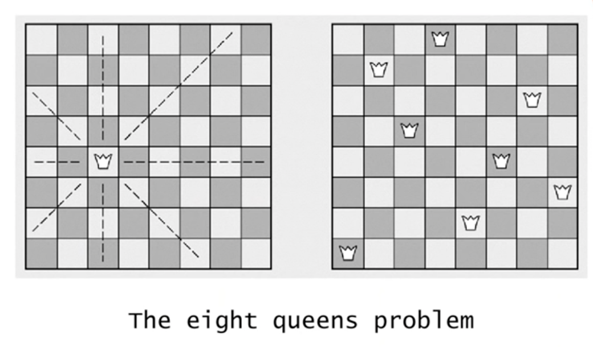
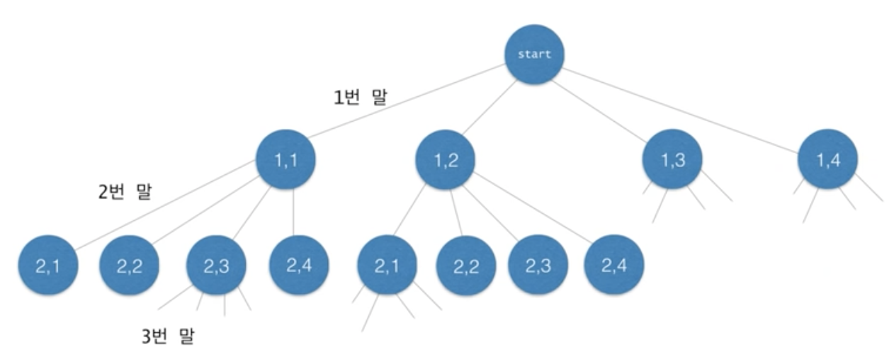
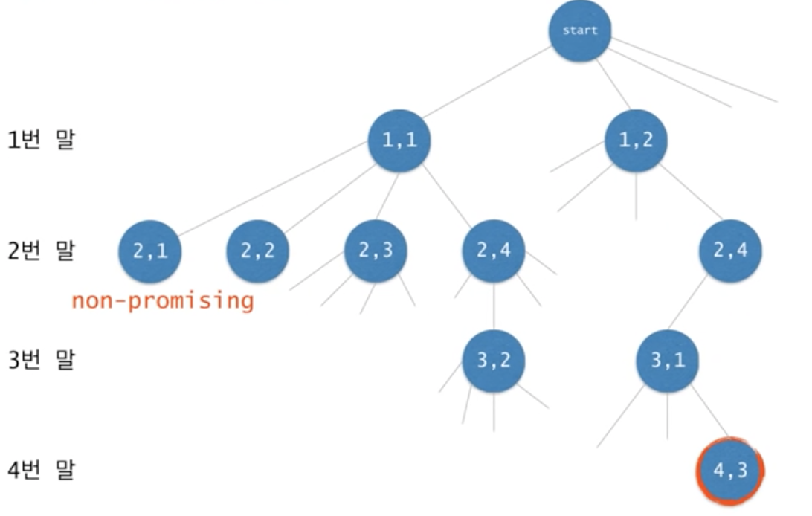
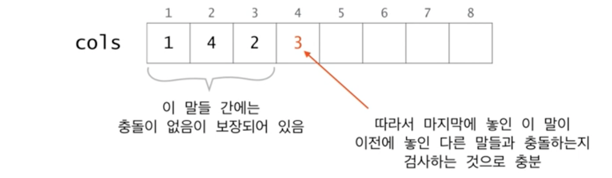
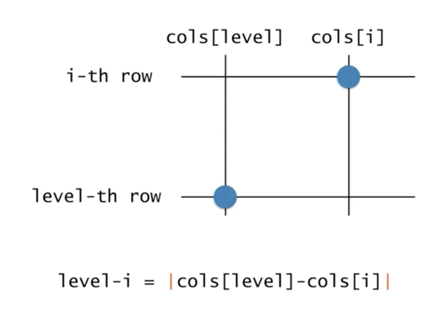

# Recursion의 응용 (3)

**목차**

- [Recursion의 응용 (3)](#recursion의-응용-3)
  - [N-Queens](#n-queens)
    - [상태공간트리](#상태공간트리)
    - [상태공간트리의 모든 노드를 탐색해야 하는 건 아니다](#상태공간트리의-모든-노드를-탐색해야-하는-건-아니다)
  - [Design Recursion](#design-recursion)
    - [Promising Test](#promising-test)
    - [정리](#정리)

## N-Queens



퀸이 이동할 수 있는 경로를 제외한 공간을 따져 총 8개의 퀸을 배치하는 문제

- 퀸을 먼저 한군데 배치
- 해당 퀸의 경로를 제외한 나머지 공간 중에 하나에 퀸을 배치
- 더 이상 놓을 공간이 없는데 8개를 배치하지 못한 상태라면 가장 최근에 놓았던 퀸 배치를 번복하고 다른 공간에 퀸을 배치
- 위 과정 반복한다.

이러한 문제 해결 방식을 `Backtracking`이라고 한다. `Backtracking` 과정을 조금 더 시각적으로 가시화하고 체계적으로 표현하기 위해서 `상태공간트리`라는 개념을 사용한다.

### 상태공간트리



`상태공간트리`란 내가 찾고 있는 해를 반드시 포함하는 트리를 말한다.

즉, 해가 존재한다면 그것은 반드시 이 트리의 어떤 한 노드에 해당한다. 따라서, **이 트리를 체계적으로 탐색하면 해를 구할 수 있다.**

### 상태공간트리의 모든 노드를 탐색해야 하는 건 아니다



모든 노드를 탐색하지 않아도 되는 이유는 우리는 이미 해당 경로에는 퀸을 배치할 수 없다는 사실을 알기 때문이다. 따라서, 퀸을 배치할 수 없는 곳의 아래 노드들은 탐색하지 않아도 된다. 이러한 노드(ex. `[2, 1]`)를 `infeasible`한 노드라고 표현한다.

> 위와 같은 트리의 탐색 방법을 **깊이우선탐색**이라고 한다.

## Design Recursion

`Backtracking` 알고리즘을 코드로 구현하는 방법에는 대표적으로 두 가지 방법이 있다.

- `Recursion`
- `Stack`

`Recursion`을 사용하는 방법이 가장 쉽고 간명하기 때문에 대부분의 경우 `Recursion`을 이용해서 `Backtracking` 알고리즘을 구현한다.

`N-Queens` 문제를 **pseudo code**로 한번 작성해보자.

여기서 매개변수는 내가 현재 트리의 어떤 노드에 있는지를(도착한지) 지정해야 한다. 어떤 노드에 있는지를 지정하는 이유는 특정 노드에 도착했을 때 그 노드에서 수행할 일련의 과정들을 `Recursion` 함수로 작성해야 하기 때문이다.

```
return-type queens(arguments) {
	if non-promising
		report failure and return;
	else if success
		report answer and return;
	else
		visit children recursively;
}
```

이러한 노드의 위치 정보를 주는 방법은 여러 가지지만 대표적으로 매개변수를 통해 전달하는 방법이 있다. 하지만 모든 정보를 매개변수로 전달하면 매개변수의 수가 너무 많아지고 복잡해지므로 하나는 전역 변수 그리고 나머지 하나는 매개변수로 노드의 위치 정보를 다룰 것이다.

- `level`: 트리의 `depth` 정보
  트리의 특정 `depth`까지 탐색이 이루어졌다는 뜻이 `1 ~ depth`까지의 말이 이미 놓인 상태라는 것을 뜻한다.
- `cols`: 말이 놓인 열 번호를 모아둔 배열
  퀸의 위치 정보를 저장하는데 2차원 배열이 필요하진 않다. 왜냐하면 1번 말은 어차피 첫 번째 행에 2번 말은 어차피 두 번째 행에 나머지 말들도 이러한 식으로 놓일 것이기 때문이다.

ex. `cols[i] = j`는 `i`번 말이 `(i행, j열)`에 놓였음을 의미한다.

```
int [] cols = new int [N+1];

return-type queens(int level) {
	if non-promising
		report failure and return;
	else if success
		report answer and return;
	else
		visit children recursively;
}
```

반환 타입은 성공이나 실패로 판단한다.

```
int [] cols = new int [N+1];

boolean queens(int level) {
	if non-promising
		report failure and return;
	else if success
		report answer and return;
	else
		visit children recursively;
}
```

노드가 어떤 경우에 `non-promising`할까? 일단 이 문제는 나중에 생각하자.

```
int [] cols = new int [N+1];

boolean queens(int level) {
	if (!promising(level))
		return false;
	} else if success
		report answer and return;
	else
		visit children recursively;
}
```

`promising` 테스트를 통과했다는 가정하에 `level == N`이면 모든 말이 놓였다는 의미이고 따라서 성공한 케이스이다.

```
int [] cols = new int [N+1];

boolean queens(int level) {
	if (!promising(level))
		return false;
	} else if (level == N) {
		report true;
	}
	else
		visit children recursively;
}
```

- `level + 1`번째 말을 각각의 열에 놓은 후 `Recursion`을 호출한다.
  `1 ~ level`까지는 말이 이미 놓였다는 뜻이니까 `level + 1`의 말을 우선 배치하고 `Recursion`을 호출한다
- `queens(level+1)`이 `true`라는 뜻은 정상적으로 말이 배치됐다는 뜻이므로 `true`를 반환한다.
- 그렇지 못한 경우 `for` 문을 순회하면서 다른 위치에 말을 배치한다.
- `for` 문이 종료됐음에도 불구하고 `true`를 반환하지 못한 경우는 해당 열에 어느 곳에 배치해도 8개의 퀸을 배치할 수 없다는 뜻이므로 `false`를 반환한다. (이전 말을 위치를 변경하는 플로우로 이동)

```
int [] cols = new int [N+1];

boolean queens(int level) {
	if (!promising(level))
		return false;
	} else if (level == N) {
		report true;
	} else {
		for (int i=1; i<=N; i++) {
			cols[level+1] = i;
			if (queens(level+1)) {
				return true;
			}
		}
		return false;
	}
}
```

### Promising Test



현재 `level` 값은 4다.

`cols[i]` 말과 `cols[level]` 말이 같은 경로 상에 위치하는 지만 검사하면 된다.

```
boolean promising(int level) {
	for (int i=1; i<level; i++) {
		if (cols[i] == cols[level]) {     - 같은 열에 놓였는지 검사
			return false;
		} else if on the same diagonal {  - 같은 대각선에 놓였는지 검사
			return false;
		}
	}
	return true
}
```

그러면 같은 대각선에 놓였는지에 대해서는 어떻게 검사하면 될까?



피타고라스 정리를 통해서 동일 대각선에 위치한지 검사한다.

```java
boolean promising(int level) {
	for (int i=1; i<level; i++) {
		if (cols[i] == cols[level]) {
			return false;
		} else if (level-i == Math.abs(cols[level]-cols[i])) {
			return false;
		}
	}
	return true
}
```

### 정리

처음에는 `queens(0)`으로 호출한다.

```java
int [] cols = new int [N+1];

boolean queens(int level) {
	if (!promising(level)) {
		return false;
	} else if (level == N) {
		for (int i=1; i<=N; i++) {
			System.out.println("(" + i + ", " + cols[i] + ")");
			return true;
		}
	} else {
		for (int i=1; i<=N; i++) {
			cols[level+1] = i;
			if (queens[level+1]) {
				return true;
			}
		}
		return false;
	}
}
```
