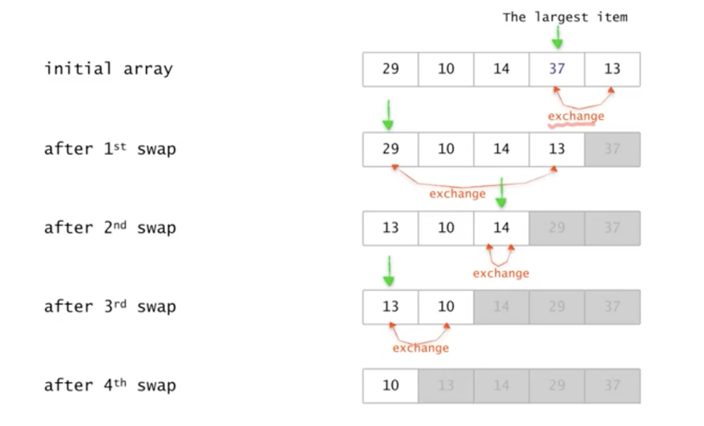
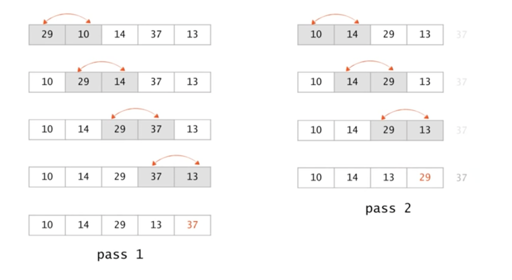
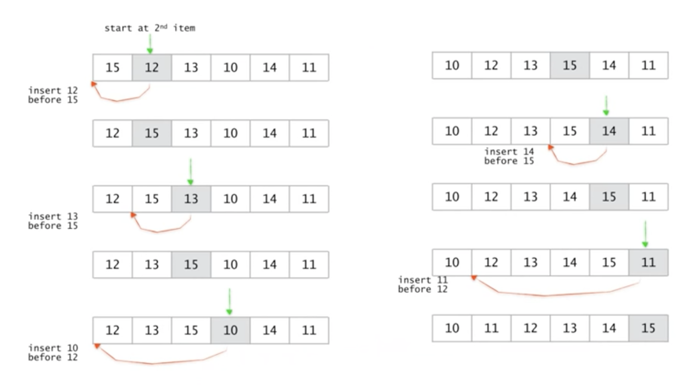
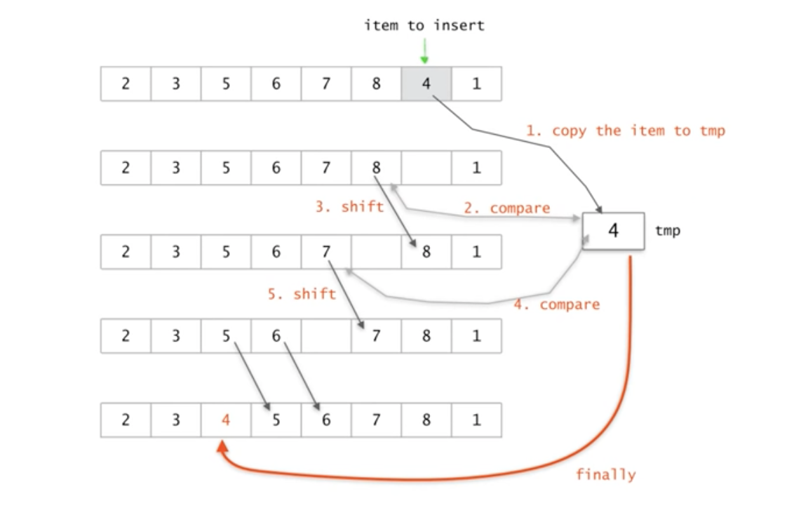

# 기본적인 정렬 알고리즘

**목차**

- [기본적인 정렬 알고리즘](#기본적인-정렬-알고리즘)
    - [정렬 알고리즘 종류](#정렬-알고리즘-종류)
  - [Selection Sort (선택 정렬)](#selection-sort-선택-정렬)
    - [pseudo code](#pseudo-code)
  - [Bubble Sort (버블 정렬)](#bubble-sort-버블-정렬)
    - [pseudo code](#pseudo-code-1)
  - [Insertion Sort (삽입 정렬)](#insertion-sort-삽입-정렬)
    - [pseudo code](#pseudo-code-2)

### 정렬 알고리즘 종류

- Bubble sort
- Insertion sort
- Selection sort
- Quicksort
- Merge sort
- Heap sort
- Radix sort

## Selection Sort (선택 정렬)

- 각 루프마다
  - 최대 원소를 찾는다.
  - 최대 원소와 맨 오른쪽 원소를 교환한다.
  - 맨 오른쪽 원소를 제외한다.
- 하나의 원소만 남을 때까지 위의 루프를 반복

이를 그림으로 한번 살펴보자.



### pseudo code

```
selectionSort(A[], n)   // 배열 A[1, ..., n]을 정렬한다.
{
	for last <- n downto 2 {
		A[1, ... , last] 중 가장 큰 수 A[k]를 찾는다;
		A[k] ... A[last]: A[k]와 A[last]의 값을 교환
	}
}
```

- 수행시간
  - `for` 루프는 `n-1`번 반복
  - 가장 큰 수를 찾기 위한 비교횟수: `n-1`, `n-2`, … , 2, 1
  - 교환은 상수시간의 작업이 소요된다.
- 시간복잡도
  ```
  T(n) = (n-1) + (n-2) + … 2 + 1 = O(n^2)
  ```
  `선택 정렬`의 경우 최악, 최소, 평균 시간 복잡도를 계산할 필요가 없다. 어떠한 경우라도 비교 연산의 시간 복잡도가 `n(n-1)/2`, 즉 `O(n^2)`이 걸리기 때문이다.

## Bubble Sort (버블 정렬)

`버블 정렬`의 아이디어 자체는 `선택 정렬`과 비슷하다. `버블 정렬`도 `선택 정렬`과 마찬가지로 정렬하고자 하는 데이터 중에서 가장 큰 값을 찾아 이를 맨 마지막으로 보내고 해당 요소를 더 이상 고려하지 않는다. 그리고 나머지 요소들에 대해서 같은 일을 반복하는 식이다.

다만, 가장 큰 요소를 마지막으로 보내는 과정에 있어서 `선택 정렬`과 차이를 보인다.

- 각 루프마다
  - 현재 인덱스의 요소가 다음 인덱스의 요소보다 크다면 둘의 자리를 교체한다.
  - 다음 인덱스로 이동하며 반복한다.
- 맨 마지막 요소(가장 큰 값)의 정렬이 완료됐으니 해당 요소를 제외한 나머지 요소들을 가지고 위 작업을 반복한다.



### pseudo code

```
bubbleSort(A[], n) // 배열 A[1, ..., n]을 정렬한다.
{
	for last <- n downto 2
		for i <- 1 to last-1
			if (A[i] > A[i+1]) then A[i] <-> A[i+1]; // 교환
}
```

- 수행시간
  - `for` 루프틑 `n-1`번 반복
  - `for` 루프는 각각 `n-1`, `n-2`, … , 2, 1번 반복
  - 상수시간 작업
- 시간복잡도
  ```
  (n-1) + (n-2) + ... + 2 + 1 = O(n^2)
  ```
  `버블 정렬`의 경우 최악, 최소, 평균 시간 복잡도를 계산할 필요가 없다. 어떠한 경우라도 비교 연산의 시간 복잡도가 `n(n-1)/2`, 즉 `O(n^2)`이 걸리기 때문이다.

## Insertion Sort (삽입 정렬)

- 각 루프마다
  - `k`번째 요소를 기준으로 삼는다.
  - `1 ~ k-1`번째 요소들 사이에 끼워넣을 곳을 찾는다.
  - 끼워넣은 후 기준이 되는 요소를 변경한다.

이를 그림으로 살펴보면 다음과 같다.



다음은 `삽입 정렬`의 한 스텝을 그림으로 표현한 것이다.



`삽입 정렬`의 키 포인트는 정렬되어 있는 `1 ~ k-1`개의 요소들 사이에 "어떻게 하면 `k`번째 요소를 잘 끼워넣어 `k`개의 정렬된 데이터를 만들 수 있을까"를 해결하는 것이다.

일반적으로 2가지 방법이 있다.

- **앞**에서부터 비교해서 찾는 방법
- **뒤**에서부터 비교해서 찾는 방법

위 그림으로 볼 때 앞을 기준으로 삼나 뒤를 기준으로 삼나 큰 차이는 없어보인다. 그러나 한 스텝 씩 진행하다 보면 차이를 보이기 시작한다.

앞에서부터 비교해서 찾을 때의 문제는 다음과 같다.

- `k`번째 요소보다 작은 값을 원하지 않아도 한번은 비교해야 한다.
- 삽입할 위치를 찾았어도 `k`번째 요소보다 큰 요소들의 위치를 이동시켜야 하기 때문에 해당 요소들과의 비교도 이루어져야 한다.

그에 반해 뒤에서부터 비교한다면 `k`번째 요소보다 작은 요소들은 볼 필요, 즉 비교할 필요가 없다.

### pseudo code

```
insertionSort(A[], n)    // 배열 A[1, ..., n]을 정렬한다.
{
	for i <- 2 to n
		A[1, ..., i]의 적당한 자리에 A[i]를 삽입한다.
}
```

- 수행시간
  - `for` 루프는 `n-1`번 반복
  - 삽입은 최악의 경우 `i-1`번 비교
- 시간복잡도 (최악의 경우)
  ```
  T(n) = (n-1) + (n-2) + ... + 2 + 1 = O(n^2)
  ```
  이상적인 경우(이미 정렬되어 있는 경우) 한번의 비교만 이루어질 것이다. 말 그대로 이상적인 경우이고 평균적으로는 최소와 최악의 중간 정도되는 시간복잡도를 가진다.
  최악의 경우 `선택 정렬`과 `버블 정렬`과 동일한 시간복잡도를 갖지만 두 정렬과의 차이점이라고 한다면 `삽입 정렬`은 최악의 경우 두 정렬과 같은 시간복잡도를 갖는다는 것이다(두 정렬은 어느 경우든 `O(n^2)`의 시간복잡도를 갖는다).
