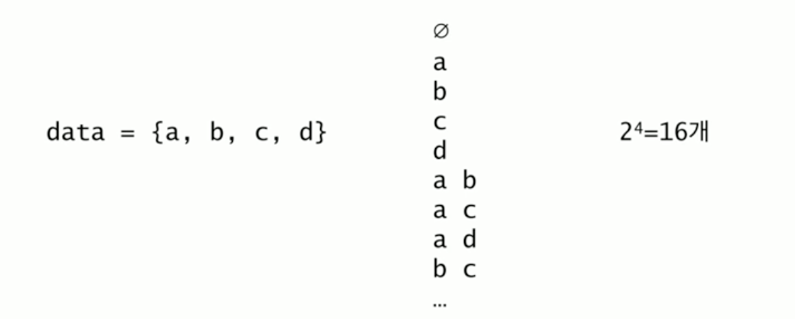
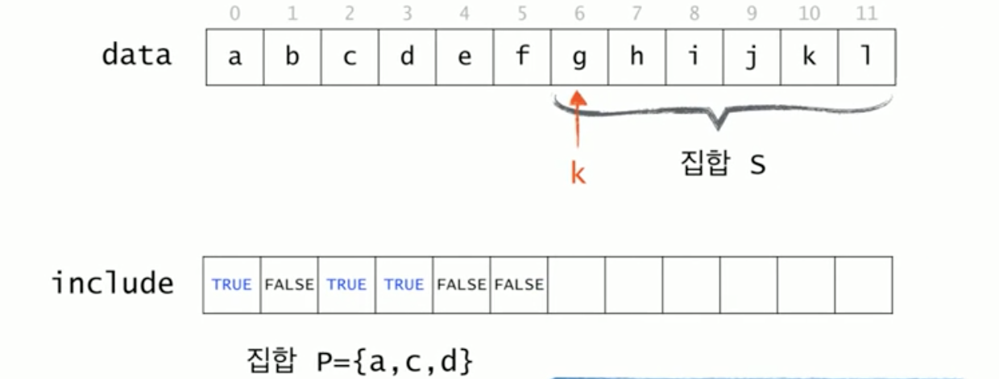
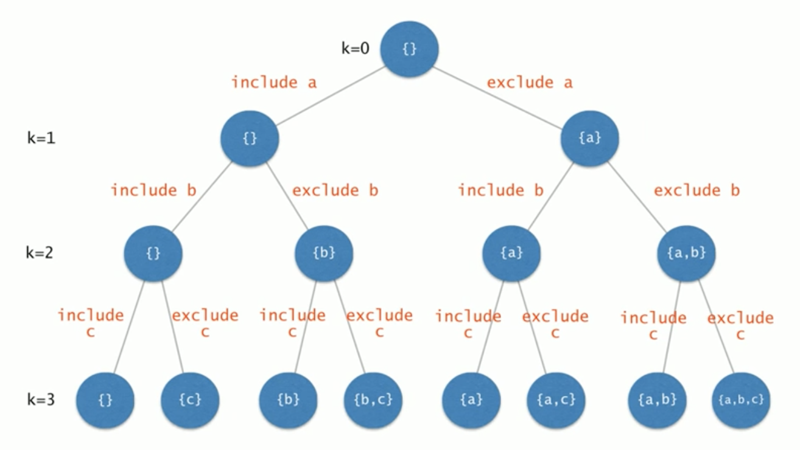

# 멱집합 (Powerset)

**목차**

- [멱집합 (Powerset)](#멱집합-powerset)
  - [멱집합이란?](#멱집합이란)
    - [모든 부분집합을 어떻게 하면 구할 수 있을까?](#모든-부분집합을-어떻게-하면-구할-수-있을까)
    - [정리](#정리)
    - [개선](#개선)
    - [집합 `S`와 `P`](#집합-s와-p)
    - [구현](#구현)
  - [상태공간트리 (탐색공간트리)](#상태공간트리-탐색공간트리)

## 멱집합이란?

어떤 집합의 모든 부분 집합을 **멱집합**이라고 한다.

예를 들어, "임의의 집합 `data`의 모든 부분집합을 출력하라"라는 문제가 있다면 다음과 같이 나타낼 수 있다.



### 모든 부분집합을 어떻게 하면 구할 수 있을까?

구하는 방법에는 여러 방법이 있겠지만 여기선 `Recursion`을 이용한 방법에 대해 알아본다.

예를 들어, `{ a, b, c, d, e, f }`의 모든 부분집합을 나열하려면

- `a`를 제외한 `{ b, c, d, e, f }`의 모든 부분집합을 나열하고
- `{ b, c, d, e, f }`의 모든 부분집합에 `{ a }`를 추가한 집합들을 나열한다.

조금 더 진행시켜보자.

`{ b, c, d, e, f }`의 모든 부분집합에 `{ a }`를 추가한 집합들을 나열하려면

- `{ c, d, e, f }`의 모든 부분집합들에 `{ a }`를 추가한 집합들을 나열하고
- `{ c, d, e, f }`의 모든 부분집합에 `{ a, b }`를 추가한 집합들을 나열한다.

한 스텝 더 진행시켜보자.

`{ c, d, e, f }`의 모든 부분집합에 `{ a }`를 추가한 집합들을 나열하려면

- `{ d, e, f }`의 모든 부분집합들에 `{ a }`를 추가한 집합들을 나열하고
- `{ d, e, f }`의 모든 부분집합에 `{ a, c }`를 추가한 집합들을 나열한다.

### 정리

내가 어떤 집합의 모든 부분집합을 구하려면 해당 집합에서 원소 하나를 제거한 다른 집합의 부분집합을 구하는 일을 하면 원래 내가 구하려던 집합의 모든 부분집합을 구할 수 있다.

정리한 내용을 **pseudo code**로 작성해보자.

```
// powerSet(S): s의 멱집합을 출력하라.

if S is an empty set
	print nothing;
else
	let t be the first element of S;
	find all subsets of S-{t} by calling powerSet(S-{t});
	print the subsets;
	print the subsets with adding t;
```

위 pseudo code에는 문제점이 있는데 첫 번째 문제는 위와 같이 하려면 `powerSet` 함수는 여러 개의 집합들을 `return` 해야 한다.

그냥 저장해서 반환하면 되지 않느냐 ? 라고 말할 수도 있겠지만 모든 부분집합을 구해 어딘가에 저장해놓는 것은 말처럼 쉽고 간단한 일은 아니다. 게다가 **pseudo code**의 앞 부분에 적어놨듯이 우리는 출력이 목적이지 저장이 목적이 아니다.

또 하나의 문제점은 반환하려고 하는 경우 **pseudo code** 마지막 부분에 적힌 출력문들은 함수의 목적에 맞지 않다. 즉, 반환해줄 필요 없이 출력을 해주면 된다.

추가적으로 반환하는 대신 출력을 해줄 경우 초기에 작성했던 `Recursion`에 구멍이 생기기 때문에(단순히 출력을 해줌으로써 나머지 부분집합을 반환하지 않기 때문에 나머지 부분집합들에 대한 출력이 발생하지 않게 된다) 이에 대한 개선도 필요하다.

### 개선

```
// powerSet(P, S): s의 멱집합을 구한 후 각각에 집합 P를 합집합하여 출력라라

if S is an empty set
	print P;
else
	let t be the first element of S;
	powerSet(P, S-{t});
	powerSet(P U {t}, S-{t});
```

`Recursion` 함수가 두 개의 집합을 매개변수로 받도록 설계해야 한다는 의미이다. 두 번째 집합의 모든 부분집합들에 첫 번째 집합을 합집합하여 출력한다.

매개변수가 2개가 된 **pseudo code**로 인해 코드가 복잡해졌을 것 같지만 조금 들여다 보면 그렇게 복잡하지는 않다. 예를 들어 다음과 같은 `Recursion` 호출 상황일 때

`{ c, d, e, f }`의 모든 부분집합에 `{ a }`를 추가한 집합들을 나열하려면

- `{ d, e, f }`의 모든 부분집합들에 `{ a }`를 추가한 집합들을 나열하고
- `{ d, e, f }`의 모든 부분집합에 `{ a, c }`를 추가한 집합들을 나열한다.

집합 `S`에 해당하는 `{ d, e, f }`는 특정 위치의 원소 `k`를 기준으로 `k`번째부터 마지막 원소까지 연속된 원소들이다. 그리고 `{ a, c }`에 해당하는 집합 `P`는 원소 `k-1`까지의 원소 중 **일부**를 뜻한다.

즉, 집합 `S`를 표현하는 것은 어렵지 않다는 뜻이다. `k`라는 숫자 하나만 있다면 집합 `S`가 표현이 된다.

### 집합 `S`와 `P`



- 집합 `S`는 `data[k], … data[n-1]`
- 집합 `P`는 `include[i] = true, i=0, … , k-1` 인 원소들

### 구현

`data[k], … data[n-1]`의 멱집합을 구한 후 각각에 `include[i] = true, i=0, … , k-1` 인 원소를 추가하여 출력하라.

처음 이 함수를 호출할 때는 `powerSet(0)`으로 호출한다. 즉 `P`는 공집합이고 `S`는 전체 집합이다.

```java
private static char data[] = { 'a', 'b', 'c', 'd', 'e', 'f' };
private static int n = data.length;
private static boolean [] include = new boolean [n];

public static void powerSet(int k) {
	if (k == n) {
		for (int i=0; i<n; i++) {
			if (include[i]) {
				System.out.print(data[i] + " ");
			}
			System.out.println();
			return;
		}
	}
	include[k] = false;
	powerSet(k+1);
	include[k] = true;
	powerSet(k+1);
}
```

설명이 복잡해서 그렇지 코드를 보고 정리하자면

기준점 `k`를 옮기면서 집합 `S`에서 원소를 하나씩 꺼내고 꺼내진 원소들을 하나하나를 집합 `P`에 포함하는 케이스와 포함하지 않는 케이스로 나누어 집합 `S`가 공집합(원소가 모두 꺼내진 상태)이 됐을 때 부분집합들을 출력하는 방식이다.

## 상태공간트리 (탐색공간트리)

이러한 문제를 가지고 `Recursion`을 고려할 때 상태공간트리를 갖고 생각할 수도 있다.



`include`와 `exclude`가 반대로 되어있으니 참조하자.

> - 해를 찾기 위해 탐색할 필요가 있는 모든 후보들을 포함하는 트리
> - 트리의 모든 노드들을 방문하면 해를 찾을 수 있다.
> - 루트에서 출발하여 체계적으로 모든 노드를 방문하는 절차를 기술한다.

위 문제에서 하고자 하는 것이 멱집합, 즉 특정 집합의 모든 부분집합을 구하는 것이니 이를 상태공간트리로 생각하여 모든 노드들을 방문하여 해를 찾는다 라고 생각할 수도 있다.

위에서 작성한 코드에 상태공간트리를 덧붙여 해석하면

- `include`, `int k`: 트리상에서 현재 나의 위치를 표현한다.
- `if (k == n)`: 만약 내 위치가 `leaf` 노드라면 (= 내가 찾고자 하는 부분집합)
- `include[k]=false`, `powerSet(k+1)`: 먼저 왼쪽으로 내려갔다가
- `include[k]=true`, `powerSet(k+1)`: 오른쪽으로 내려간다.
