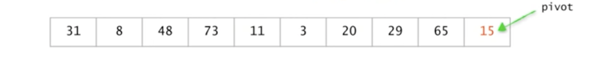
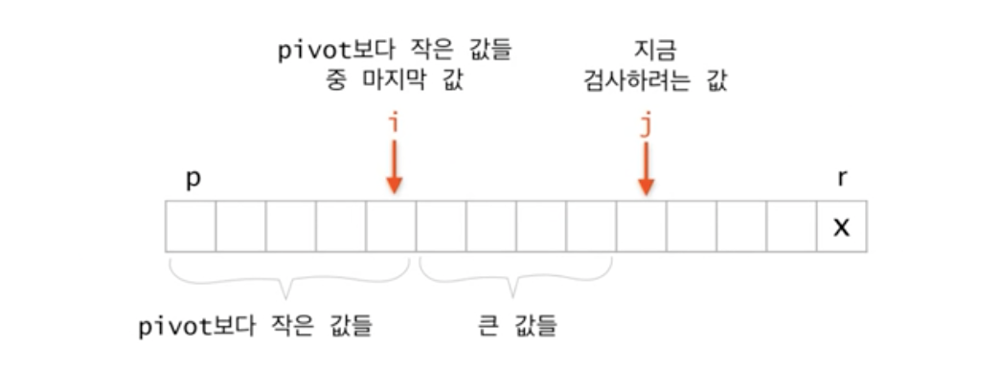
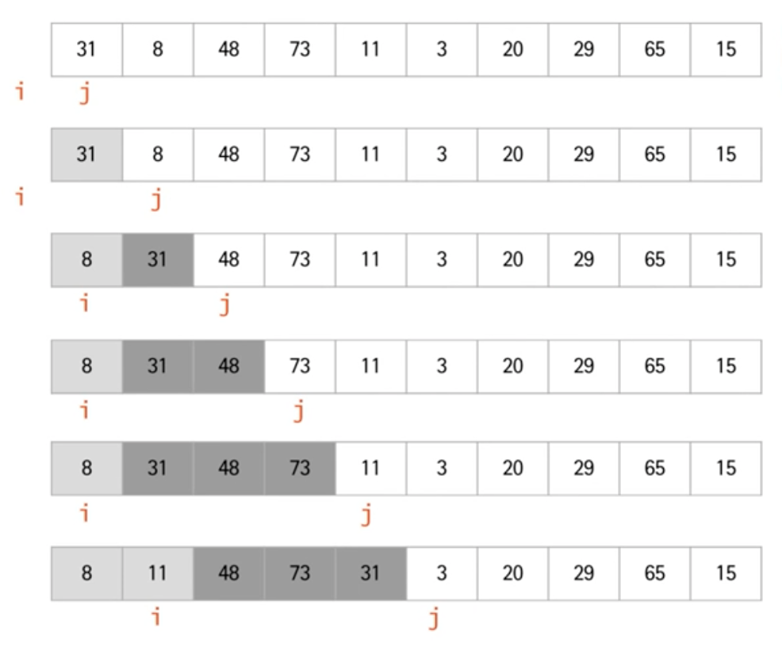
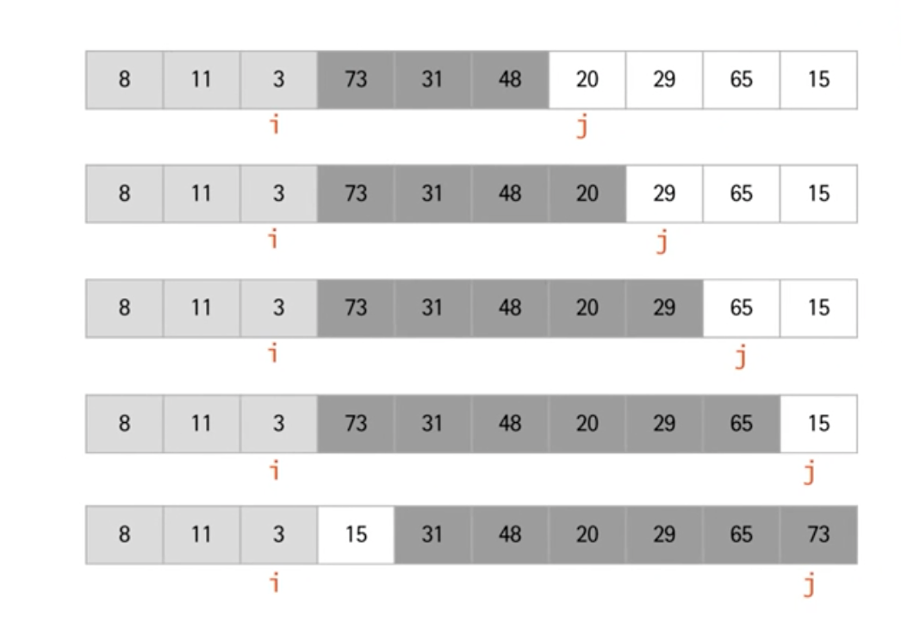
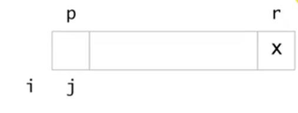
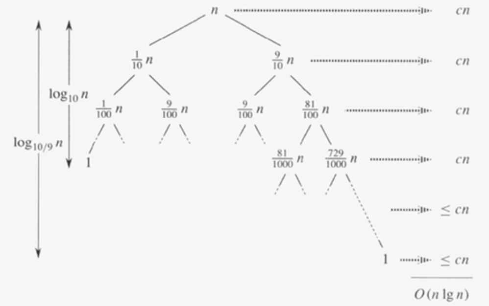

# 퀵소트 (Quicksort)

**목차**

- [퀵소트 (Quicksort)](#퀵소트-quicksort)
  - [개요](#개요)
  - [분할정복법](#분할정복법)
  - [Quicksort pseudo code](#quicksort-pseudo-code)
  - [Partition](#partition)
    - [과정](#과정)
    - [예시](#예시)
    - [pseudo code](#pseudo-code)
    - [최악의 경우](#최악의-경우)
    - [최선의 경우](#최선의-경우)
    - [Balanced Partition](#balanced-partition)
  - [`Pivot`의 선택](#pivot의-선택)
    - [첫번째 값이나 마지막 값을 피봇으로 선택](#첫번째-값이나-마지막-값을-피봇으로-선택)
    - [Median of Three](#median-of-three)
    - [Randomized Quicksort](#randomized-quicksort)

### 개요

`퀵 소트` 또한 **분할정복법**으로 데이터를 정렬하는데 `퀵 소트`가 `합병 정렬`과 다른 점은 데이터를 분할하는 방법이다.

`퀵 소트`는 데이터를 분할하기에 앞서 하나의 값을 기준점(이하 `pivot`)으로 삼는데 이 `pivot`은 첫 번째 값, 중간 값 그리고 마지막 값 등 기준을 잡기 나름이다. 앞으로 나올 예제에서는 배열의 마지막 값을 `pivot`으로 삼는다.

## 분할정복법

- **분할**: 배열을 다음과 같은 조건이 만족되도록 두 부분으로 나눈다.

  ```
  elements in lower parts <= elements in upper parts
  ```

  기준으로 삼은 `pivot`보다 작은 값들과 큰 값들로 나누기 때문에 `합병 정렬`처럼 매 분할마다 배열이 절반으로 쪼개진다는 보장을 할 수 없다.
  예를 들어, 극단적으로 `pivot`보다 작은 값들이 0개이고 큰 값들은 `n-1`개 또는 작은 값들이 `n-1`개 큰 값들은 0개일 수도 있다는 것이다.

- **정복**: 각 부분을 순환적으로 정렬한다.
- **합병**: nothing to do  
  이미 `pivot`을 기준으로 앞 쪽에는 작은 값들을 뒤 쪽에는 큰 값들을 모아놓은 상태이기 때문에 분할했던 두 배열이 정렬이 됐다면 합병할 때 두 배열의 요소들을 비교할 필요가 없다.

예를 들어, 정렬할 배열이 주어지고 마지막 수를 기준(`pivot`)으로 삼는다고 해보자.



기준보다 작은 수는 기준의 왼쪽에 나머지는 기준의 오른쪽에 오도록 재배치(분할)한다.

이 과정을 `퀵 소트`에서 `partition`, 즉 데이터를 분할한다고 한다.


기준의 왼쪽과 오른쪽을 각각 순환적으로 정렬한다. (정렬 완료)


## Quicksort pseudo code

```
quickSort(A[], p, r)         // A[p, ..., r]을 정렬한다
{
	if (p < r) then {
		q = partition(A, p, r);  // 분할
		quickSort(A, p, q-1);    // 왼쪽 부분배열 정렬
		quickSort(A, q+1, r);    // 오른쪽 부분배열 정렬
	}
}
```

- 합병 정렬때와 동일하게 `p ≥ r`이라면 정렬할 데이터가 0 또는 1개인 상황이기에 정렬 알고리즘이 할 일은 없다.
- `partition` 함수에게서 반환받은 `q`(= `pivot`)를 기준으로 `pivot`보다 작은 범위를 `p` ~ `q-1`로 `pivot`보다 큰 범위를 `q+1` ~ `r`까지로 한다.
- `quickSort` 함수 내부에서 하는 일은 `Recursion`의 호출 밖에 없으므로 실질적으로 중요한 일이 이루어지는 곳은 `partition` 함수이다.

## Partition

```
partition(A[], p, r)
{
	배열 A[p, ..., r]의 원소들을 A[r]을 기준으로 양쪽으로 재배치하고
	A[r]이 자리한 위치를 return 한다;
}
```

- `partition` 함수가 반환해주는 것은 `pivot`의 위치이다. 즉, 데이터를 분할한 기준점(`pivot`)을 반환한다.

### 과정



```
if A[j] >= x
	j <- j+1;
else
	i <- i+1;
	exchange A[i] and A[j];
	j <- j+1;
```

앞서 언급했듯이 `pivot`은 배열의 마지막 값으로 시작한다.

`pivot`을 기준으로 작은 값과 큰 값을 나누기 위해서 비교를 시작하는데 비교를 할 때마다 `pivot`의 인덱스를 옮기기엔 비용이 많이 발생하기 때문에 우선 작은 값들과 큰 값들로 나누고 마지막 한 스텝에서 `pivot`의 위치를 옮긴다.

우선 `pivot`보다 큰지 작은지를 알아야 하기 때문에 배열의 첫 번째 값부터 `pivot`과 비교를 한다.

당연한 이야기겠지만 비교만 하는 것은 무의미하다. 따라서, `pivot`보다 작은 값들을 기억하기 위해 `pivot`보다 작은 값들 중 마지막 값의 인덱스를 기억해놓는다(위 이미지에선 `i`).

- `if A[j] >= x`

  현재 검사하려는 값이 `pivot`보다 크다면 따로 할 일이 없다 그저 검사를 위한 `j`의 값을 하나 증가시켜 검사 대상을 다음 인덱스로 변경해주기만 하면 된다.

- `else`

  위 경우의 나머지 경우라는 것은 검사 대상이 pivot보다 작은 값이라는 뜻이다. 검사 대상의 위치를 바꿔주어야 하는데 이때 가장 쉬운 방법은 `i`의 인덱스롤 옮기고 해당 자리에 있는 값과 `j` 인덱스에 위치한 값을 바꿔주는 것이다.
  그리하면 원래 자리에 있던 값은 `pivot`보다 큰 값이니 위치를 더 뒤로 보내도 상관없고 원래 `j` 인덱스에 있던 값은 `pivot`보다 작은 값들 중 마지막 값이 되며 여전히 첫 번째 인덱스부터 i까지는 `pivot`보다 작은 값들로 유지된다.

### 예시





### pseudo code



- `x`는 `pivot`

  ```
  partition(A, p, r)
  {
  	x <- A[r];
  	i <- p-1;
  	for j <- p to r-1
  		if A[j] <= x then
  			i <- i+1;
  			exchange A[i] and A[j];
  	exchange A[i+1] and A[r];
  	return i+1;
  }
  ```

`i`는 `pivot`보다 작은 값 중 마지막 값의 인덱스인데 초기엔 아무런 값도 찾지 않았으므로 `p-1`로 초기화한다..

- 작은 값들과 큰 값들의 분류가 끝나면 `pivot`의 위치를 옮긴고 해당 위치를 반환한다.

### 최악의 경우

항상 한 쪽은 0개이고 다른 쪽은 `n-1`개로 분할되는 경우, 즉 입력 데이터가 이미 정렬된 경우(마지막 원소를 `pivot`으로 선택하는 경우)가 `퀵 소트`의 최악의 경우라고 할 수 있다.

```
T(n) = T(0) + T(n-1) + O(n)
		 = T(n-1) + O(n)
     = T(n-2) + T(n-1) + O(n-1) + O(n)
		 ...
		 = O(1) + O(2) + ... + O(n-1) + O(n)
		 = O(n(n-1)/2)
		 = O(n^2)
```

- 시간복잡도의 계산이 `합병 정렬`보다 복잡해 보이는 이유는 `합병 정렬`은 항상 절반으로 나누는데에 비해 `퀵 소트`는 `pivot`이 무엇이냐에 따라 어느 정도로 나뉠 지가 다르기 때문이다.

### 최선의 경우

항상 절반으로 분할되는 경우가 `퀵 소트`의 최선의 경우다. 이는 `합병 정렬`의 경우도 동일하다.

```
T(n) = 2T(n/2) + O(n)
		 = O(nlogn)
```

### Balanced Partition

`퀵 소트`는 이름이 정해진 이유는 다른 정렬 알고리즘에 비해 빠르다는 이유일 것이다. 근데 최악의 경우를 봤을 때는 `합병 정렬`보다 시간이 더 오래 걸릴 수도 있다. 어떻게 `퀵 소트`는 다른 정렬 알고리즘에 비해 빠를 수 있을까?

예를 들어, 최악의 경우도 아니고 최선의 경우도 아닌 항상 한쪽이 적어도 1/9 이상이 되도록 분할된다면?



- 분할이 어떻게 이루어지든 결국 분할에 한해서 시간복잡도는 `O(n)`이다. (`n`개의 요소가 존재하기 때문에)
  따라서, 전체 시간복잡도는 `n x 층수`가 된다.
- 아주 극단적인 케이스가 아니라면 위 예제(1/9 정도로 분할이 이루어지는 등)처럼 다른 정렬 알고리즘에 비해 빠르다.

## `Pivot`의 선택

### 첫번째 값이나 마지막 값을 피봇으로 선택

- 이미 정렬된 데이터 혹은 거꾸로 정렬된 데이터가 최악의 경우가 된다.
- 현실의 데이터는 랜덤하지 않으므로 (거꾸로) 정렬된 데이터가 입력으로 들어올 가능성은 매우 높다.
- 정렬된 데이터를 다시 정렬하는 경우가 발생할 수 있다.

따라서, 좋은 방법이라고는 할 수 없다.

### Median of Three

- 첫 번째 값과 마지막 값 그리고 가운데 값 중에서 중간값을 `pivot`으로 선택
- 선택한 `pivot`이 데이터 중 가장 작은 값이거나 큰 값인 케이스를 줄이는 목적
- 단, 최악의 경우의 시간복잡도가 달라지지는 않는다.

### Randomized Quicksort

- `pivot`을 랜덤하게 선택하는 방법
- no worst case instance, but worst case execution
  다른 방법들은 입력 데이터가 무엇이냐에 따라 이미 최악의 경우가 정해질 수 있다. 하지만 랜덤하게 `pivot`을 선택하면 입력 데이터가 어떤 형태를 취하고 있는지는 상관없어진다.
- 평균 시간복잡도 O(`nlogn`)
