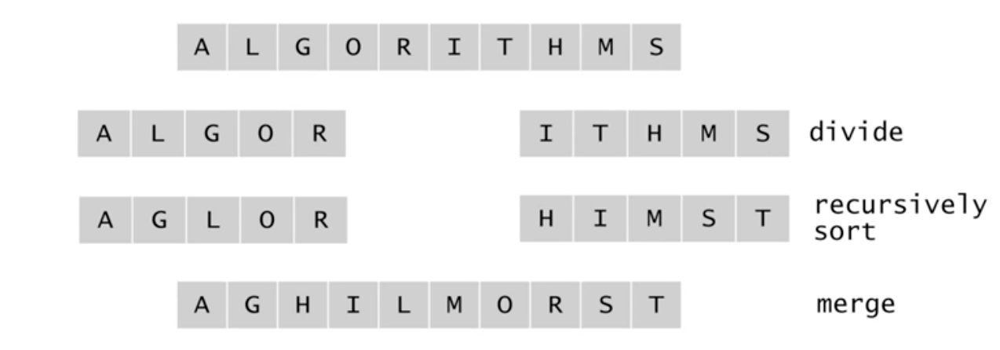
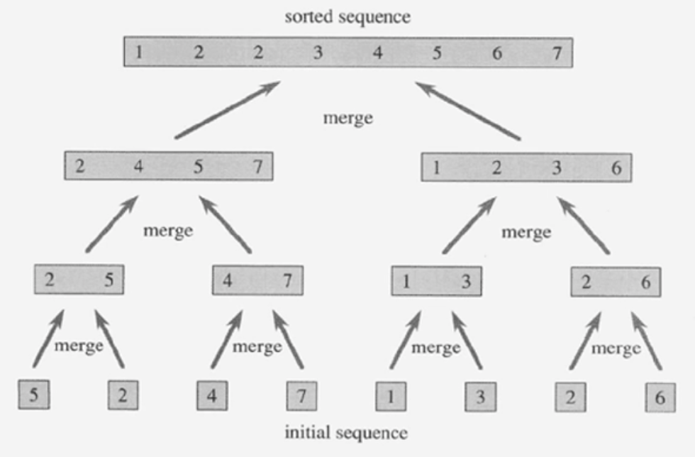
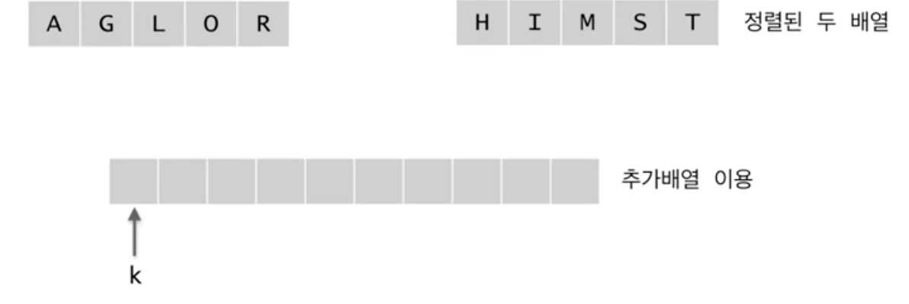
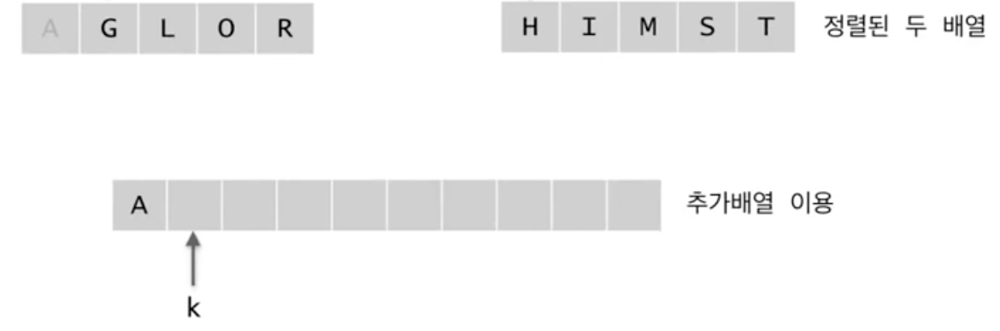
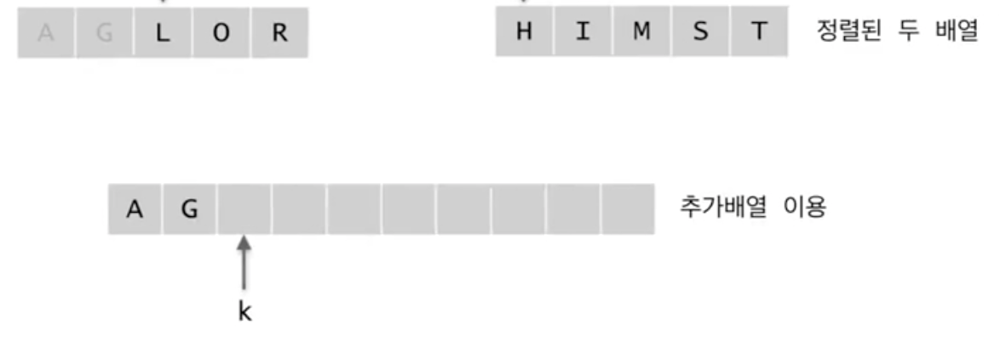
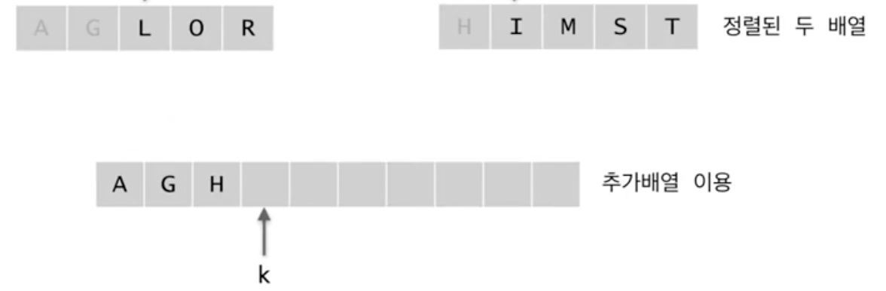
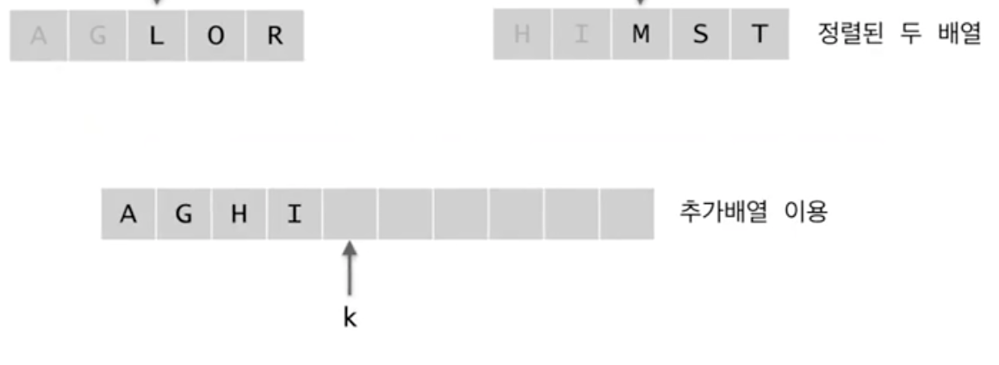
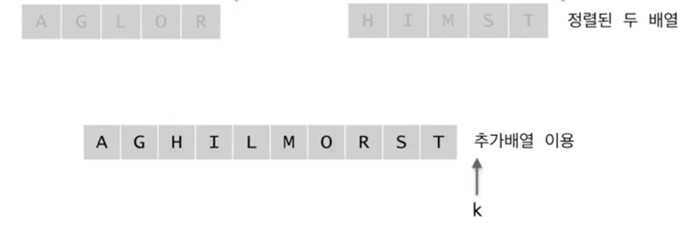
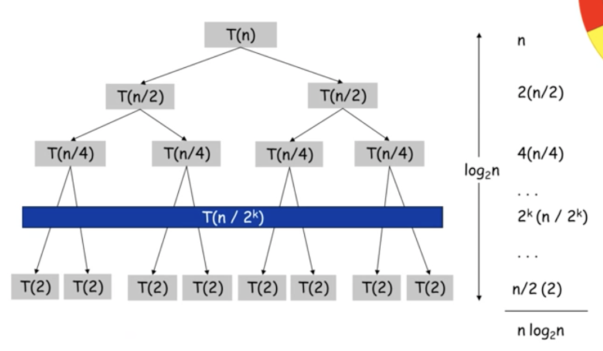

# 합병정렬 (Mergesort)

**목차**

- [합병정렬 (Mergesort)](#합병정렬-mergesort)
    - [개요](#개요)
  - [분할정복법](#분할정복법)
  - [pseudo code](#pseudo-code)
    - [mergeSort](#mergesort)
    - [merge](#merge)
    - [구현](#구현)
    - [시간복잡도](#시간복잡도)

### 개요

`Mergesort`와 `Quicksort`는 **Divide and Conquer**라고 불리는 분할정복법을 사용하는 정렬 방법이다. 여기선 `Mergesort`, 즉 합병정렬에 대해서 알아보자.

## 분할정복법

분할정복법은 다음과 같은 3가지 단계를 거쳐서 문제를 해결한다.

- **분할**: 해결하고자 하는 문제를 작은 크기의 **동일한** 문제들로 분할
- **정복**: 각각의 작은 문제를 순환적으로 해결
- **합병**: 작은 문제의 해를 합하여 원래 문제에 대한 해를 구한다.

분할 단계는 이미 `Recursion`에서 간단한 예를 접했었다. 예를 들어 최대값을 구하는 문제가 있다고 할 때 최대값을 구하기 위해서 첫 번째 요소를 최대값으로 잡고 나머지 요소들 중 최대값을 구해 첫 번째 요소와 비교하여 더 큰 값을 구하고 이를 더 작은 범위로 쪼개서 반복해나가는 `Recursion` 문제가 있었다.

여기서 포인트는 "**작은 크기의 동일한 문제**"로 분할한다는 것이다.

이를 배열의 정렬에 적용하면

- 데이터가 저장된 배열을 절반으로 나눈다.
- 각각을 순환적으로 정렬한다.
- 정렬된 두 개의 배열을 합쳐 전체를 정렬한다.

위 과정을 그림으로 살펴보면 다음과 같다.



배열을 절반으로 나눈다고 표현하고 있지만 실제로 이를 나누는 것은 아니다. 범위를 나눈다고 표현할 뿐이며 나눈 배열의 정렬 또한 `Recursion`을 다시 호출함으로써 해결할 것이다.

따라서, 코딩을 통해 해결해줘야 하는 부분은 정렬된 배열을 하나로 합치는 부분이다.



배열을 정렬하기 위해 반복해서 절반으로 나누다 보면 결국 1개의 요소만 담겨있는 배열만 남게 되며 정렬 자체는 이러한 1개의 요소만 담겨있는 배열을 하나의 배열로 합치는 과정에서 이루어 진다.

합치는 과정의 한 스텝을 그림으로 살펴보면 다음과 같다.



여기서 포인트는 하나로 합칠 두 배열이 **이미 정렬된 상태**의 배열이라는 것이다.

따라서, 추가 배열에 넣을 값을 정렬된 두 배열의 첫 인덱스부터 차례로 비교하여 하나씩 배치하면 된다. 위 예에서는 `A`와 `H`를 비교해서 더 작은 값이 추가 배열의 첫 인덱스인 `k`에 위치하면 된다.



`A`는 추가 배열에 위치했기 때문에 더 이상 신경 쓸 필요가 없다.

`k` 인덱스를 옮기고 이전에 했던 과정, 즉 `G`와 `H`를 비교하여 더 작은 값을 `k` 인덱스에 위치 시킨다.



동일하게 `k` 인덱스를 옮기고 `L`과 `H`를 비교하여 더 작은 값을 `k` 인덱스에 위치시킨다.



이번엔 오른쪽 배열에 있는 `I`가 더 작은 값이므로 `L` 대신 `I`를 추가 배열에 위치시킨다.



이 과정을 반복하면 정렬될 두 배열을 하나로 합친 하나의 정렬된 배열을 얻을 수 있다.



## pseudo code

### mergeSort

```
mergeSort(A[], p, r)     // A[p, ..., r]을 정렬한다
{
  if (p < r) then {
    q <- (p + r) / 2;     // p, r의 중간 지점 계산
    mergeSort(A, p, q);   // 전반부 정렬
    mergeSort(A, q+1, r); // 후반부 정렬
    merge(A, p, q, r);    // 합병
  }
}
```

- `p ≥ r` 경우는 배열의 요소가 1개 또는 0개라는 뜻이다. 따라서, `p < r`인 경우에만 `mergeSort`를 실행한다.

### merge

```
merge(A[], p, q, r)
{
  정렬되어 있는 두 배열 A[p, ..., q]와 A[q+1, ..., r]을 합하여
  정렬된 하나의 배열 A[p, ..., r]을 만든다.
}
```

### 구현

```java
void merge(int data[], int p, int q, int r) {
  int i=p, j=q+1, k=p;
  int tmp[data.length()];

  while (i<=q && j<=r) {
    if (data[i] <= data[j]) {
      tmp[k++] = data[i++];
    } else {
      tmp[k++] = data[j++];
    }
  }
  while (i<=q) {
    tmp[k++] = data[i++];
  }
  while (j<=r) {
    tmp[k++] = data[j++];
  }
  for (int i=p; i<=r; i++) {
    data[i] = tmp[i];
  }
}
```

- 정렬된 하나의 배열의 시작점을 `i`(= `p`)
- 정렬된 나머지 하나의 배열의 시작점을 `j`(= `q+1`)
- 추가 배열의 시작점을 `k`(= `p`)
- 정렬된 두 배열 중 하나의 배열에서 모든 요소가 추출될 때까지 비교 및 추출을 반복한다.
- 남은 하나의 배열 중 추출되지 않은 나머지 요소들을 추가 배열로 마저 옮긴다.
- 추가 배열의 데이터들을 원본 배열의 데이터로 옮긴다. (동일한 인덱스로)

> 합병정렬의 흠이라고 한다면 추가 배열(`tmp`)가 반드시 필요하다는 점이다.

### 시간복잡도

```
- 0                       if n=1
- T([n/2] + T([n/2]) + n  otherwise.
```

- 한번 비교할 때마다 하나의 요소가 추가 배열로 이동하기 때문에 비교 연산이 `n`번을 넘진 않는다.
- 결과적으로는 `O(nlogn)`의 시간 복잡도를 갖는다.

순환 과정을 그림으로 표현하면 다음과 같다.


