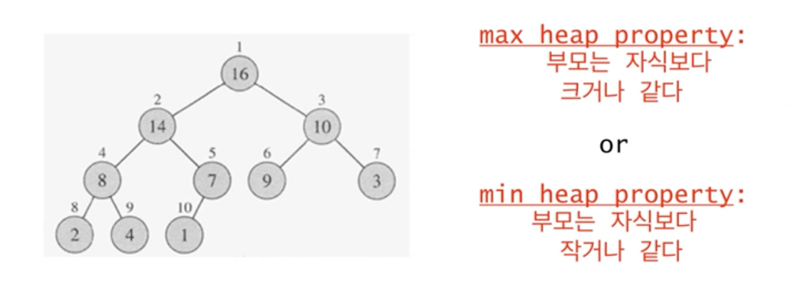
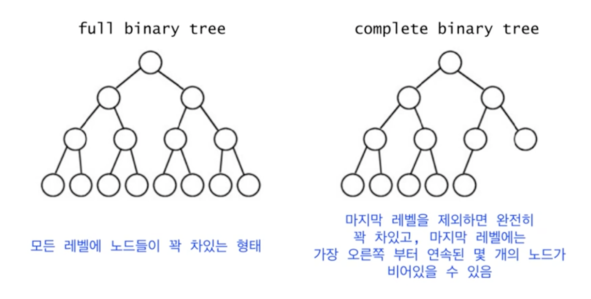
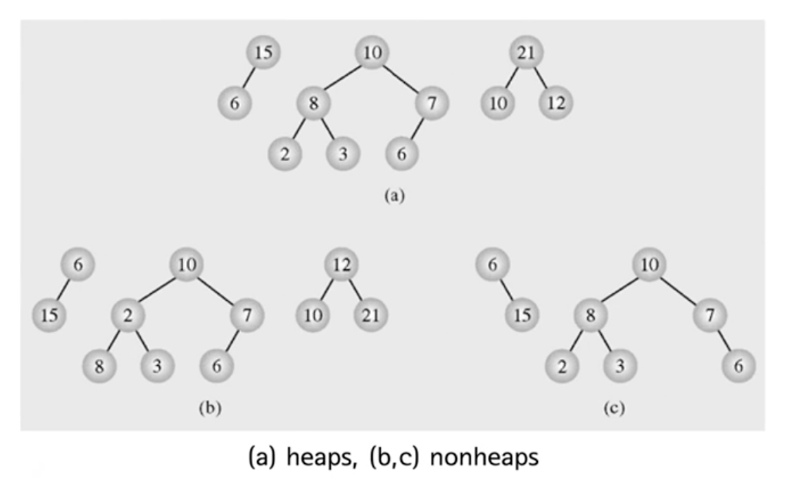
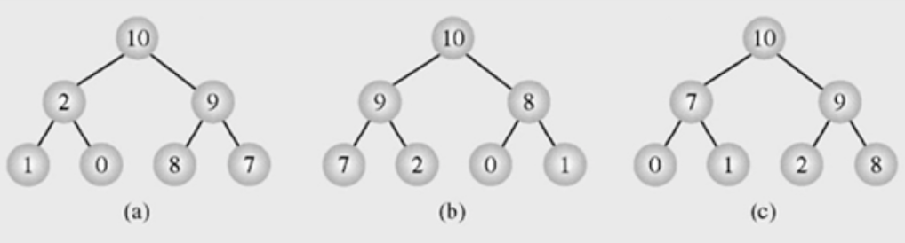
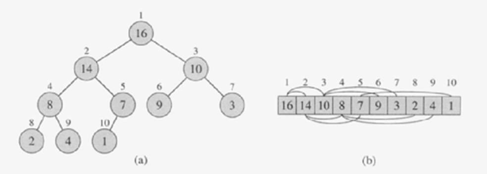
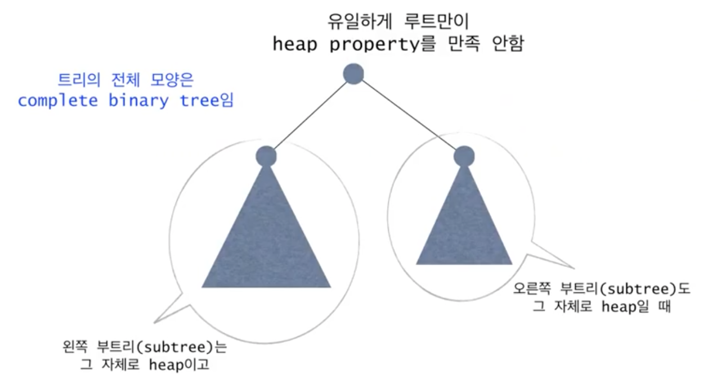
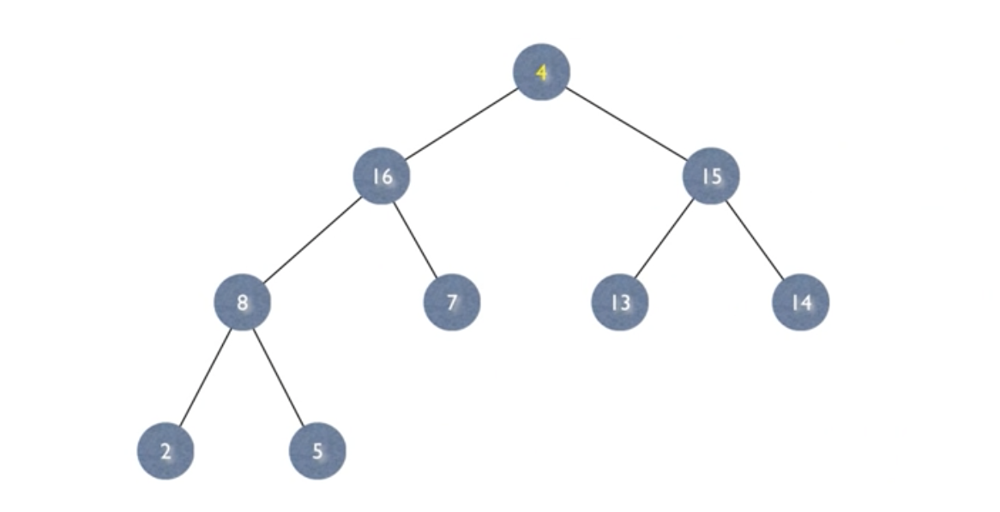

# 힙정렬 (1)

**목차**

- [힙정렬 (1)](#힙정렬-1)
  - [Heapsort](#heapsort)
  - [Heap](#heap)
    - [Tree](#tree)
    - [Binary Tree](#binary-tree)
    - [Full vs. Complete Binary Tree](#full-vs-complete-binary-tree)
    - [heap 예시 1](#heap-예시-1)
    - [heap 예시 1](#heap-예시-1-1)
  - [heap의 표현](#heap의-표현)
  - [기본 연산: max-heapify](#기본-연산-max-heapify)
    - [max-heapify 예시](#max-heapify-예시)

## Heapsort

- 최악의 경우 시간복잡도 `O(nlogn)`
- Sorts in place - 추가 배열 불필요
  - 원래 데이터가 저장되어 있는 자리끼리 교체하여 정렬하는 방식을 뜻한다.
- 이진 힙(binary heap) 자료구조를 사용

## Heap

- **complete binary tree**이면서 **heap property**를 만족해야 한다.
- 높이는 `O(logn)`
- `max heap`과 `min heap`은 대칭적인 관계기 때문에 부호를 반대로 하면 `max`에서 `min`으로 `min`에서 `max`로 전환이 가능하다.

여기선 **max heap**을 다룬다.

### Tree

- 계층적 관계를 표현하기 위해 사용하는 그림을 보통 트리(tree)라고 한다. 현실에서 대표적인 트리의 예는 조직도가 있다.
- 노드는 `부모 - 자식` 관계를 갖고 있으면 이는 노드에 따라 상대적이라서 특정 노드는 어떤 노드와의 관계를 두냐에 따라 부모가 될 수도 자식이 될 수도 있다.
- 부모가 없는 노드는 `root` 노드라 부르고 자식이 없는 노드를 `leaf` 노드라고 부른다.

### Binary Tree

- 부모 노드가 최대 2개의 자식 노드를 가지는 트리를 이진 트리(binary tree)라고 부른다.
- 자식 노드는 왼쪽 자식 노드인지 오른쪽 자식 노드인지 명시되어 있다.

### Full vs. Complete Binary Tree

- 여기서 **레벨**이란 `root` 노드로 부터 몇 단계 내려와 있는지를 의미한다.
- **Full Binary Tree**는 그 자체로 **Complete Binary Tree**이기도 하다.

### heap 예시 1

- `(a)`에 있는 트리들은 **complete binary tree**이면서 **max heap property**를 충족한다.
- 그에 반해 `(b)`에 있는 트리들은 **complete binary tree**지만 **heap property**를 충족하지 못한다. `max`, `min` 그 무엇도 만족시키지 못한다.
- 마지막으로 `(c)`에 있는 트리들은 **complete binary tree** 조차 만족시키지 못한다.

### heap 예시 1

`heap`에 저장되어 있는 데이터를 보면 동일한 것을 알 수 있다. 동일한 데이터를 가진 서로 다른 `heap`이 존재할 수 있다. 즉, `heap`은 유일하지 않다.

## heap의 표현

위 `heap` 설명을 보기에 이를 정렬의 알고리즘으로 사용하기에는 복잡하게 보일 수 있다.

하지만 `heap`은 일차원 배열로 표현이 가능하다. 배열로 표현하면 누가 부모 노드이고 누가 자식 노드인지 어떻게 알 수 있냐고 생각할 수도 있지만 우리가 다루는 건 **complete binary tree**라는 것을 기억하자. **complete binary tree**인 이상 배열의 인덱스만 가지고도 부모 노드와 자식 노드를 알 수 있다.

- `heap` = `A[1, …, n]` (`n`은 노드의 개수)
  - `root` 노드 = `A[1]`
  - `A[i]`의 부모 = `A[i/2]`
  - `A[i]`의 왼쪽 자식 = `A[2i]`
  - `A[i]`의 오른쪽 자식 = `A[2i+1]`

이를 그림으로 표현하면

## 기본 연산: max-heapify

`heap`이라는 자료구조를 이용해 정렬 알고리즘에 사용하기 위해서 필요한 기본 연산이 있다. 바로 트리 전체를 `heap`으로 만드는 연산이다.

단, 전제 조건으로 트리의 전체 모양은 **complete bianry tree**여야 한다.

### max-heapify 예시

위 이미지를 보면 왼쪽 서브트리와 오른쪽 서브트리는 모두 `heap`이다. 앞서 알아봤듯이 `heap`이란건 **complete binary tree**이면서 **heap property**를 만족한다는 것을 뜻한다. 양쪽 서브트리는 모두 `heap`이지만 `root` 노드를 포함하는 순간 `heap`이 아니게 된다.

따라서 `root` 노드를 포함하여 트리를 `heap`으로 만들어 주는 연산이 필요하다.

연산 자체는 간단하다. "**두 자식들 중 더 큰 쪽이 기준 노드보다 크면 두 노드를 교환**"한다.

두 자식 노드들 중 더 큰 쪽과 자리를 바꾸는 것이기 때문에 노드가 바뀌지 않은 쪽의 트리는 `heap` 조건을 만족하고 있던 상태라면 걱정하지 않아도 된다.

교환을 진행하고 나면 교환이 진행된 트리는 기존에 만족하고 있던 `heap` 규칙이 어긋나게 되므로 해당 트리에서 이전에 진행했던 방법("**두 자식들 중 더 큰 쪽이 기준 노드보다 크면 두 노드를 교환**")을 다시 진행하여 `heap` 조건을 만족시켜주면 된다.
