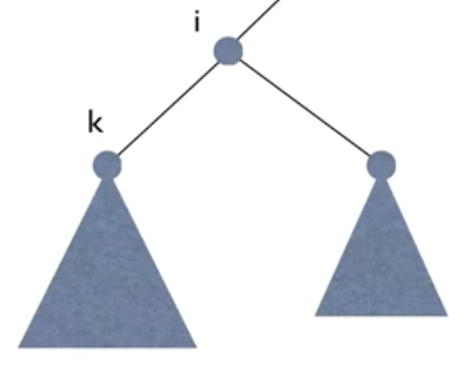
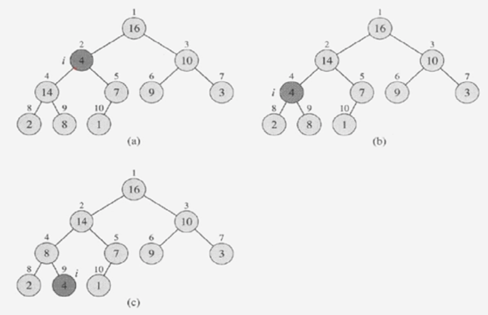

# 힙정렬 (2)

**목차**

- [힙정렬 (2)](#힙정렬-2)
  - [max-heapify: Recursive version](#max-heapify-recursive-version)
    - [pseudo code](#pseudo-code)
  - [max-heapify: Iterative version](#max-heapify-iterative-version)
    - [pseudo code](#pseudo-code-1)
  - [예시: max-heapify(A, 2)](#예시-max-heapifya-2)
  - [시간복잡도](#시간복잡도)

## max-heapify: Recursive version



노드 `i`를 `root`로 하는 서브트리를 **heapify**한다.

단, 노드 `i`의 왼쪽 서브트리와 오른쪽 서브트리 모두 `heap`이라는 가정하에 노드 `i`를 포함한 **heapify** 과정을 진행한다.

### pseudo code

```
max-heapify(A, i)
{
  if there is no child of A[i]
    return;
  k <- index of the biggest child of i;
  if A[i] >= A[k]
    return;
  exchange A[i] and A[k];
  max-heapify(A, k);
}
```

- 노드 `i`의 자식 노드가 더 이상 존재하지 않는다면 `Recursion` 종료
- 자식 노드 중 더 큰 값을 `k`라고 명시한다.
  - 부모 노드인 `A[i]`와 자식 노드인 `A[k]`를 비교해 부모 노드가 더 큰 경우 `heap` 조건을 만족하므로 `Recursion`을 종료한다.
- 자식 노드가 더 큰 경우 자식 노드와 부모 노드를 교체한다.
- 교체한 자식 노드를 기준으로 다시 **heapify**를 진행한다.

## max-heapify: Iterative version

`Recursion`을 사용하지 않고 반복문을 이용해서도 **heapify**를 진행할 수 있다.

### pseudo code

```
max-heapify(A, i)
{
  while A[i] has a child do
    k <- index of the biggest child of i;
    if A[i] >= A[k]
      return;
    exchange A[i] and A[k];
    i = k;
  end.
}
```

- 기준이 되는 노드에게 자식 노드가 존재하지 않을 때까지 반복한다.

## 예시: max-heapify(A, 2)



- 7과 14 중에 더 큰 자식 노드는 14이므로 14를 4와 교체한다.
- 교체한 노드를 기준으로 다시 **heapify**를 진행, 8과 2 중에 더 큰 자식 노드는 8이므로 8과 4를 교체한다.
- 자식 노드가 더 이상 존재하지 않으므로 **heapify**를 종료한다.

## 시간복잡도

**max-heapify**의 시간 복잡도는 `O(logn)`이다.

트리의 **depth**(높이)만큼 시간이 걸리는 데 트리의 높이가 `logn`이기 때문이다. 여기서 `n`은 노드의 개수를 뜻한다.
