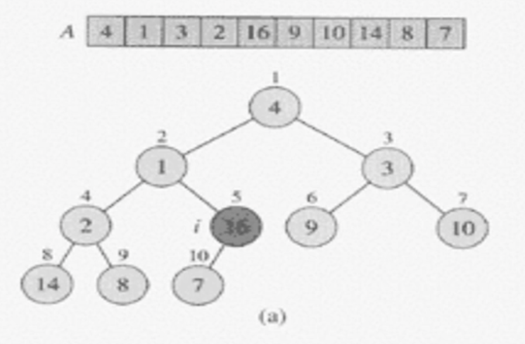
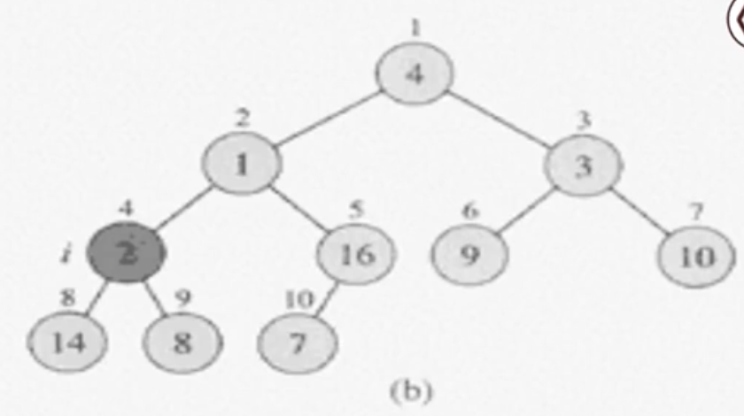
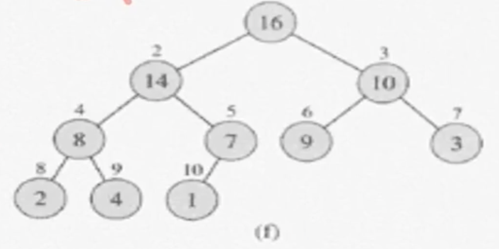
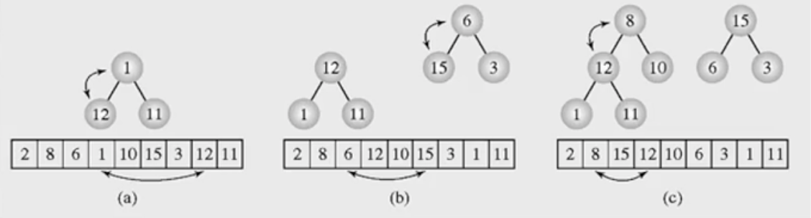
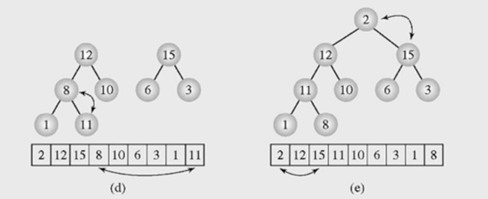

# 힙정렬 (3)

**목차**

- [힙정렬 (3)](#힙정렬-3)
  - [정렬할 배열을 힙으로 만들기](#정렬할-배열을-힙으로-만들기)
    - [pseudo code](#pseudo-code)
    - [예시](#예시)
  - [Heapsort](#heapsort)
    - [pseudo code](#pseudo-code-1)
    - [시간복잡도](#시간복잡도)

## 정렬할 배열을 힙으로 만들기

지금까지 `heap`이 무엇인지에 대해 알아봤으니 이제부터는 이 `heap`을 가지고 정렬하는 방법에 대해 알아보자. `heap`을 가지고 정렬하기 위해서는 우선 `heap`을 만드는 방법부터 알아야 한다.

우선 정렬할 1차원 배열을 **complete binary tree**로 표현한다. (아직 `heap`은 아니다. **heap property**를 만족하지 않는다)



배열의 역순으로 노드들을 확인하고 자식 노드가 존재하는 노드부터, 즉 해당 노드를 포함하는 서브트리부터 **heapify** 연산을 진행한다.



- **heapify** 연산을 마쳤으면 다음 서브트리(자식 노드가 존재하는)로 넘어가서 **heapify** 연산을 진행한다.
- 자식 노드들 중 더 큰 값과 부모 노드를 교체한다.



**heapify** 연산을 반복하면 `heap`이 완성되며 위 과정을 **pseudo code**로 표현하면 다음과 같다.

### pseudo code

```
build-max-heap(A)
#1 heap-size[A] <- length[A] (정렬할 데이터의 개수)
#2 for i <- floor(length[A]/2) downto 1
#3       do max-heapify(A, i)
```

- 기준이 되는 노드(부모 노드)부터 1씩 감소하면서 **heapify** 연산을 진행
- 시간복잡도: `O(n)`
  - **heapify** 연산을 한번 진행하는 데 걸리는 시간복잡도: `O(logn)`
  - **heapify** 연산이 총 실행 수는 `n/2`
  - 이를 정리하면 `O(n/2 * logn)` = `O(nlogn)`
  - 하지만 항상 노드의 개수가 `n`개일 순 없다. **complete binary tree**인 이상 root 노드를 제외한 나머지 서브트리들의 경우 자식 노드가 1개인 경우가 있을 수도 있기 때문에 **heapify** 연산을 한번 진행하는 데 걸리는 시간복잡도가 항상 `O(logn)`이다 라고 말할 수 없다.

이와 별개로 **heapsort**의 시간복잡도는 `O(nlogn)`이다. 왜냐하면 `heap`을 만드는 **heapify** 연산 다음에 정렬 연산이 별개로 존재하는데 이 연산의 시간복잡도가 `O(nlogn)`이기 때문에 `heap`을 만드는 연산이 `O(nlogn)` 이든 `O(n)` 이든 결국 **heapsort**의 시간복잡도는 `O(nlogn)`이 된다.

### 예시

배열 `[2, 8, 6, 1, 10, 15, 3, 12, 11]`을 `heap`으로 만드는 과정을 그림으로 살펴보면 다음과 같다.



`n/2` 인덱스를 기준 노드로 **heapify** 연산 시작하므로 시작 노드는 4번 노드인 1이 된다.



## Heapsort

**heapsort**에서 중요한 점은 **max-heapfiy**의 경우 최대값(**min-heapify**의 경우 최소값)이 `root` 노드에 위치한다는 것이다. 이를 이용하여 정렬을 진행한다.

1. 주어진 데이터를 `heap`으로 만든다.
2. `heap`에서 최대값(`root`)을 가장 마지막 값과 바꾼다.
3. `heap`의 크기가 1 줄어든 것으로 간주한다.

   즉, **가장 마지막 값은 `heap`의 일부가 아닌 것으로 간주한다**.

4. `root` 노드에 대해서 **heapify(1)** 한다.
5. 2 ~ 4번을 반복한다.

### pseudo code

```
heapsort(A)
#1 build-max-heap(A)                : O(n)
#2 for i <- heap_size downto 2 do   : n-1 times
#3   exchange A[1] ... A[i]         : O(1)
#4   heap_size <- heap_size - 1     : O(1)
#5   max-heapify(A, 1)              : O(logn)
```

- `i`: 현재 마지막 노드의 인덱스
- `A[1]`: `root` 노드
- `A[i]`: 마지막 노드

### 시간복잡도

따라서, 총 시간 복잡도는 `O(nlogn)`이 된다.
