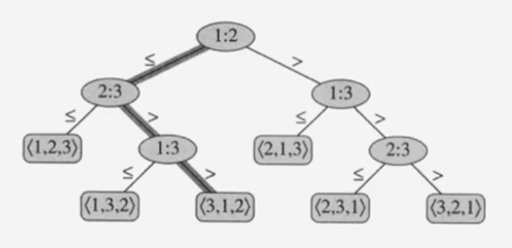

# #7 정렬의 하계

**목차**

- [#7 정렬의 하계](#7-정렬의-하계)
  - [개요](#개요)
  - [Comparison Sort](#comparison-sort)
  - [Non Comparison Sort](#non-comparison-sort)
  - [정렬 문제의 하한](#정렬-문제의-하한)
    - [하한 (Lower bound)](#하한-lower-bound)
  - [Decision Tree](#decision-tree)
    - [Abstraction of any comparison sort](#abstraction-of-any-comparison-sort)

## 개요

지금까지 살펴본 정렬 알고리즘의 시간복잡도를 나열해보자.

| 종류      | 시간복잡도                |
| --------- | ------------------------- |
| Bubble    | O(n^2)                    |
| Selection | O(n^2)                    |
| Insertion | O(n^2)                    |
| Quick     | O(n^2)(단, 평균 O(nlogn)) |
| Merge     | O(nlogn)                  |
| Heap      | O(nlogn)                  |

여기서 의문이 생길 수 있다. 시간복잡도가 `O(nlogn)`가 최선일까? 평균 시간복잡도가 `O(nlogn)`보다 적은 정렬 알고리즘은 존재하지 않는걸까? 이런 생각에 대해서 알아보는 것이 이번 포스팅의 주제이다.

미리 결론을 말하자면 `O(nlogn)`보다 적은 시간복잡도를 갖는 정렬 알고리즘은 없다.

단, 전제조건이 정렬 알고리즘이긴 하지만 **Comparison Sort**라는 가정하에 `O(nlogn)`보다 더 시간복잡도가 낮아질 수 없다.

## Comparison Sort

- 데이터들간의 **`상대적 크기 관계`**만을 이용해서 정렬하는 알고리즘을 말한다.
- 따라서, **데이터들간의 크기 관계가 정의**되어 있으면 어떤 데이터에든 적용이 가능하다.

  ex. 문자열, 알파벳, 사용자 정의 객체 등

- **Bubble**, **Insertion**, **Merge**, **Quick**, **Heap** 등

## Non Comparison Sort

- 정렬할 데이터에 대한 **사전 지식**을 이용한다.

  예를 들어, 시험 점수를 정렬한다고 할 때 점수대별로 분류 작업을 먼저 진행한다. 이는 시험 점수가 **이미 두 자리 정수라는 사실을 알고 있기 때문에** 가능한 작업이다. 이는 시험 점수가 몇 자리 수 또는 실수인지 정수인지 모른다면 불가능한 작업일 것이다.

- Bucket Sort

  사전 지식이 있는 경우 지식을 기반으로 분류를 하고 분류된 범주 안에서 정렬을 진행하는 방식

- Radix Sort
- 데이터들이 특정 조건(상대적 크기 관계를 제외한)을 만족해야 사용할 수 있는 정렬이다.

## 정렬 문제의 하한

시간복잡도가 얼마 보다 더 낮을 수 없다 라고 말할 떄 그 "얼마"를 해당 정렬 알고리즘 시간복잡도의 `하한`이다 라고 표현한다.

### 하한 (Lower bound)

- 입력된 데이터를 한번 씩 다 보기 위해서 최소 `O(n)`의 시간복잡도가 필요하다.
  - 데이터를 보지도 않고 정렬할 순 없기 때문에 최소 `O(n)`이 필요하다.
- 합병 정렬과 힙 정렬 알고리즘들의 시간복잡도는 `O(nlogn)`이다.
- 어떤 **Comparison Sort** 알고리즘도 `O(nlogn)`보다 나을 수 없다.

## Decision Tree

`n`개의 데이터가 입력으로 주어졌을 때 정렬하기 위해 값들을 비교해나가는 과정을 하나의 트리로 표현할 수 있는데 이 트리를 **Decision Tree**라고 한다. 배열의 요소들을 정렬할 때 일어날 수 있는 모든 경우의 수를 표현하는 트리라고 말할 수도 있다.

- `Leaf` 노드의 개수는 **모든 순열**에 해당하므로 `n!`개이다.
- 최악의 경우 시간복잡도는 **트리의 높이**가 된다.
- 트리의 높이는 `height ≥ logn!` = `O(nlogn)`

### Abstraction of any comparison sort

임의의 **Comparison Sort**에 대해서 모두 적용할 수 있지만 여기선 `삽입 정렬`을 예로 들어 설명한다.

3개의 값을 정렬하는 삽입 정렬 알고리즘에 대한 **Decision Tree**

- 트리에서 `root` 노드에 적힌 `1:2`라는 값의 뜻은 첫 번째 값과 두 번째 값을 비교한다는 뜻이다.
