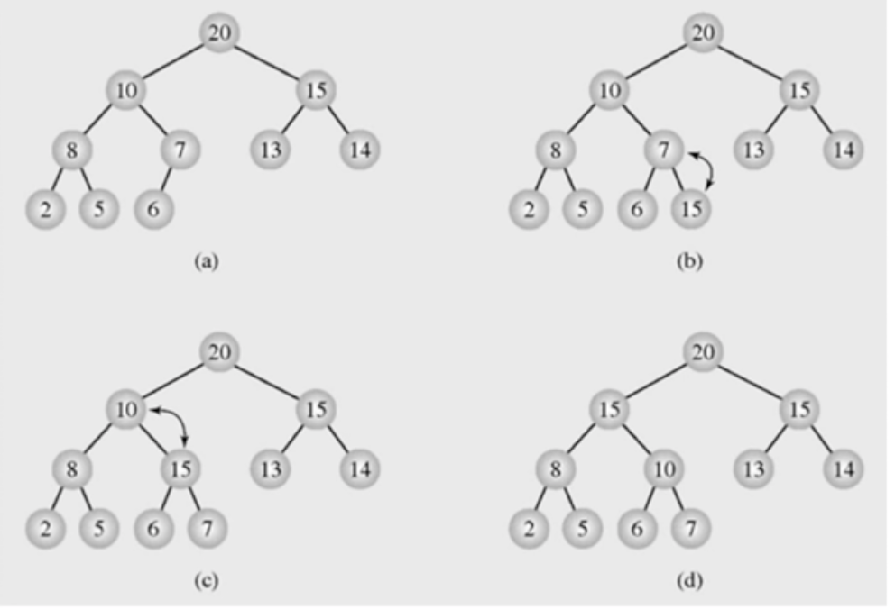
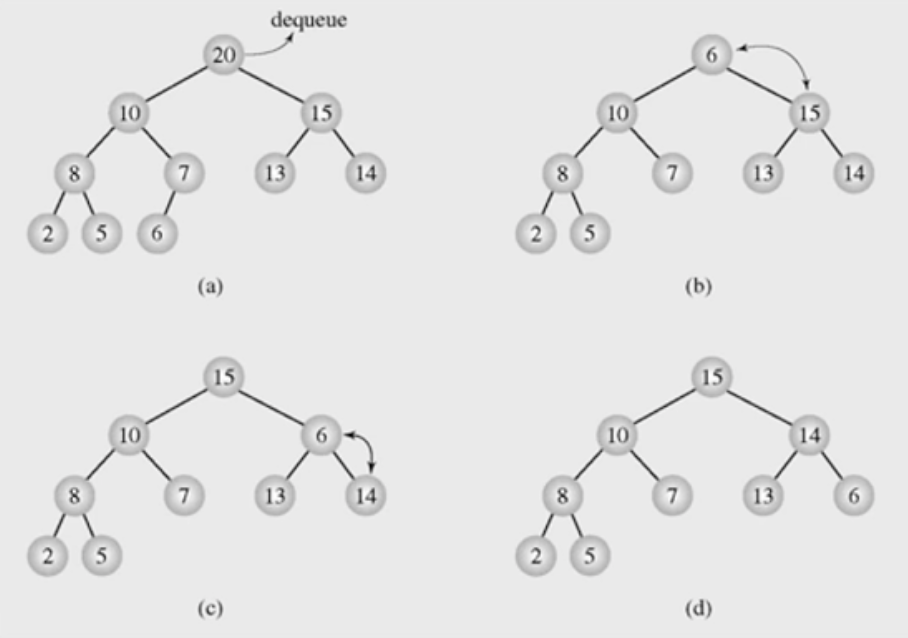

# 힙의 다른 응용

**목차**

- [힙의 다른 응용](#힙의-다른-응용)
  - [힙의 응용: 우선순위 큐](#힙의-응용-우선순위-큐)
  - [`INSERT`](#insert)
    - [pseudo code](#pseudo-code)
  - [`EXTRACT_MAX()`](#extract_max)
    - [pseudo code](#pseudo-code-1)

## 힙의 응용: 우선순위 큐

큐에 데이터가 들어가고 그 중에서 특정 조건을 만족하는 데이터만 먼저 나올 수 있는 방식

- 최대 우선순위 큐(maximum priority queue)는 다음의 두 가지 연산을 지원하는 자료구조
  - `INSERT(x)`: 새로운 원소 `x`를 삽입
  - `EXTRACT_MAX()`: 최대값을 삭제하고 반환
- 최소 우선순위 큐(mininum priority queue)는 `EXTRACT_MAX` 대신 `EXTRACT_MIN`을 지원하는 자료구조
- `MAX HEAP`을 이용한 최대 우선순위 큐를 구현

## `INSERT`



첫 번째 트리가 우선순위 큐에 저장되어 있으며 **max-heap**의 형태를 취하고 있다. 트리가 **max-heap**이라는 것은 다음과 같은 조건을 만족한다는 것이다.

- **complete binary tree**
- 부모 노드가 자식 노드들보다 큰 값을 가진다.

따라서 새로운 노드가 삽입되더라도 **complete binary tree**를 만족하는 자리에 노드가 추가되어야 한다는 말이다. 위 예제의 첫 번째 트리의 경우 7번 노드의 오른쪽 자식 노드 자리가 삽입할 노드의 위치가 된다.

새로운 노드(`15`)가 추가되면 부모 노드가 자식 노드들보다 커야한다는 **max-heap**의 조건이 깨지게 된다. 따라서, **max-heap** 조건을 맞춰주는 작업이 필요한데 이때 트리는 애초에 **max-heap** 조건을 만족하고 있었기 때문에 삽입된 노드가 위치한 서브트리를 제외한 나머지 요소들은 신경쓰지 않아도 된다.

삽입된 노드의 값이 커서 해당 서브트리의 부모 노드와 위치가 바뀌었을 경우 왼쪽 자식 노드는 신경쓰지 않아도 되는 이유는 기존에 **max-heap**을 만족하고 있었기 때문이다. 즉, **max-heap**을 만족한다라는 것은 부모 노드가 자식 노드들보다 이미 큰 값이라는 뜻이고 해당 부모 노드와 바뀐 값은 부모 노드보다 큰 값이니 나머지 자식 노드보다도 큰 값이 될 수 밖에 없다.

이처럼 **max-heap**을 조건이 일치하는지 확인하면서 위치를 바꾼 노드가 **max-heap** 조건을 만족할 때까지 반복하면 된다.

### pseudo code

```
max-heap-insert(A, key) {
  heap_size = heap_size + 1;
  A[heap_size] = key;
  i = heap_size;
  while (i > 1 and A[parent(i)] < A[i]) {
    exchange A[i] and A[parent(i)];
    i = parent(i)
  }
}
```

- `A[heap_size] = key`: `heap` 사이즈를 1 증가시켜줬기 때문에 complete binary tree를 만족하면서 트리에 요소를 추가할 수 있는 요소의 위치에 노드를 위치시킬 수 있게 된다.
- `i`: 문제가 되는 노드, 즉 **max-heap**를 만족하지 않는 노드를 뜻한다.
- `i > 1`: `root` 노드가 아닌 경우
- `A[parent(i)]`: 부모 노드의 저장된 값
- 시간복잡도: `O(logn)`

## `EXTRACT_MAX()`



**max-heap**은 최대값을 꺼내기 아주 좋은 자료구조일 수 밖에 없다. **max-heap**을 만족하는 트리라는 것은 `root` 노드에 트리 요소들 중 최대값이 위치한다는 뜻이니 말이다.

최대값을 찾았으니 해당 노드를 제거한다. 단, `root` 노드가 제거됐으니 다른 노드로 `root` 노드를 채워줘야 한다.

문제는 아무 노드나 가져와서 `root` 노드로 채울 수는 없다는 것인데 그 이유는 아무 노드가 빼올 경우 **complete binary tree**를 만족하지 않게 되기 때문이다. 하나의 노드를 삭제하고도 **complete binary tree**를 만족하기 위해서는 트리의 마지막 요소를 가져오는 수 밖에 없다.

이렇게 하면 노드의 개수가 하나 줄고도 여전히 **complete binary tree**를 만족한다. 그러나 최대값 노드가 제거됐으므로 **max-heap** 조건을 만족하지 않게 된다. 따라서 새로운 `root` 노드를 기준으로 **max-heapify** 연산을 진행한다.

### pseudo code

```
heap-extract-max(A)
  if heap-size[A] < 1
    then error "heap underflow"
  max <- A[1]
  A[1] <- A[heap-size[A]]
  heap-size[A] <- heap-size[A] - 1
  max-heapify(A, 1)
  return max
```

- `if heap-size[A] < 1`: `heap`이 빈 예외 케이스
- `A[1] <- A[heap-size[A]]`: 트리의 맨 마지막 요소는 배열의 마지막 요소이므로 해당 요소를 `root` 노드(배열의 첫 번째 요소)로 옮긴다
- `heap-size[A] <- heap-size[A] - 1`: 맨 마지막 요소를 옮겼으므로 배열의 사이즈를 1 줄인다.
- **max-heap** 조건이 깨졌으므로 **max-heapify** 연산을 다시 실행
- 시간복잡도: `O(logn)`
