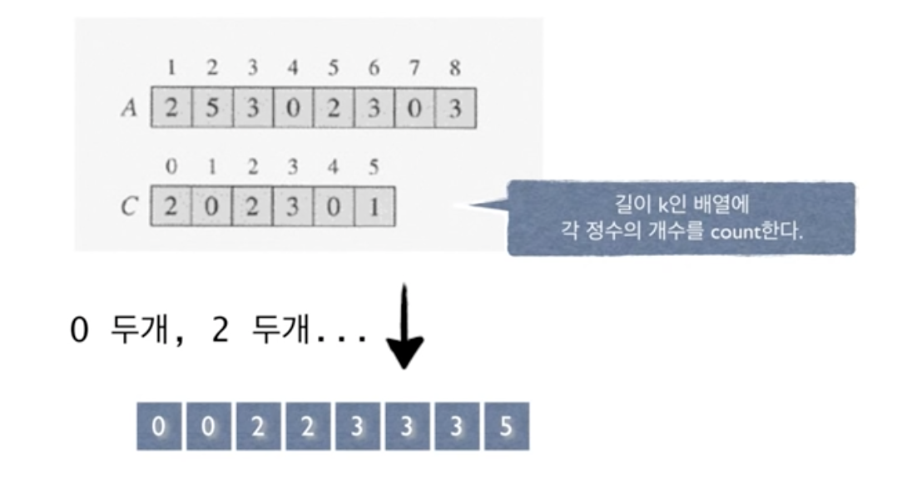

# #8-1 선형시간 정렬 알고리즘 (1)

**목차**

- [#8-1 선형시간 정렬 알고리즘 (1)](#8-1-선형시간-정렬-알고리즘-1)
  - [Sorting in Linear Time](#sorting-in-linear-time)
  - [Counting Sort](#counting-sort)
    - [예제](#예제)
    - [구현](#구현)
    - [문제점](#문제점)
    - [개선](#개선)
    - [pseudo code](#pseudo-code)
    - [시간복잡도](#시간복잡도)

### Sorting in Linear Time

**Comparison Sort**가 아닌 정렬 알고리즘의 예제를 살펴보자.

## Counting Sort

- `n`개의 정수를 정렬하라. 단, 모든 정수는 `0`에서 `k` 사이의 정수다.
  - **Comparison Sort**가 아닌 것을 볼 수 있는 게 우리가 정렬할 데이터에 대한 사전 지식이 존재한다. **Comparison Sort**였다면 데이터들 간의 크기 관계만을 가지고 정렬했을 것이다.
  - 이 사전 지식을 적극적으로 이용하여 정렬을 진행한다.
- **Counting Sort**의 예로는 `n`명의 학생들의 시험 점수를 정렬하되 모든 점수는 `100` 이하의 양의 정수라는 사전 지식이 있는 경우이다.

### 예제

- `k = 5`인 경우의 예



사전 지식에 의하면 어차피 입력으로 들어올 수는 `0`부터 `k` 사이의 숫자다. 따라서, 정렬을 한다라기 보다는 숫자를 센다라는 느낌으로 작업을 진행한다.

배열을 순회하면서 각 숫자가 몇 개 존재하는지 체크하고 이를 `0`부터 차례대로 배치하면 정렬이 되는 식이다.

### 구현

```java
int A[n];
int C[k] = { 0, };

for (int i=1; i<=n; i++) {
  C[A[i]]++;
}

for (int s=1, i=0; i<=k; i++) {
  for (int j=0; i<C[i]; j++) {
    A[s++] = i;
  }
}
```

- `A[n]`: 정렬할 데이터
- `C[k]`: 각 요소가 몇 번 나왔는지 체크할 용도
- `C[A[i]]++`: 요소의 개수를 `+1`

### 문제점

위 방식의 문제점은 현실의 데이터는 위와 같이 단순하지 않다는 것이다. 대부분의 경우 정렬할 `key` 값들은 레코드의 일부분이기 때문이다.

입력으로 정수만 들어오면 이상적인 정렬 알고리즘이 되겠지만 현실의 데이터는 달랑 정수만 저장해놓지 않고 여러 가지 데이터가 묶여 있는 형식일 것이다. 예를 들어, 특정 사람의 데이터를 저장할 때 이름만 저장하는 것이 아니라 전화번호나 주소를 하나의 테이블에 같이 저장해 관리하는 것처럼 말이다.

### 개선


- **누적합**을 구한다. (1보다 작거나 같은 수의 개수를 인덱스 1에 위치)
- `(c)`에서 7번 인덱스에 3을 위치시킬 수 있는 이유는 누적합을 통해 3보다 같거나 작은 값이 7개가 있다는 것을 알아냈기 때문이다. 따라서, 7개 중에 마지막 요소는 3을 위치시켜도 안전하다.
- 입력으로 들어온 요소를 하나씩 뒤에서부터 꺼내어 누적합을 이용해 위 작업을 반복한다.

### pseudo code

```
counting-sort(A, B, k)
  for i <- 0 to k
    do C[i] <- 0
  for j <- l to length[A]
    do C[A[j]] <- C[A[j]] + 1
  C[i] now contains the number of elements equal to i
  for i <- l to k
    do C[i] <- C[i] + C[i-1]
  C[i] now contains the number of elements less than or equal to i
  for j <- length[A] downto 1
    do B[C[A[]j]] <- A[j]
    C[A[j]] <- C[A[j]] - 1
```

- `do C[i] <- 0`: 배열 초기화
- `do C[A[j]] <- C[A[j]] + 1`: 요소를 체크하는 배열에 해당 요소의 수를 + 1
- `do C[i] <- C[i] + C[i-1]`: 누적합

### 시간복잡도

- `O(n+k)` 또는 `O(n)`, `if k=O(n)`
- `k`가 **클 경우 비실용적**이다.
- **Stable** 정렬 알고리즘
  - 입력에 동일한 값이 있을 때 입력에 먼저 나오는 값이 출력에서도 먼저 나온다.
    - 이 조건을 만족하는 정렬 알고리즘을 **Stable** 정렬 알고리즘이라고 표현한다.
    - 해당 조건은 **Radix Sort**에서 의미를 가진다.
  - **Counting** 정렬은 `stable`하다. (위 조건을 만족하기 때문에)
