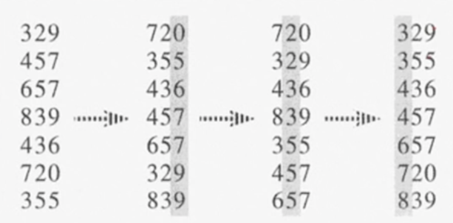

# #8-2 선형시간 정렬 알고리즘 (2)

**목차**

- [#8-2 선형시간 정렬 알고리즘 (2)](#8-2-선형시간-정렬-알고리즘-2)
  - [Radix Sort](#radix-sort)
    - [pseudo code](#pseudo-code)
  - [정렬 알고리즘들](#정렬-알고리즘들)

## Radix Sort

- `n`개의 `d`자리 정수들
  - **Radix Sort**가 반드시 정수여야 한다는 것은 아니고 정수가 **Radix Sort**를 적용할 수 있는 전형적인 예라는 뜻일 뿐이다.
- 가장 낮은 자리수부터 정렬
  - 정렬이 끝났으면 자리수를 한자리 앞으로(두 번째로 낮은 자리수) 이동해 다시 정렬을 진행한다.



위 **Radix Sort** 예제를 보면 알고리즘 자체는 간단하다.

이 알고리즘의 조건 중 하나는 매 단계에서 이루어지고 있는 정렬 알고리즘이 **Stable** 해야 한다는 것이다. 즉, **Stable** 정렬 알고리즘이여야 한다는 것인데 예를 들어, 위에서 두 번째로 낮은 자리수를 정렬할 때 이전 단계(가장 낮은 자리수)에서 정렬했던 `720 - … - 329 - 839`의 순서가 `329 - 720`과 같이 바뀌면 안되고 `720 - … - 329 - … - 839`의 출력 순서를 유지해야 한다는 것이다.

정리하자면 각 단계에서 **Counting Sort**를 하고 있다면 보면 된다. **Counting Sort**를 하기에 적합한 이유 중 하나는 각 자리 수에 나올 수 있는 경우의 수가 `0 - 9`까지의 수이기 때문에 경우의 수가 큰 경우 비효율적인 **Counting Sort**에 더욱 더 적합하다.

**문제는 이 알고리즘은 왜 정렬이 될까?**

정렬이 되는 가장 큰 이유 중 하나는 각 단계에서 행해지고 있는 정렬 알고리즘이 **Stable** 정렬 알고리즘이라는 것이 크다.

가장 낮은 자리수에서 했던 정렬의 결과가 그 다음 단계에서 행해지는 정렬 때 보장이 되기 때문이다.

예를 들어 두 번째로 낮은 자리수에서 `436 - 839`와 같이 두 번째로 낮은 자리수의 값이 같으면서 가장 낮은 자리수의 값이 작은 수와 큰 수의 순서로 정렬이 되는 것을 볼 수 있다. 여기서 정렬이 되지 않는 경우, 즉 `839 - 436`과 같은 순서로 정렬이 되어야 한다는 건데 이는 매 단계에서 행해지는 정렬 알고리즘이 **Stable** 정렬 알고리즘이기 때문에 이 경우는 발생할 수가 없다.

결국 이전 단계들에서 이루어졌던 정렬 결과가 다음 단계에서 계속해서 보장되기 때문에 정렬이 이루어 진다.

### pseudo code

```
radix-sort(A, d)
  for i <- 1 to d
    do use a stable sort to sort array A on digit i
```

- `A`: `n`개의 배열
- `d`: `d`자리 정수임을 명시하기 위한 매개변수
- 시간복잡도: `O(d(n+k))`
  단, `k`가 `n` 보다 작고 `d`가 상수인 경우 `O(n)`이라고도 할 수 있다.

## 정렬 알고리즘들

| Sort Algorithm | T(n)                              |
| -------------- | --------------------------------- |
| Bubble Sort    | O(n^2)                            |
| Insertion Sort | O(n^2)                            |
| Selection Sort | O(n^2)                            |
| Quick Sort     | worst O(n^2) and average O(nlogn) |
| Merge Sort     | O(nlogn)                          |
| Heap Sort      | O(nlogn)                          |
| Counting Sort  | O(n+k)                            |
| Radix Sort     | O(d(n+k))                         |
