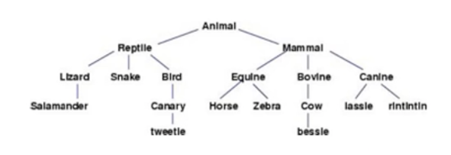

# #9 트리와 이진트리

**목차**

- [#9 트리와 이진트리](#9-트리와-이진트리)
  - [트리 (Tree)](#트리-tree)
    - [용어](#용어)
    - [트리의 기본적인 성질](#트리의-기본적인-성질)
  - [이진 트리 (binary tree)](#이진-트리-binary-tree)
    - [이진 트리 응용의 예 1: Expression Tree](#이진-트리-응용의-예-1-expression-tree)
    - [이진 트리 응용의 예 2: Huffman Code](#이진-트리-응용의-예-2-huffman-code)
  - [Full and Complete Binary Trees](#full-and-complete-binary-trees)
  - [이진트리의 표현](#이진트리의-표현)
    - [연결 구조(Linked Structure)](#연결-구조linked-structure)
  - [이진트리의 순회 (traversal)](#이진트리의-순회-traversal)
    - [종류](#종류)
    - [중순위(inorder) 순회](#중순위inorder-순회)
    - [`inorder` pseudo code](#inorder-pseudo-code)
    - [`preorder` pseudo code](#preorder-pseudo-code)
    - [`postorder` pseudo code](#postorder-pseudo-code)
    - [Expression Trees](#expression-trees)
  - [Level-Order 순회](#level-order-순회)
    - [예제](#예제)
    - [pseudo code](#pseudo-code)

## 트리 (Tree)



계층적인 구조를 표현한 것을 보통 **트리**라고 부른다. 예를 들어

- 조직도
- 디렉토리와 서브디렉토리 구조
- 가계도
- …

### 용어


- **노드(node)**
  - 위 이미지에서 동그랗게 표현된 것
- **루트(root)**
  - 노드 중에서 맨 위(최상단)의 노드
- **링크(link)**, **엣지(edge)**, **브랜치(branch)** 등
  - 노드들을 연결하는 선
- **부모(parent)-자식(child) 관계**
  - 연결된 노드 간에 위에 위치한 노드를 부모 노드, 아래 위치한 노드를 자식 노드라 부르며 이는 상대적인 관계이다.
  - 루트노드를 제외한 트리의 모든 노드들은 유일한 부모 노드를 가진다.
- **형제(sibling) 관계**
  - 부모가 동일한 노드들을 형제 관계라고 부른다.
- **리프(leaf) 노드**
  - 자식이 없는 노드들을 리프 노드라고 부른다.
  - 리프 노드가 아닌 노드들을 내부(internal) 노드라고 부른다.
- **조상(ancestor)-자손(descendant) 관계**
  - 부모-자식 관계를 확장한 것이 조상-자손 관계다.
- **부트리(subtree)**
  - 트리에서 어떤 한 노드와 그 노드의 자손들로 이루어진 트리를 부트리(subtree)라고 부른다.
  - 전체 트리의 일부분에 해당하는 트리
- **레벨(level)**

  

  - 레벨을 나누는데 정해진 법칙이 있는 것은 아니기 때문에 레벨 0부터 시작하는 경우도 있다.

- **높이(height)**
  - 레벨이 3이면 높이가 3이라고 할 수 있다.

### 트리의 기본적인 성질

- 노드가 `N`개인 트리는 항상 `N-1`개의 링크(link)를 가진다.
- 트리의 루트에서 어떤 노드로 가는 경로는 유일하다. 또한 임의의 두 노드간의 경로도 유일하다.
  단, 같은 노드를 두 번 이상 방문하지 않는다는 조건하에

## 이진 트리 (binary tree)

- 이진 트리에서 각 노드는 **최대 2개의 자식**을 가진다.
  - 자식이 둘이거나 하나이거나 없을 수도 있다.
- 각각의 자식 노드는 자신이 부모의 왼쪽 자식인지 오른쪽 자식인지가 지정된다.
  - 자식이 한 명인 경우에도 동일하다.
- 왼쪽 자식과 오른쪽 자식이 값은 같지만 서로의 위치가 다르다면 이는 서로 다른 이진트리이다.

  

### 이진 트리 응용의 예 1: Expression Tree


이진 트리를 응용한 예 중 하나는 위와 같은 구문을 파싱할 때 이미지와 같은 이진 트리의 형태로 만드는 경우를 들 수 있다.

### 이진 트리 응용의 예 2: Huffman Code


**Huffman Code**는 어떤 코드를 압축 또는 인코딩하는 가장 기본적인 알고리즘 중에 하나다.

각 알파벳(`a` ~ `z`)에 부여된 이진 코드를 이진 트리의 형태로 표현이 가능하다.

## Full and Complete Binary Trees


- 높이가 `h`인 **full binary tree**는 `2^h-1`개의 노드를 가진다.
- 노드가 `N`개인 **full** 혹은 **complete** 이진 트리의 높이는 `O(logN)`이다.
  단, 노드가 `N`개인 이진트리의 높이는 최악의 경우 `N`이 될 수도 있다. 왜냐하면 이진 트리라는 것은 최대 2개의 자식 노드를 가질 수 있을 뿐이지 꼭 2개의 자식 노드를 가지고 있어야 하는 것은 아니기 때문이다. 한 방향으로만 자식 노드를 계속 가지게 되면 최악의 경우를 맞이하게 된다.

## 이진트리의 표현

`heap`의 경우 **complete binary tree**를 기반으로 하기 때문에 배열로 간단하게 표현이 가능했다. 하지만 일반적인 이진 트리의 형태를 갖고 있다면 더 이상 이런 규칙성은 성립하지 않는다.

따라서, complete binary tree와 같은 경우가 아니라면 이진 트리를 표현할 때 연결 구조(Linked Structure)를 이용하여 표현을 할 수 밖에 없다.

### 연결 구조(Linked Structure)

이러한 연결 구조의 대표적인 예는 Linked List를 떠올리면 된다. Linked List는 현재 노드가 다음 노드의 주소를 가지고 있는 구조를 말한다.

이진 트리는 연결 구조를 이용하여 다음과 같이 표현한다.


- 각 노드에 하나의 **데이터(data) 필드**와 **왼쪽 자식(left)**, **오른쪽 자식(right)** 그리고 **부모 노드(p)**의 주소를 저장한다.
- 부모 노드의 주소는 반드시 필요한 경우가 아니라면 보통 생략한다.
- 루트 노드의 주소는 따로 보관한다.

## 이진트리의 순회 (traversal)

순회란 이진트리의 모든 노드를 방문하는 일을 말한다. 트리의 구조상 연결 리스트와 같이 선형적인 구조가 아니기 때문에 단순히 순회하는 방법이 하나로 정해져 있지 않다.

따라서, 이진트리의 순회에는 다음과 같은 방법들이 있다.

### 종류

- 중순위(inorder) 순회
- 선순위(preorder) 순회
- 후순위(postorder) 순회
- 레벨오더(level-order) 순회

### 중순위(inorder) 순회


1. 먼저 `T-left`를 `inorder`로 순회하고 (recursive)
2. `root`를 순회하고
3. `T-right`를 `inorder`로 순회한다. (recursive)

### `inorder` pseudo code

```
inorder-tree-walk(x)
  if x != NIL
    then inorder-tree-walk(left[x])
      print key[x]
      inorder-tree-walk(right[x])
```

- `x`를 루트로 하는 트리를 `inorder` 순회
- `if x != NIL`: `x`가 `null`인지 확인
- `key[x]`: 노드 `x`에 저장된 값
- `inorder-tree-walk(left[x])`: `x`의 왼쪽 자식 노드를 루트로 하는 트리를 `inorder` 순회
- `inorder-tree-walk(right[x])`: `x`의 오른쪽 자식 노드를 루트로 하는 트리를 `inorder` 순회

### `preorder` pseudo code

`inorder` 순회와의 차이점은 노드를 방문하는 순서 밖에 없다.

1. 루트를 먼저 방문
2. 왼쪽 자식 노드를 루트로 하는 `preorder` 순회
3. 오른쪽 자식 노드를 루트로 하는 `preorder` 순회

```
preorder-tree-walk(x)
  if x != NIL
    then print key[x]
      preorder-tree-walk(left[x])
      preorder-tree-walk(right[x])
```

### `postorder` pseudo code

`postorder` 순회도 동일하다. `inorder` 순회와의 차이점은 노드를 방문하는 순서 밖에 없다.

1. 왼쪽 자식 노드를 루트로 하는 `preorder` 순회
2. 오른쪽 자식 노드를 루트로 하는 `preorder` 순회
3. 루트를 먼저 방문

```
postorder-tree-walk(x)
  if x != NIL
    then postorder-tree-walk(left[x])
      postorder-tree-walk(right[x])
      print key[x]
```

### Expression Trees

앞서 나왔던 **Expression Tree** 예제에 이진트리의 순회 방법을 사용해보자.


**Expression Tree**를 `inorder` 순회하면 다음과 같이 출력된다.

> `x + y * a + b / c`

각 서브트리를 순회할 때 시작과 종료시에 괄호를 추가하면 다음과 같이 올바른 수식이 출력된다.

> `(x + y) * ((a + b)) / c)`

`postorder` 순회하면 후위표기식이 출력된다.

> `x y + a b + c / *`

## Level-Order 순회

- 레벨 순으로 방문하되 동일 레벨에서는 왼쪽에서 오른쪽 순서로 순회한다.
- **큐(queue)**를 이용하여 구현한다.

### 예제


- 방문 순서는 3, 1, 5, 0, 2, 4, 6, 7, 8이 된다.
- 큐를 이용하는 방식은 다음과 같다.
  - 3을 우선 큐에 넣는다.
  - 3을 큐에서 꺼내 3의 자식 노드들(1, 5)을 큐에 넣는다.
  - 다시 큐에서 노드 하나를 꺼낸다.
  - 해당 노드(1)의 자식 노드들(0, 2)을 큐(5, 0, 2)에 넣는다.
  - 반복한다.

### pseudo code

```
level-order-tree-traversal()
  visit the root;
  Q <- root;
  while Q is not empty do
    v <- dequeue(Q);
    visit children of v;
    enqueue children of v into Q;
  end.
end.
```

- `Q`는 **큐(queue)**를 뜻한다.
- `while Q is not empty do`: 큐에 아무것도 담겨있지 않을 때까지 반복한다.
